# claw-rust Application Workflow

> **Auto-maintained**: Keep this document in sync with code changes.
> Last updated: 2026-02-17

## Crate Dependency Graph

Shows how the 9 workspace crates depend on each other. `claw-core` is the
foundation with zero internal dependencies; `claw-app` is the top-level binary
that wires everything together.

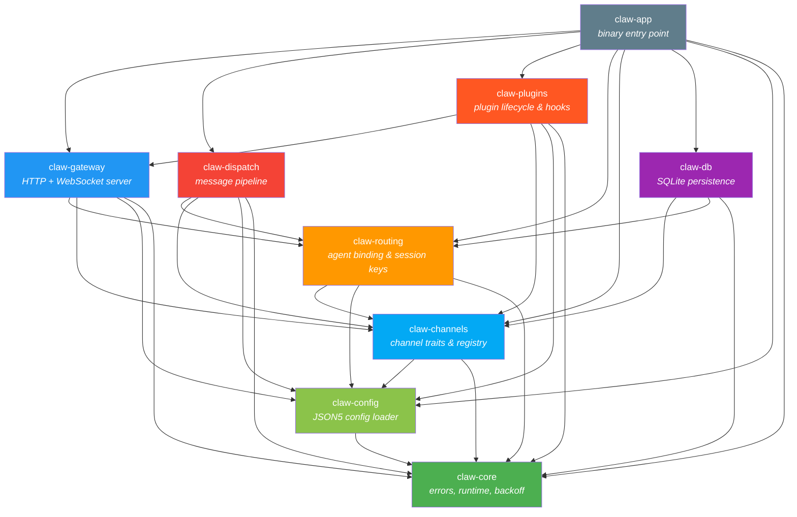

## Application Startup Flow

The `claw-app` binary boots the system in this sequence:

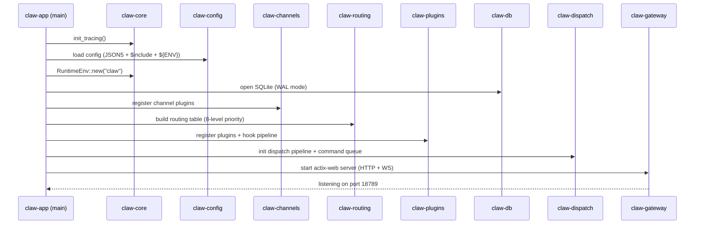

## Inbound Message Flow

When a message arrives from an external channel (e.g. Telegram), it flows
through the system like this:

```mermaid
flowchart LR
    EXT["External Channel<br/>(Telegram, Discord, etc.)"]
    CHAN["claw-channels<br/>ChannelPlugin.receive()"]
    CTX["Build MsgContext<br/>(~60 fields)"]
    HOOKS1["Plugin Hooks<br/>message_received"]
    ROUTE["claw-routing<br/>resolve agent binding<br/>(8-level cascade)"]
    SESS["Session Key<br/>agent:id:channel:scope"]
    DB_R["claw-db<br/>load session state"]
    DISP["claw-dispatch<br/>command lane queue"]
    HOOKS2["Plugin Hooks<br/>before_model_resolve<br/>before_prompt_build<br/>before_agent_start"]
    AGENT["AI Agent<br/>(LLM call)"]
    HOOKS3["Plugin Hooks<br/>llm_output<br/>agent_end"]
    OUT["Outbound Delivery"]
    DB_W["claw-db<br/>persist transcript"]

    EXT --> CHAN --> CTX --> HOOKS1 --> ROUTE
    ROUTE --> SESS --> DB_R --> DISP
    DISP --> HOOKS2 --> AGENT
    AGENT --> HOOKS3 --> OUT
    AGENT --> DB_W

    style EXT fill:#E91E63,color:#fff
    style AGENT fill:#9C27B0,color:#fff
    style OUT fill:#4CAF50,color:#fff
```

## Outbound Message Flow

Responses flow back to the originating channel:

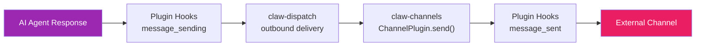

## Gateway WebSocket Protocol

The gateway implements a JSON-RPC protocol over WebSocket with three frame
types: `req`, `res`, and `event`.

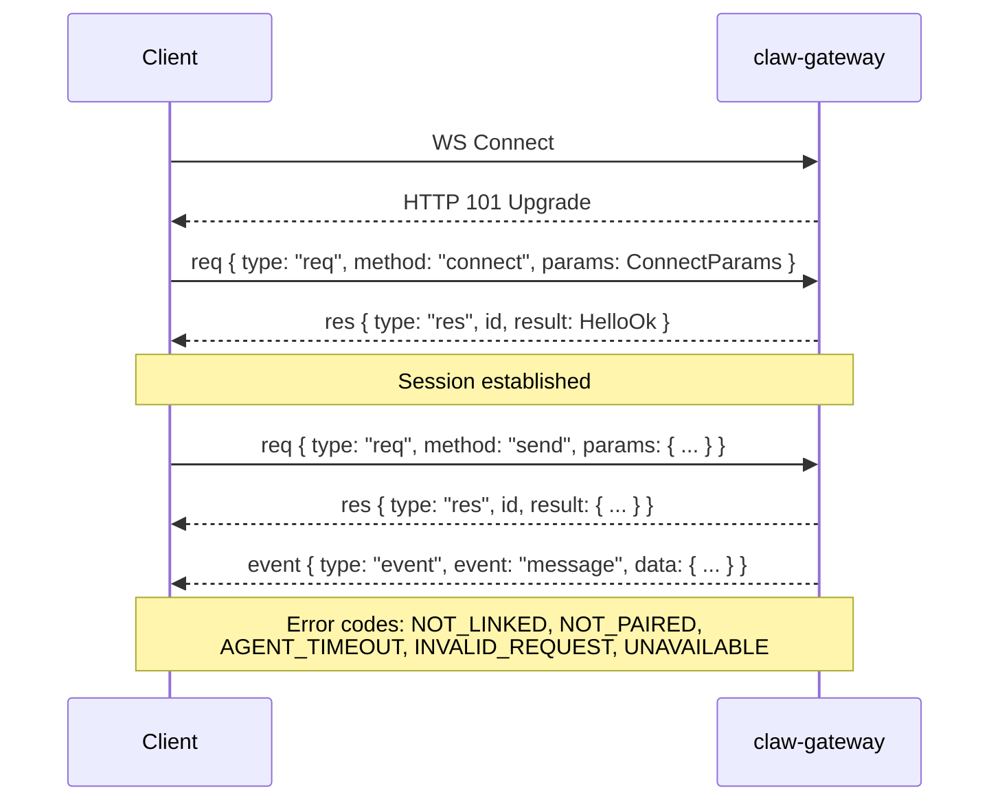

## Plugin Hook Pipeline

Plugins can intercept 20+ lifecycle events. Hooks fire in registration order.

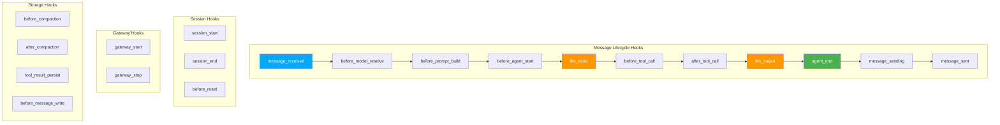

## Routing: 8-Level Agent Binding Cascade

When resolving which AI agent handles a message, routing checks bindings in
priority order (first match wins):

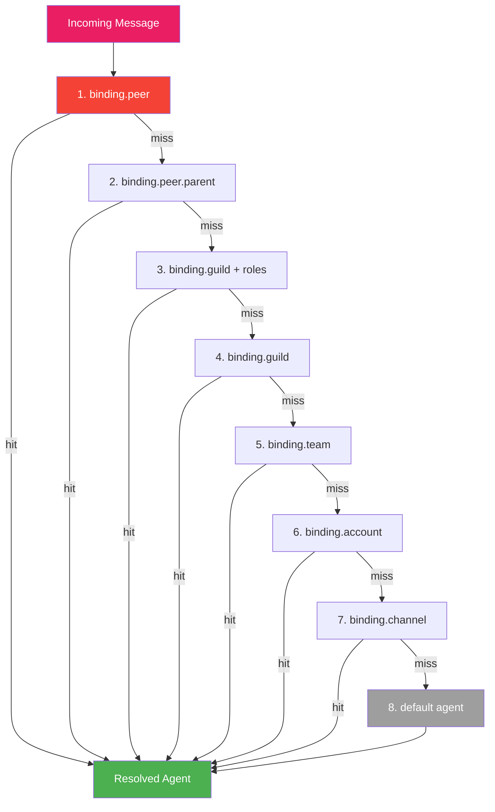

## Session Key Format

Session keys scope conversations to a specific agent-channel-peer combination:

```
agent:<agentId>:<channel>:<scope>
```

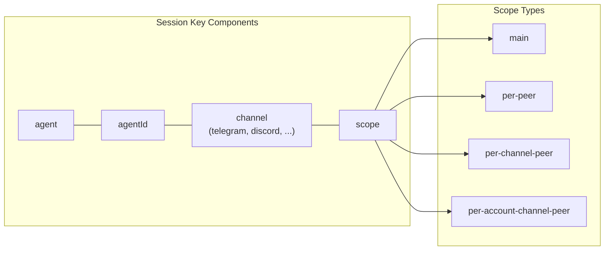

## Config Loading Pipeline

Configuration is loaded from JSON5 files with support for recursive includes
and environment variable substitution:

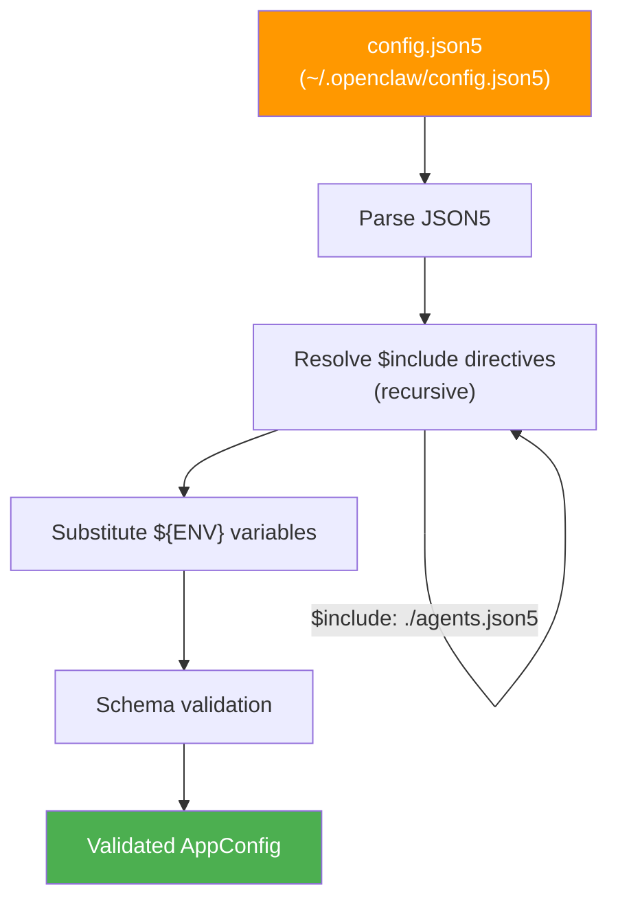

## Crate Module Map

Detailed module breakdown for each crate:

```mermaid
flowchart TD
    subgraph claw-core
        C1["error.rs<br/>ErrorShape, ErrorCode, token redaction"]
        C2["runtime.rs<br/>RuntimeEnv, init_tracing"]
        C3["backoff.rs<br/>BackoffPolicy, compute_backoff, sleep_with_abort"]
    end

    subgraph claw-config
        CF1["lib.rs<br/>JSON5 parsing, $include, ${ENV} substitution"]
    end

    subgraph claw-channels
        CH1["lib.rs<br/>ChannelPlugin trait, adapters, MsgContext, registry"]
    end

    subgraph claw-routing
        R1["lib.rs<br/>8-level binding cascade, session key gen/parse"]
    end

    subgraph claw-dispatch
        D1["lib.rs<br/>inbound pipeline, outbound delivery, command lane queue"]
    end

    subgraph claw-gateway
        G1["lib.rs<br/>actix-web HTTP, WS handshake, RPC dispatch, events"]
    end

    subgraph claw-plugins
        P1["lib.rs<br/>plugin registration, lifecycle, hook pipeline, PluginApi"]
    end

    subgraph claw-db
        DB1["lib.rs<br/>SQLite WAL, sessions, transcripts, message history"]
    end

    subgraph claw-app
        A1["main.rs<br/>binary entry point, wires all crates"]
    end

    style claw-core fill:#4CAF50,color:#fff
    style claw-config fill:#8BC34A,color:#fff
    style claw-channels fill:#03A9F4,color:#fff
    style claw-routing fill:#FF9800,color:#fff
    style claw-dispatch fill:#F44336,color:#fff
    style claw-gateway fill:#2196F3,color:#fff
    style claw-plugins fill:#FF5722,color:#fff
    style claw-db fill:#9C27B0,color:#fff
    style claw-app fill:#607D8B,color:#fff
```

## Supported Channels

Built-in channel IDs matching the OpenClaw protocol:

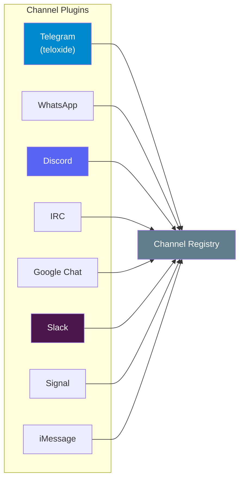

## Tech Stack Summary

| Layer | Rust Crate/Lib | OpenClaw Equivalent |
|-------|---------------|---------------------|
| Runtime | `tokio` | Node.js event loop |
| HTTP/WS | `actix-web` + `actix-ws` | Express + ws |
| Serialization | `serde` + `serde_json` + `json5` | @sinclair/typebox |
| Database | `rusqlite` (SQLite WAL) | better-sqlite3 |
| Telegram | `teloxide` | grammy |
| Logging | `tracing` + `tracing-subscriber` | pino |
| Errors | `thiserror` + `anyhow` | custom Error classes |
| Cancellation | `tokio_util::CancellationToken` | AbortSignal |
| Config validation | Custom (serde) | Zod |
