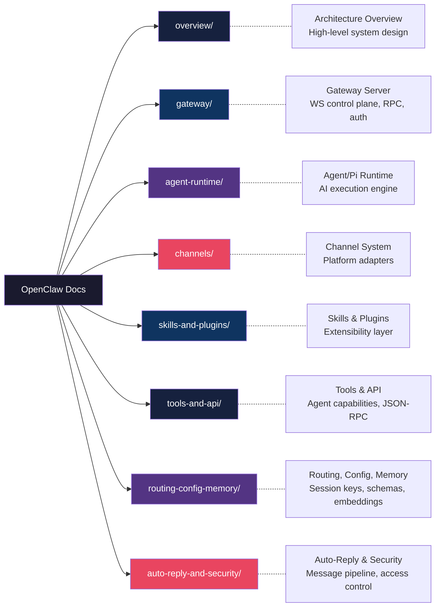
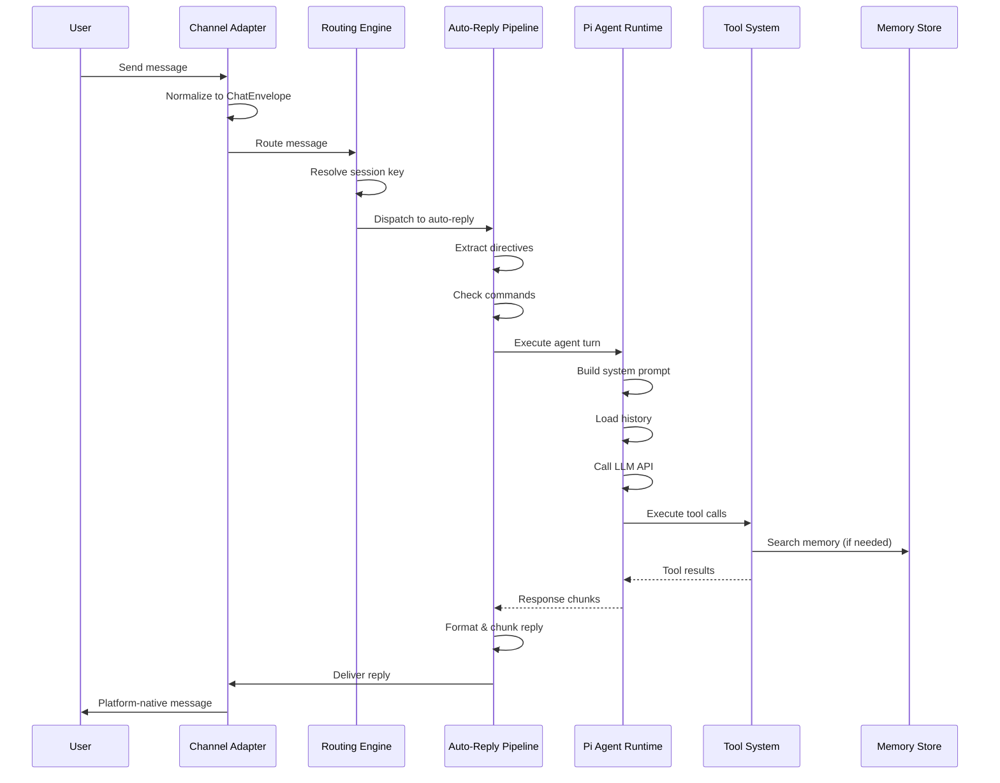

# OpenClaw Reference Documentation

Deep analysis of the [OpenClaw](https://github.com/openclaw/openclaw) personal AI assistant platform. These docs serve as the definitive reference for the **claw-rust** port — covering every subsystem, data flow, and integration point without any code.

## Documentation Map

## Subsystem Index

| # | Directory | Document | Description |
|---|-----------|----------|-------------|
| 0 | [`overview/`](overview/) | Architecture Overview | High-level system design, subsystem map, data flow diagrams |
| 1 | [`gateway/`](gateway/) | Gateway Server | WebSocket control plane, JSON-RPC protocol, authorization, config reload |
| 2 | [`agent-runtime/`](agent-runtime/) | Agent/Pi Runtime | AI model execution, tool orchestration, session management, compaction |
| 3 | [`channels/`](channels/) | Channel System | Platform adapters (WhatsApp, Telegram, Discord, Slack, Signal, etc.) |
| 4 | [`skills-and-plugins/`](skills-and-plugins/) | Skills & Plugins | Skill injection, plugin API, hooks (20 lifecycle events), providers |
| 5 | [`tools-and-api/`](tools-and-api/) | Tools & API | Agent tools, tool policies, sandbox, Gateway JSON-RPC API |
| 6 | [`routing-config-memory/`](routing-config-memory/) | Routing, Config, Memory | Session keys, config schemas, hot-reload, vector embeddings |
| 7 | [`auto-reply-and-security/`](auto-reply-and-security/) | Auto-Reply & Security | Message processing pipeline, DM pairing, exec approvals |

## End-to-End Message Flow

## OpenClaw Source Layout (TypeScript)

| Source Directory | Subsystem | claw-rust Crate |
|------------------|-----------|-----------------|
| `src/gateway/` | Gateway control plane | `claw-gateway` |
| `src/agents/` | Agent/Pi runtime | `claw-core` |
| `src/channels/`, `src/discord/`, `src/telegram/`, etc. | Channel adapters | `claw-channels` |
| `src/auto-reply/` | Message pipeline | `claw-dispatch` |
| `src/plugins/`, `src/plugin-sdk/` | Plugin system | `claw-plugins` |
| `src/routing/` | Session routing | `claw-routing` |
| `src/config/` | Configuration | `claw-config` |
| `src/memory/` | Semantic search | `claw-db` |
| `src/browser/` | Browser control | (future crate) |
| `src/cron/` | Scheduled tasks | (future crate) |
| `src/cli/` | CLI interface | `claw-app` |
| `src/security/` | Security & audit | `claw-core` |
