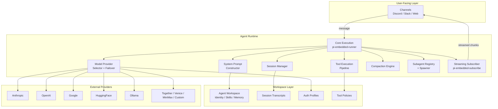
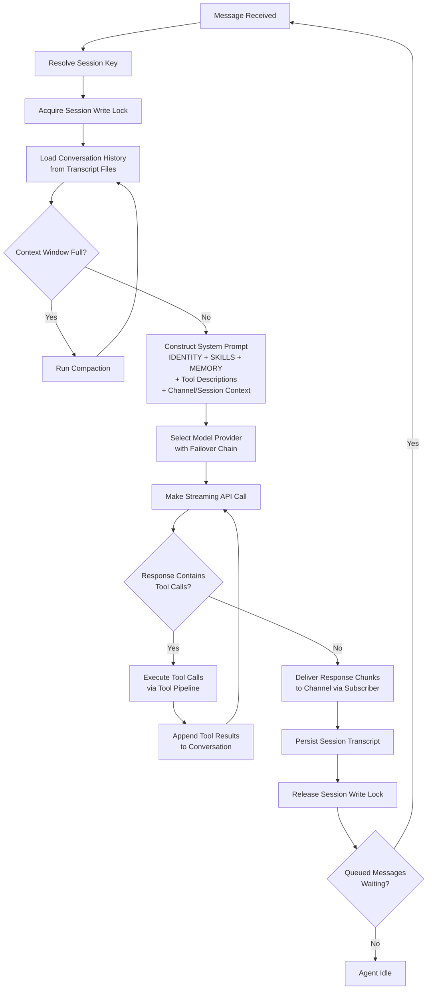
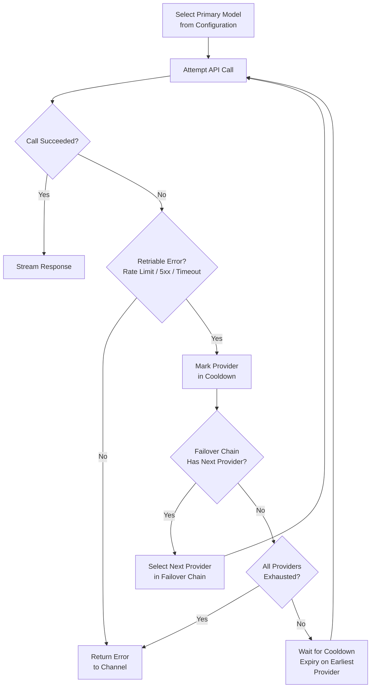
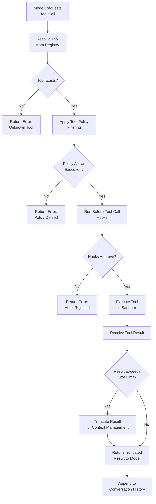
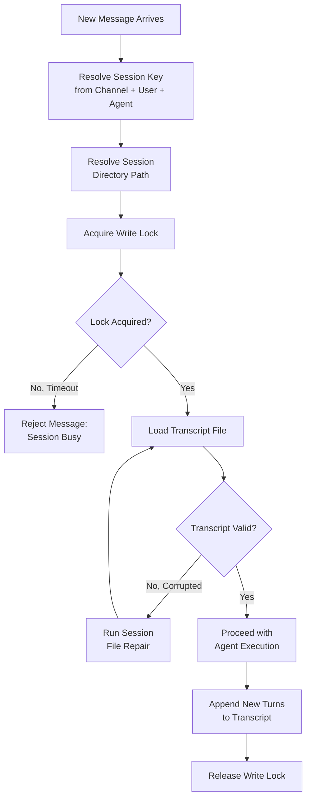
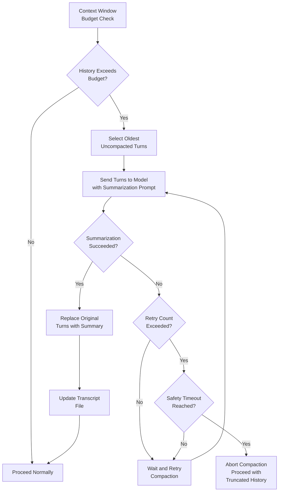

# Agent Runtime — Pi Agent Core Execution Engine

The Agent Runtime is OpenClaw's AI execution engine, built on the "Pi Agent Core" framework. It manages the full lifecycle of conversations between users and LLM models: from receiving a message, through system prompt assembly and model invocation, to streaming responses back and persisting transcripts. Every agent operates within an isolated workspace, with its own identity, skills, memory, tool policies, and session history.

This document covers each subsystem in detail, including execution flow, model management, tool policy enforcement, session persistence, compaction, subagent orchestration, and streaming delivery.

---

## Table of Contents

1. [Architecture Overview](#architecture-overview)
2. [Core Execution API](#core-execution-api)
3. [Agent Execution Lifecycle](#agent-execution-lifecycle)
4. [System Prompt Construction](#system-prompt-construction)
5. [Model Support and Failover](#model-support-and-failover)
6. [Agent Workspace](#agent-workspace)
7. [Tool Execution Pipeline](#tool-execution-pipeline)
8. [Session Management](#session-management)
9. [Compaction](#compaction)
10. [Subagents](#subagents)
11. [Streaming and Subscription](#streaming-and-subscription)
12. [Extensions](#extensions)

---

## Architecture Overview

The Agent Runtime sits at the center of OpenClaw's architecture, mediating between user-facing channels (Discord, Slack, web UI) and LLM provider APIs. It is not a single monolithic module but a composition of cooperating subsystems, each with a clearly scoped responsibility.

Each subsystem is described in its own section below.

---

## Core Execution API

**Source:** `src/agents/pi-embedded-runner.ts`, `src/agents/pi-embedded-runner/`

The core execution module exposes a small, well-defined API surface for controlling agent runs. All interaction with the Agent Runtime passes through these entry points.

### Entry Points

| Function | Purpose |
|---|---|
| `runEmbeddedPiAgent` | Primary entry point. Initiates a full agent execution cycle: resolves the session, loads history, constructs the system prompt, selects a model, calls the API, processes tool calls, streams the response, and persists the transcript. |
| `abortEmbeddedPiRun` | Cancels a currently running agent execution. Propagates an abort signal through the entire call chain, stopping streaming, tool execution, and API calls. Analogous to an `AbortController.abort()` in browser APIs. |
| `isEmbeddedPiRunActive` | Returns whether an agent execution is currently in progress for a given session key. Used by channels to decide whether to queue or reject new messages. |
| `waitForEmbeddedPiRunEnd` | Returns a promise that resolves when the current agent execution completes (or immediately if none is active). Used for orderly shutdown and sequencing. |
| `queueEmbeddedPiMessage` | Enqueues a user message for processing. If an agent run is already active, the message waits in the queue and is picked up when the current run finishes. This prevents race conditions from rapid user input. |
| `isEmbeddedPiRunStreaming` | Returns whether the agent is currently in the streaming phase of its execution (as opposed to tool processing or prompt construction). Used by the UI to show typing indicators and progress. |

### Concurrency Model

Only one agent run may be active per session key at any time. The queue mechanism ensures that rapid successive messages from a user do not spawn parallel runs against the same session state. Instead, messages are serialized and processed in order, each run seeing the full transcript including the previous run's output.

---

## Agent Execution Lifecycle

**Source:** `src/agents/pi-embedded-runner.ts`, `src/agents/pi-embedded-runner/`

The execution lifecycle is the central flow of the runtime, orchestrating every other subsystem.

### Phase Details

**1. Session Resolution.** When a message arrives, the runtime resolves a session key from the channel, user, and agent identifiers. This key determines which transcript file to load and which workspace to use.

**2. Write Lock Acquisition.** Before any read or write to the session transcript, a write lock is acquired. This prevents concurrent runs (from different server instances or race conditions) from corrupting the transcript. See [Session Management](#session-management) for details.

**3. History Loading.** The full conversation history is loaded from the session's transcript files. These are structured files containing every user message, assistant response, tool call, and tool result from the session.

**4. Compaction Check.** If the loaded history exceeds the context window budget for the selected model, compaction is triggered before proceeding. Compaction summarizes older turns to free up token space. See [Compaction](#compaction) for details.

**5. System Prompt Construction.** The system prompt is assembled from workspace files and runtime context. This is one of the most critical steps, as it defines the agent's identity, capabilities, and constraints. See [System Prompt Construction](#system-prompt-construction) for the full breakdown.

**6. Model Selection.** The runtime selects a model provider based on the agent's configuration, with failover logic in case the primary provider is unavailable. See [Model Support and Failover](#model-support-and-failover).

**7. Streaming API Call.** The assembled prompt and history are sent to the selected model provider via a streaming API call. Response tokens arrive incrementally.

**8. Tool Call Loop.** If the model's response includes tool call requests, the runtime enters a loop: it executes the requested tools via the tool pipeline, appends the results to the conversation, and makes another API call so the model can react to the tool output. This loop repeats until the model produces a final text response with no further tool calls.

**9. Response Delivery.** Response chunks are delivered back to the originating channel via the streaming subscriber. The subscriber handles block chunking, code span awareness, and platform-specific formatting.

**10. Transcript Persistence.** The complete exchange (user message, assistant response, all tool calls and results) is appended to the session transcript file.

**11. Lock Release and Queue Drain.** The write lock is released. If messages are waiting in the queue, the next one is immediately picked up and the cycle repeats.

---

## System Prompt Construction

**Source:** `src/agents/system-prompt.ts`

The system prompt is the foundational instruction set sent to the model at the beginning of every API call. It is assembled dynamically from multiple workspace files and runtime context, allowing each agent to have a unique persona, skill set, and awareness of its environment.

### Prompt Components

The system prompt is built by concatenating the following sections, in order:

| Component | Source | Purpose |
|---|---|---|
| Identity | `IDENTITY.md` in agent workspace | Defines the agent's persona, tone, behavioral rules, and constraints. This is the "character sheet" of the agent. |
| Skills | `SKILLS.md` in agent workspace | Describes the skills the agent can perform, written in natural language. Helps the model understand what it is capable of beyond raw tool access. |
| Memory | `MEMORY.md` in agent workspace | Persistent memory context that survives across sessions. Contains facts, preferences, and learned context about users or the environment that the agent should always have available. |
| Tool Descriptions | Generated from tool registry | Machine-readable schemas for every tool available to the agent in the current session. Includes parameter types, descriptions, and usage constraints. Filtered by tool policy. |
| Channel Context | Runtime-injected | Information about the current channel: platform (Discord, Slack, web), channel name, server/guild info, and any channel-specific rules or formatting requirements. |
| Session Context | Runtime-injected | Metadata about the current session: session ID, user identity, conversation start time, and any session-level overrides or flags. |

### Assembly Process

The construction is not simple concatenation. Each section is wrapped with structural markers so the model can parse the boundaries. The tool descriptions section is particularly important because it is the model's only source of truth about what tools exist and how to call them. If a tool is excluded by policy, its description is omitted entirely, making it invisible to the model.

---

## Model Support and Failover

**Source:** `src/agents/models-config.ts`, `src/agents/model-catalog.ts`

The Agent Runtime supports multiple LLM providers and implements a failover system to maintain availability when individual providers experience outages or rate limits.

### Supported Providers

| Provider | Models | Notes |
|---|---|---|
| Anthropic | Claude Pro, Claude Max, Claude Opus | Primary provider for most deployments |
| OpenAI | GPT-4, Codex | Widely supported, strong tool use |
| Google | Gemini family | Multimodal support |
| HuggingFace | Various open models | Hosted inference API |
| Ollama | Any local model | For self-hosted / air-gapped deployments |
| Together | Various open models | Serverless inference platform |
| Venice | Specialized models | Privacy-focused provider |
| MiniMax | Specialized models | Additional provider option |
| Custom Plugins | Any | Extend via plugin interface for custom endpoints |

### Model Selection Hierarchy

Model selection follows a priority chain, with the first match winning:

1. **Session override** — A specific model pinned to the current session (e.g., a user requested a particular model for a task).
2. **Agent configuration** — The model configured in the agent's workspace settings.
3. **Channel default** — A default model assigned to the channel.
4. **Global default** — The system-wide default model.

### Authentication

Each provider requires authentication, managed through auth profiles stored in the agent's workspace. The runtime supports two authentication modes:

- **API Key** — A static key stored in the auth profile. Simple but requires manual rotation.
- **OAuth** — Token-based authentication with automatic refresh. Used for providers that support it. Auth profile rotation distributes load across multiple accounts.

### Failover Chain

**Cooldown Mechanism.** When a provider fails with a retriable error (rate limit, server error, timeout), it is placed in a cooldown state for a configured duration. During cooldown, the provider is skipped in favor of the next one in the failover chain. Cooldowns auto-expire after the configured duration, at which point the provider becomes eligible again.

**Failover Chain Configuration.** Each agent can configure an ordered list of model providers. When the primary fails, the runtime walks the chain in order, skipping any provider currently in cooldown, until one succeeds or all are exhausted.

---

## Agent Workspace

**Source:** `src/agents/workspace.ts`, `src/agents/workspace-dir.ts`

Every agent operates within an isolated workspace directory. The workspace is the agent's "home" — it contains everything specific to that agent, separated from all other agents in the system.

### Workspace Contents

| Directory / File | Purpose |
|---|---|
| `IDENTITY.md` | Agent persona definition |
| `SKILLS.md` | Skill descriptions for system prompt |
| `MEMORY.md` | Persistent cross-session memory |
| `sessions/` | Session transcript files, one per session |
| `auth/` | Auth profiles (API keys, OAuth tokens) per provider |
| `tools/` | Tool policy configuration files |
| `models/` | Model selection and failover configuration |

### Isolation Guarantees

Workspaces are fully isolated. One agent cannot read or modify another agent's workspace. This isolation extends to:

- **Session transcripts** — Each agent sees only its own conversations.
- **Auth profiles** — Credentials are not shared between agents.
- **Tool policies** — Each agent has independent tool access rules.
- **Memory** — One agent's learned context does not leak to another.

The workspace module (`workspace.ts`) provides the API for reading and writing workspace contents, while `workspace-dir.ts` handles path resolution and directory structure creation.

---

## Tool Execution Pipeline

**Source:** `src/agents/pi-tools.ts`

Tool execution is one of the most security-sensitive parts of the runtime. The pipeline enforces policy-based access control, applies filtering, and manages tool results before they re-enter the conversation.

### Policy System

Tool policies are evaluated in a specific precedence order, with more specific rules overriding more general ones:

1. **Sandbox restrictions** — Hard limits on what tools can do in the execution environment (filesystem access, network access, process spawning). These are non-negotiable and cannot be overridden by any other policy layer.
2. **Global deny list** — Tools that are blocked system-wide, regardless of agent or group configuration.
3. **Global allow list** — Tools that are permitted system-wide as a baseline.
4. **Group policies** — Policies applied to groups of agents (e.g., all agents in a specific Discord server).
5. **Agent overrides** — Per-agent policy overrides that can further restrict or (within bounds) expand tool access.
6. **Provider-specific policies** — Some model providers have restrictions on which tools they support. For example, a provider might not support file-write tools.

### Tool Profiles

Tool profiles are named presets that bundle commonly-used tool sets:

| Profile | Included Tools | Typical Use |
|---|---|---|
| `minimal` | Read-only tools, basic text processing | Information retrieval, Q&A agents |
| `coding` | File read/write, shell execution, git operations | Developer assistant agents |
| `messaging` | Channel messaging, DMs, reactions | Social / community agents |
| `full` | All available tools | Unrestricted power agents (admin only) |

Profiles serve as a starting point. Individual tools can be added or removed on top of a profile via the allow/deny lists.

### Before-Tool-Call Hooks

Before a tool is executed, registered hooks run in sequence. These hooks can inspect the tool name, parameters, and conversation context, and either approve or reject the call. Use cases include:

- Logging all tool invocations for audit trails.
- Rate-limiting expensive tools (e.g., web searches).
- Requiring human approval for destructive operations.
- Injecting additional parameters or transforming inputs.

### Result Truncation

Tool results can be arbitrarily large (e.g., reading a large file or fetching a web page). To prevent blowing through the model's context window, results exceeding a configured size limit are truncated. The truncation preserves the beginning and end of the result with a marker indicating how much was removed, so the model is aware that information was lost.

---

## Session Management

**Source:** `src/agents/session-dirs.ts`, `src/agents/session-file-repair.ts`, `src/agents/session-write-lock.ts`

Sessions are the unit of conversation state. Each session maps to a single ongoing conversation between a user (or channel) and an agent.

### Transcript Files

Session transcripts are structured files that store the complete conversation history. Each turn is recorded with:

- The role (user, assistant, tool).
- The content (message text, tool call parameters, tool results).
- Timestamps.
- Metadata (model used, token counts, latency).

Transcript files are the source of truth for conversation history. They are loaded at the start of every agent run and appended to at the end.

### Write Locks

**Source:** `src/agents/session-write-lock.ts`

Write locks prevent concurrent modifications to a session transcript. The lock is file-system-based, using lock files in the session directory. Key properties:

- **Exclusive** — Only one process can hold the lock at a time.
- **Timeout** — Lock acquisition times out after a configured period, preventing deadlocks from crashed processes.
- **Stale detection** — If a lock file is older than a threshold (indicating a crashed holder), it is forcibly broken.

### File Repair

**Source:** `src/agents/session-file-repair.ts`

Transcript files can become corrupted due to crashes during write operations (e.g., power loss, process kill). The repair module detects and fixes common corruption patterns:

- Truncated JSON objects at end of file.
- Duplicate entries from partial writes.
- Missing closing brackets or delimiters.

Repair runs automatically when a corrupt transcript is detected during loading. It is conservative: it preserves as much data as possible and logs what was repaired.

---

## Compaction

**Source:** `src/agents/compaction.ts`

As conversations grow long, the accumulated transcript can exceed the model's context window. Compaction addresses this by summarizing older turns, freeing up token budget for new interactions while preserving essential context.

### How Compaction Works

1. **Budget check.** Before every API call, the runtime calculates the total token count of the system prompt plus conversation history. If it exceeds the budget (typically 80% of the model's context window, leaving room for the response), compaction is triggered.

2. **Turn selection.** The oldest turns that have not yet been compacted are selected. The runtime selects enough turns to bring the total back under budget.

3. **Summarization.** The selected turns are sent to the model with a specialized summarization prompt. The model produces a concise summary that captures the key information, decisions, and context from those turns.

4. **Replacement.** The original turns in the transcript are replaced with a single "compaction" entry containing the summary. The original turns are preserved in an archive section of the transcript for debugging, but are not loaded into context.

### Retry and Safety

Compaction depends on a successful model call, which can fail for the same reasons any API call can (rate limits, timeouts, provider outages). The system retries failed compactions with exponential backoff, up to a configured maximum retry count.

A safety timeout provides a hard upper bound on how long compaction can take. If the timeout is reached, compaction is aborted and the runtime proceeds with a truncated history (dropping the oldest turns entirely) rather than blocking the user indefinitely. This prevents infinite retry loops in pathological scenarios.

---

## Subagents

**Source:** `src/agents/subagent-spawn.ts`, `src/agents/subagent-registry.ts`

Subagents allow a running agent to spawn child agents for delegated tasks. This enables decomposition of complex tasks into subtasks handled by specialized agents.

### Spawning

**Source:** `src/agents/subagent-spawn.ts`

When an agent spawns a subagent, the following occurs:

1. A new isolated session is created for the subagent.
2. The subagent inherits certain context from the parent (task description, relevant memory) but operates in its own workspace.
3. The subagent runs its own execution lifecycle independently.
4. Results are communicated back to the parent via an announce queue.

### Depth Limiting

To prevent infinite recursion (agent A spawns agent B which spawns agent A), the runtime enforces a configurable depth limit. Each subagent spawn increments a depth counter passed through the call chain. When the limit is reached, further spawn requests are rejected with an error returned to the requesting agent.

### Registry

**Source:** `src/agents/subagent-registry.ts`

The subagent registry tracks all currently active subagents. It provides:

- **Lookup** — Find a subagent by its session key or parent relationship.
- **Lifecycle tracking** — Know which subagents are running, completed, or failed.
- **Cleanup** — When a parent agent's session ends, orphaned subagents are detected and terminated.

### Announce Queue

The announce queue is the communication channel between parent and child agents. When a subagent completes its task, it places its result on the announce queue. The parent agent polls or awaits this queue to receive the result and incorporate it into its own conversation flow. This decouples the execution timing of parent and child, allowing asynchronous delegation.

---

## Streaming and Subscription

**Source:** `src/agents/pi-embedded-subscribe.ts`

The streaming subscriber is responsible for delivering model responses back to the user in real time. Rather than waiting for the full response to complete, it processes the stream of tokens as they arrive from the model API.

### Responsibilities

- **Block chunking.** Model responses can be long. The subscriber splits them into platform-appropriate chunks (e.g., Discord has a 2000-character message limit). Splitting is intelligent: it respects paragraph boundaries, avoids splitting mid-sentence where possible, and never splits inside code blocks.

- **Code span awareness.** The subscriber tracks whether the current position in the stream is inside a code block (fenced with triple backticks). This prevents chunk splits from producing malformed code blocks with mismatched delimiters.

- **Reply tag management.** On platforms that support reply threading (Discord, Slack), the subscriber manages reply tags to ensure response chunks appear as a coherent thread rather than disconnected messages.

- **Reasoning/thinking tag handling.** Some models emit reasoning or thinking tags (e.g., `<thinking>...</thinking>`) in their output. The subscriber detects these tags and either strips them (if configured to hide reasoning from the user) or formats them distinctly (e.g., in a collapsible section or with a visual indicator).

### Backpressure

If the channel cannot accept messages fast enough (e.g., due to platform rate limits), the subscriber applies backpressure to the streaming pipeline, slowing down token consumption rather than dropping tokens or buffering unboundedly.

---

## Extensions

**Source:** `src/agents/pi-extensions/`

Extensions provide additional runtime behaviors that augment the core execution lifecycle without modifying it directly.

### Context Pruning

When the conversation context approaches the model's limit but full compaction is not yet warranted, context pruning selectively removes low-value content from the context. This includes:

- Stripping verbose tool results that have already been summarized by the model.
- Removing redundant system messages.
- Trimming overly long individual messages while preserving their semantic content.

Context pruning is a lighter-weight alternative to full compaction and runs more frequently.

### Compaction Safeguards

The compaction safeguards extension adds additional protection around the compaction process:

- Validates that compaction summaries do not exceed a maximum length.
- Ensures that critical context markers (e.g., user preferences, task objectives stated early in the conversation) are preserved even when the turns containing them are compacted.
- Prevents compaction from running during time-sensitive operations (e.g., while a tool call is in progress).

### Session Manager Runtime Registry

This extension maintains a runtime registry of all active session managers across the system. It enables:

- Global visibility into which sessions are active and on which server instances.
- Load balancing decisions based on current session distribution.
- Graceful migration of sessions between instances during deployments or scaling events.

---

## Source File Reference

| Component | Source Path |
|---|---|
| Core Execution | `src/agents/pi-embedded-runner.ts`, `src/agents/pi-embedded-runner/` |
| System Prompt | `src/agents/system-prompt.ts` |
| Model Configuration | `src/agents/models-config.ts` |
| Model Catalog | `src/agents/model-catalog.ts` |
| Agent Workspace | `src/agents/workspace.ts`, `src/agents/workspace-dir.ts` |
| Tool Execution | `src/agents/pi-tools.ts` |
| Session Directories | `src/agents/session-dirs.ts` |
| Session File Repair | `src/agents/session-file-repair.ts` |
| Session Write Lock | `src/agents/session-write-lock.ts` |
| Compaction | `src/agents/compaction.ts` |
| Subagent Spawning | `src/agents/subagent-spawn.ts` |
| Subagent Registry | `src/agents/subagent-registry.ts` |
| Streaming Subscriber | `src/agents/pi-embedded-subscribe.ts` |
| Extensions | `src/agents/pi-extensions/` |
