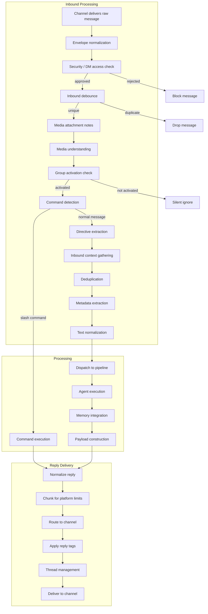
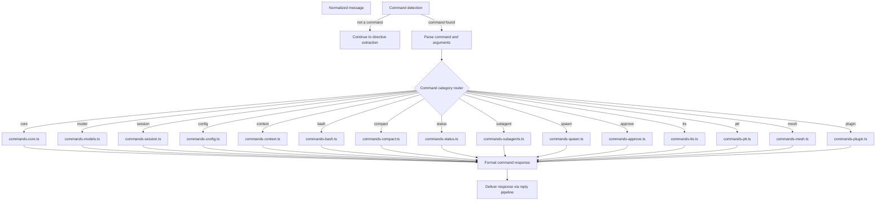
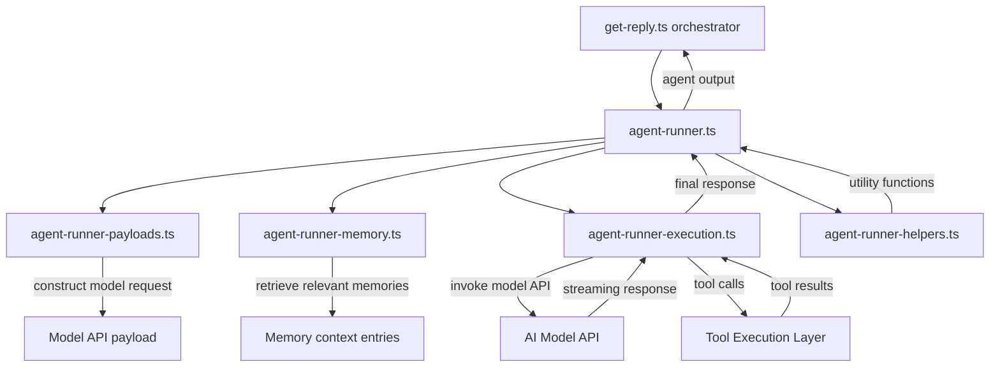
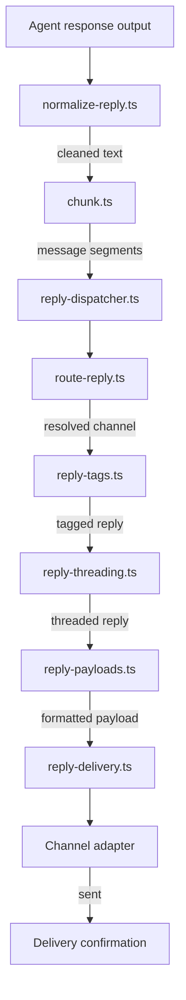
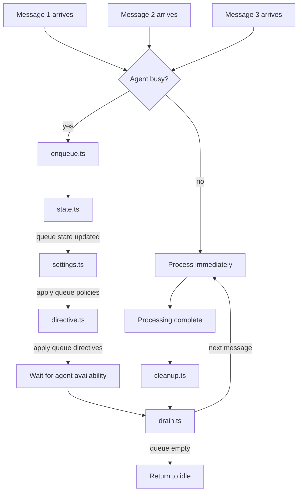
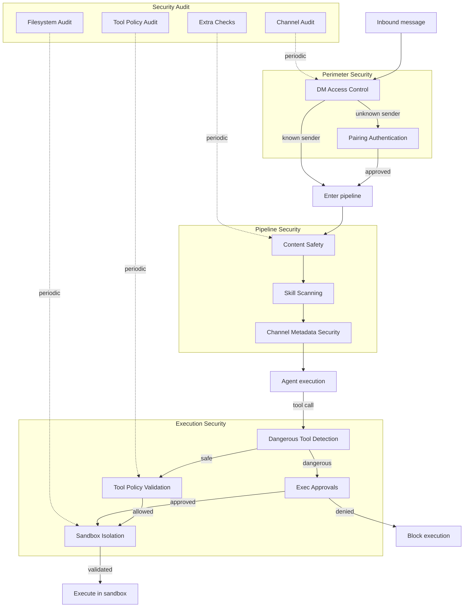
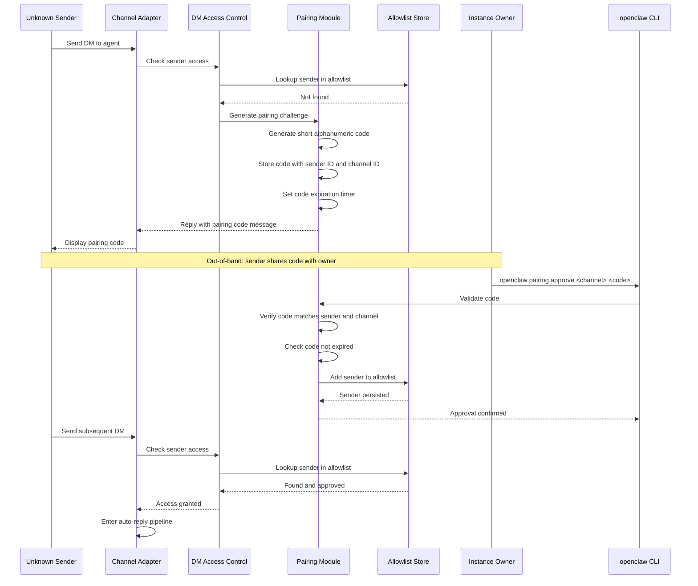
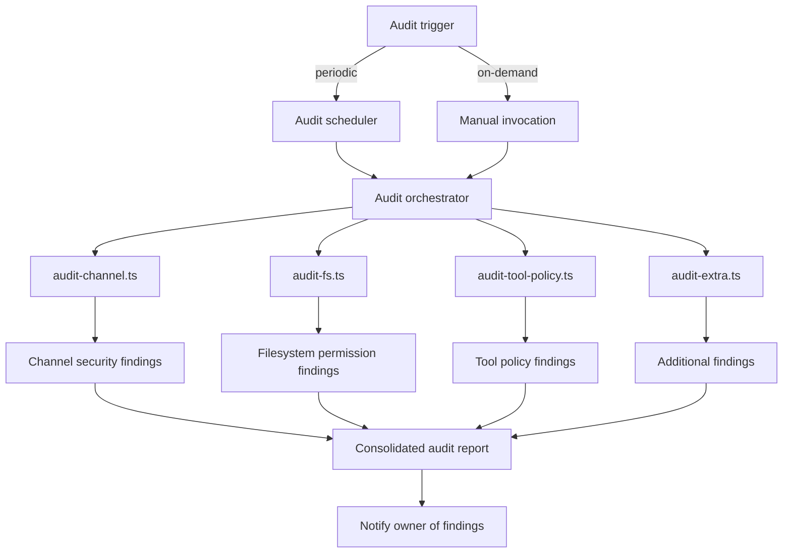
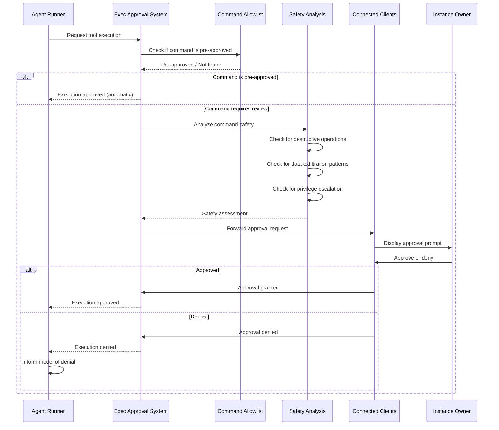

# OpenClaw Auto-Reply Pipeline and Security Subsystem

The auto-reply pipeline is OpenClaw's core message processing engine. It receives inbound messages from any connected channel, normalizes them, runs them through directive extraction, command detection, group activation rules, and deduplication, then executes the AI agent and delivers the reply back to the originating channel. The security subsystem wraps around the entire pipeline, governing DM access control, pairing authentication, content safety, tool execution approvals, and sandbox isolation.

This document covers both subsystems in full depth: the end-to-end auto-reply pipeline from message receipt to reply delivery, the directive system, command dispatch, streaming and queue management, and the full security stack from DM access policies through sandbox validation.

---

## Table of Contents

- [Auto-Reply Pipeline End-to-End](#auto-reply-pipeline-end-to-end)
- [Inbound Processing](#inbound-processing)
- [Directive System](#directive-system)
- [Command Detection and Dispatch](#command-detection-and-dispatch)
- [Group Activation](#group-activation)
- [Reply Generation](#reply-generation)
- [Agent Execution](#agent-execution)
- [Reply Delivery](#reply-delivery)
- [Streaming](#streaming)
- [Queue Management](#queue-management)
- [Typing and Status](#typing-and-status)
- [Message Chunking](#message-chunking)
- [Security System Overview](#security-system-overview)
- [DM Access Control](#dm-access-control)
- [Pairing Flow](#pairing-flow)
- [Security Audit](#security-audit)
- [Content Safety](#content-safety)
- [Exec Approvals](#exec-approvals)
- [Sandbox Security](#sandbox-security)
- [Source File Reference](#source-file-reference)

---

## Auto-Reply Pipeline End-to-End

The auto-reply pipeline is the longest critical path in OpenClaw. A single inbound message traverses normalization, security checks, deduplication, directive extraction, command detection, group activation gating, agent execution, reply formatting, and finally delivery. Every stage can short-circuit the pipeline (for example, a failed security check or a recognized slash command that needs no AI invocation).

The pipeline is designed so that each stage operates on a progressively enriched message object. The envelope normalization stage produces a uniform structure regardless of originating channel (Slack, Discord, Telegram, WebChat, etc.), and every subsequent stage reads from and writes to that normalized envelope. This means the agent execution and reply delivery stages are entirely channel-agnostic.

---

## Inbound Processing

Inbound processing transforms a raw channel-specific message into a normalized, deduplicated, context-enriched envelope ready for the processing stage.

### Envelope Normalization

The `envelope.ts` module is the first thing that touches an inbound message. It receives the raw, channel-specific payload and produces a uniform envelope structure containing the sender identity, channel identity, message body, timestamps, thread information, and any attached media references. Every downstream stage works exclusively with this normalized envelope, never with raw channel data.

Source: `src/auto-reply/envelope.ts`

### Dispatch

Once the envelope is normalized, `dispatch.ts` routes the message into the processing pipeline. Dispatch determines whether the message should enter the reply pipeline, be queued, or be dropped based on the current agent state and pipeline capacity. If the agent is already processing a message for the same conversation, dispatch interacts with the queue system to hold the message until the current run completes.

Source: `src/auto-reply/dispatch.ts`

### Inbound Debounce

The `inbound-debounce.ts` module prevents duplicate processing of the same message. This is necessary because some channels (particularly webhook-based ones) may deliver the same message multiple times due to retries or network conditions. The debounce layer maintains a short-lived cache of recently processed message identifiers and silently drops any duplicates.

Source: `src/auto-reply/inbound-debounce.ts`

### Media Handling

Two modules handle media attachments:

**Media Notes** -- `media-note.ts` inspects the envelope for media attachments (images, audio files, video files, documents) and generates descriptive notes that are appended to the message context. These notes inform the agent that media is present even before any understanding is attempted.

**Media Understanding** -- `media-understanding.ts` processes the actual media content. For images, this means sending them through a vision model to produce a textual description. For audio, it runs speech-to-text transcription. For video, it extracts key frames and processes them as images. The resulting understanding text is merged into the envelope so the agent has full awareness of media content.

Source: `src/auto-reply/media-note.ts`, `src/auto-reply/media-understanding.ts`

---

## Directive System

Directives are inline instructions embedded within messages that modify agent behavior for a specific request. They are parsed from the message text before agent execution and alter parameters such as model selection, reasoning depth, output verbosity, and execution permissions.

```mermaid
flowchart LR
    subgraph Parse["Parse Phase"]
        direction TB
        RAW[Raw message text]
        SCAN[Scan for directive patterns]
        EXTRACT[Extract directive values]
    end

    subgraph Validate["Validate Phase"]
        direction TB
        CHECK[Check directive permissions]
        COMPAT[Check directive compatibility]
        RESOLVE[Resolve conflicts between directives]
    end

    subgraph Apply["Apply Phase"]
        direction TB
        PARAMS[Modify agent parameters]
        PERSIST[Persist directive state]
        STRIP[Strip directives from message text]
    end

    RAW --> SCAN
    SCAN --> EXTRACT
    EXTRACT --> CHECK
    CHECK -->|unauthorized| REJECT[Reject directive]
    CHECK -->|authorized| COMPAT
    COMPAT --> RESOLVE
    RESOLVE --> PARAMS
    PARAMS --> PERSIST
    PERSIST --> STRIP
    STRIP --> CLEAN[Clean message to agent]
```

### Directive Types

**Elevated Model Directive** -- Extracted by `extractElevatedDirective`. Allows a message to request a higher-capability model than the default for a single interaction. This is useful when a particularly complex question benefits from a more capable model without permanently changing the agent's configuration. The directive is validated against allowed model tiers before application.

**Reasoning Directive** -- Extracted by `extractReasoningDirective`. Toggles the reasoning mode on or off for the current request. When reasoning is enabled, the model produces chain-of-thought output that may be visible to the user depending on channel configuration.

**Think Directive** -- Extracted by `extractThinkDirective`. Activates extended thinking mode, where the model is given significantly more processing time and token budget to work through complex problems. This differs from the reasoning directive in that it affects the model's internal computation budget rather than output format.

**Verbose Directive** -- Extracted by `extractVerboseDirective`. When active, the agent produces more detailed output, including intermediate steps, citations, and explanations that would normally be suppressed for brevity.

**Exec Directive** -- Extracted by `extractExecDirective`. Grants or restricts the agent's ability to execute tools and commands for the current interaction. This interacts with the security subsystem's exec approval mechanism.

**Queue Directive** -- Extracted by `extractQueueDirective`. Controls queue behavior for the current message, such as priority elevation or queue bypass.

**Reply-To Tag** -- Extracted by `extractReplyToTag`. Specifies that the reply should be directed to a particular message or user rather than following the default threading behavior.

### Directive Processing Flow

The directive processing flow follows a strict parse-validate-apply sequence. Parsing is purely syntactic: it scans the message text for recognized directive patterns (typically prefixed or suffixed markers). Validation checks that the sender has permission to use the requested directive and that multiple directives do not conflict. Application modifies the agent parameters for the current run, persists any state that needs to survive across the pipeline, and strips the directive markers from the message text so the agent sees clean natural language.

Source: `src/auto-reply/reply/directive-handling.ts`, `src/auto-reply/reply/directive-handling-elevated.ts`, `src/auto-reply/reply/directive-handling-reasoning.ts`, `src/auto-reply/reply/directive-handling-think.ts`, `src/auto-reply/reply/directive-handling-verbose.ts`, `src/auto-reply/reply/directive-handling-exec.ts`, `src/auto-reply/reply/directive-handling-queue.ts`, `src/auto-reply/reply/directive-handling-reply-to.ts`

---

## Command Detection and Dispatch

Commands are slash-prefixed instructions (e.g., `/reset`, `/model`, `/help`) that are handled directly by the command system without invoking the AI agent. Command detection happens early in the pipeline, immediately after group activation checks, so that commands are processed with minimal latency.

### Command Categories

**Core Commands** (`commands-core.ts`) -- Fundamental operations: `/reset` clears conversation history, `/help` displays available commands, and other essential lifecycle commands.

**Model Commands** (`commands-models.ts`) -- `/model` switches the active model, `/models` lists available models with their capabilities and pricing information.

**Session Commands** (`commands-session.ts`) -- Manage conversation sessions: create, switch, list, and delete sessions.

**Config Commands** (`commands-config.ts`) -- View and modify agent configuration at runtime without restarting.

**Context Commands** (`commands-context.ts`) -- Manage the context window: view current usage, inject context, and clear specific context entries.

**Bash Commands** (`commands-bash.ts`) -- Execute shell commands through the agent's bash tool, subject to exec approval policies.

**Compact Commands** (`commands-compact.ts`) -- Trigger conversation compaction, which summarizes older messages to free context window space while preserving key information.

**Status Commands** (`commands-status.ts`) -- Display agent status including current model, active tools, memory usage, and pipeline state.

**Subagent Commands** (`commands-subagents.ts`) -- Manage subagent instances: list active subagents, inspect their state, and terminate them.

**Spawn Commands** (`commands-spawn.ts`) -- Spawn new agent instances for parallel task execution.

**Approval Commands** (`commands-approve.ts`) -- Approve or deny pending tool execution requests from the exec approval queue.

**TTS Commands** (`commands-tts.ts`) -- Configure text-to-speech output for voice-enabled channels.

**PTT Commands** (`commands-ptt.ts`) -- Configure push-to-talk behavior for voice input channels.

**Mesh Commands** (`commands-mesh.ts`) -- Manage mesh network connections: list peers, connect, disconnect, and inspect mesh state.

**Plugin Commands** (`commands-plugin.ts`) -- Manage plugins: list, enable, disable, and configure plugins at runtime.

Source: `src/auto-reply/command-detection.ts`, `src/auto-reply/reply/commands-core.ts`, `src/auto-reply/reply/commands-models.ts`, `src/auto-reply/reply/commands-session.ts`, `src/auto-reply/reply/commands-config.ts`, `src/auto-reply/reply/commands-context.ts`, `src/auto-reply/reply/commands-bash.ts`, `src/auto-reply/reply/commands-compact.ts`, `src/auto-reply/reply/commands-status.ts`, `src/auto-reply/reply/commands-subagents.ts`, `src/auto-reply/reply/commands-spawn.ts`, `src/auto-reply/reply/commands-approve.ts`, `src/auto-reply/reply/commands-tts.ts`, `src/auto-reply/reply/commands-ptt.ts`, `src/auto-reply/reply/commands-mesh.ts`, `src/auto-reply/reply/commands-plugin.ts`

---

## Group Activation

In group chats (Slack channels, Discord servers, Telegram groups), the agent does not respond to every message. The `group-activation.ts` module implements activation rules that determine whether a given message should trigger a reply.

The primary activation mechanism is mention gating: the agent only activates when explicitly mentioned by name or handle. Additional activation rules can be configured per channel, including keyword triggers, reply-chain activation (the agent responds if it is part of an ongoing thread), and always-on mode for specific channels.

When a message does not meet the activation criteria, the pipeline short-circuits with a silent ignore -- no response is sent and no processing resources are consumed.

Source: `src/auto-reply/group-activation.ts`

---

## Reply Generation

Reply generation is the heart of the pipeline. It orchestrates context gathering, agent execution, memory integration, and payload construction into a single coherent reply.

### Inbound Context and Text Processing

Before the agent runs, several modules prepare the input:

**Inbound Context** (`inbound-context.ts`) -- Gathers all relevant context for the current interaction: conversation history, active memory entries, system prompts, tool definitions, and any injected context from commands or directives.

**Inbound Deduplication** (`inbound-dedupe.ts`) -- A second deduplication layer that operates at the semantic level rather than the message ID level. If the same question has been asked very recently in the same conversation, this layer can merge or skip the duplicate.

**Inbound Metadata** (`inbound-meta.ts`) -- Extracts structured metadata from the message: sender information, channel properties, timestamps, referenced messages, and platform-specific attributes.

**Inbound Text** (`inbound-text.ts`) -- Normalizes the message text: resolves mentions to display names, strips platform-specific formatting, handles Unicode normalization, and applies any text transformations required by the active agent configuration.

Source: `src/auto-reply/reply/inbound-context.ts`, `src/auto-reply/reply/inbound-dedupe.ts`, `src/auto-reply/reply/inbound-meta.ts`, `src/auto-reply/reply/inbound-text.ts`

### Reply Orchestration

The `get-reply.ts` module is the top-level orchestrator. It coordinates the full sequence: gather context, construct the agent payload, execute the agent run, process the response, and hand off to delivery. The `get-reply-run.ts` module handles the actual agent run execution, including retry logic, timeout handling, and error recovery.

Source: `src/auto-reply/reply/get-reply.ts`, `src/auto-reply/reply/get-reply-run.ts`

---

## Agent Execution

The agent runner is the component that actually invokes the AI model. It is split across multiple modules for separation of concerns.

### Agent Runner Core

`agent-runner.ts` is the main entry point. It coordinates the lifecycle of a single agent invocation: initialization, payload construction, model execution, tool call handling (potentially multiple rounds), and final response extraction. The runner manages the conversation turn loop where the model may request tool executions, receive results, and continue generating until it produces a final text response.

### Payload Construction

`agent-runner-payloads.ts` assembles the complete payload sent to the model API. This includes the system prompt, conversation history (potentially compacted), tool definitions, memory context, and any directive-modified parameters. Payload construction is where token budget management happens: if the conversation history exceeds the model's context window, older messages are truncated or summarized.

### Memory Integration

`agent-runner-memory.ts` handles retrieval-augmented generation by pulling relevant memory entries from the memory subsystem. Memories are matched against the current query using semantic similarity and recency, then injected into the model context as additional system information. This gives the agent long-term recall beyond the conversation window.

### Execution Logic

`agent-runner-execution.ts` manages the actual model API call, including streaming, timeout enforcement, cancellation handling, and error recovery. When the model returns tool calls, this module dispatches them to the tool execution layer, collects results, and feeds them back into the model for the next turn.

### Helper Utilities

`agent-runner-helpers.ts` provides shared utility functions used across the agent runner modules: token counting, message formatting, response parsing, and other common operations.

Source: `src/auto-reply/reply/agent-runner.ts`, `src/auto-reply/reply/agent-runner-execution.ts`, `src/auto-reply/reply/agent-runner-helpers.ts`, `src/auto-reply/reply/agent-runner-memory.ts`, `src/auto-reply/reply/agent-runner-payloads.ts`

---

## Reply Delivery

Once the agent produces a response, the reply delivery subsystem formats it, routes it to the correct channel, and manages threading.

### Normalization

`normalize-reply.ts` cleans the raw agent output. This includes stripping internal tool-call artifacts, removing model-specific formatting tokens, applying Markdown normalization appropriate for the target channel, and handling edge cases like empty responses or error messages.

### Chunking

`chunk.ts` splits long replies into segments that fit within the target channel's message size limits. Different platforms have different maximum message lengths (Slack: 40,000 characters, Discord: 2,000 characters, Telegram: 4,096 characters, etc.). The chunker is aware of Markdown structure and splits at paragraph or sentence boundaries to avoid breaking formatting.

Source: `src/auto-reply/chunk.ts`

### Dispatch and Routing

`reply-dispatcher.ts` determines which delivery path the reply should take. In most cases this is straightforward: the reply goes back to the same channel and thread it came from. However, directives and commands can redirect replies (e.g., a reply-to directive routing the response to a different user), and mesh network configurations can cause replies to be forwarded to peer nodes.

`route-reply.ts` resolves the abstract routing decision into a concrete channel adapter and delivery target.

### Tags and Threading

`reply-tags.ts` manages reply tag metadata: attribution tags, model identification, and any status indicators that should be attached to the reply.

`reply-threading.ts` handles thread management: creating new threads when appropriate, continuing existing threads, and managing thread references across platforms that support threading (Slack, Discord) versus those that do not (SMS, basic webhooks).

### Payload Formatting and Delivery

`reply-payloads.ts` constructs the final channel-specific payload from the normalized, chunked, tagged, and threaded reply data. This is where the abstract reply is transformed back into channel-specific format (Slack blocks, Discord embeds, Telegram HTML, etc.).

`reply-delivery.ts` performs the actual send operation, handling retries, rate limiting, and delivery confirmation.

Source: `src/auto-reply/reply/reply-delivery.ts`, `src/auto-reply/reply/reply-dispatcher.ts`, `src/auto-reply/reply/reply-payloads.ts`, `src/auto-reply/reply/reply-tags.ts`, `src/auto-reply/reply/reply-threading.ts`, `src/auto-reply/reply/route-reply.ts`, `src/auto-reply/reply/normalize-reply.ts`

---

## Streaming

For channels that support it, replies can be streamed block-by-block rather than delivered as a single message after the agent completes. This provides immediate feedback to the user and reduces perceived latency.

### Block Streaming Architecture

The streaming system operates at the block level rather than the token level. As the agent generates output, the streaming modules group tokens into logical blocks (paragraphs, code blocks, list items) and deliver each block as soon as it is complete. This strikes a balance between responsiveness (the user sees output quickly) and coherence (each delivered chunk is a complete, well-formed unit).

**Block Streaming** (`block-streaming.ts`) -- Manages the stream lifecycle: opening the stream, delivering blocks, handling backpressure from slow channels, and closing the stream when the agent completes.

**Block Reply Pipeline** (`block-reply-pipeline.ts`) -- Processes each block through a miniature version of the reply pipeline: normalization, formatting, and channel adaptation happen per-block rather than on the complete response.

**Block Reply Coalescer** (`block-reply-coalescer.ts`) -- Merges very small blocks into larger ones to avoid flooding the channel with tiny messages. For example, if the agent produces three single-sentence paragraphs in rapid succession, the coalescer may combine them into a single delivered block.

**Streaming Directives** (`streaming-directives.ts`) -- Handles stream-level control signals: pause, resume, cancel, and flush. These can be triggered by user actions (sending a new message while the agent is still streaming) or by system events (timeout, error).

Source: `src/auto-reply/reply/block-streaming.ts`, `src/auto-reply/reply/block-reply-pipeline.ts`, `src/auto-reply/reply/block-reply-coalescer.ts`, `src/auto-reply/reply/streaming-directives.ts`

---

## Queue Management

The queue system ensures orderly processing when multiple messages arrive faster than the agent can handle them. Rather than dropping messages or processing them out of order, the queue holds pending messages and drains them sequentially.

### Queue Components

**Enqueue** (`enqueue.ts`) -- Adds a message to the queue. Validates that the queue has capacity (configurable maximum depth), applies priority ordering if queue directives are present, and updates queue state.

**Drain** (`drain.ts`) -- The drain loop runs whenever the agent becomes available after completing a processing run. It pulls the next message from the queue (respecting priority order) and feeds it into the processing pipeline. If the queue is empty, the agent returns to idle state.

**State** (`state.ts`) -- Maintains the current queue state: pending messages, processing status, queue depth, and ordering. The state is observable by the status command so users can inspect what is queued.

**Directive** (`directive.ts`) -- Applies queue-specific directives that modify queue behavior: priority elevation, queue bypass for urgent messages, and batch processing hints.

**Cleanup** (`cleanup.ts`) -- Removes completed messages from the queue, handles expired messages (messages that have waited too long), and performs periodic queue maintenance.

**Settings** (`settings.ts`) -- Configurable queue parameters: maximum depth, timeout duration, priority scheme, and overflow behavior (drop oldest, reject new, etc.).

Source: `src/auto-reply/reply/queue/enqueue.ts`, `src/auto-reply/reply/queue/drain.ts`, `src/auto-reply/reply/queue/state.ts`, `src/auto-reply/reply/queue/directive.ts`, `src/auto-reply/reply/queue/cleanup.ts`, `src/auto-reply/reply/queue/settings.ts`

---

## Typing and Status

**Typing Indicators** -- The `typing.ts` and `typing-mode.ts` modules manage typing indicators on channels that support them. When the agent begins processing a message, a typing indicator is activated on the originating channel. The indicator is maintained throughout the processing duration and cleared when the reply is delivered or the processing fails. For long-running operations (such as tool executions that take tens of seconds), the typing indicator is periodically refreshed to prevent it from timing out.

**Reply Status** -- `status.ts` tracks the current state of the reply pipeline: idle, processing, streaming, queued, or error. This status is exposed to the Gateway for broadcasting to connected clients, enabling the Control UI to display real-time pipeline state.

Source: `src/auto-reply/typing.ts`, `src/auto-reply/typing-mode.ts`, `src/auto-reply/status.ts`

---

## Message Chunking

The `chunk.ts` module deserves detailed attention because it solves a subtle problem: delivering arbitrarily long agent outputs across platforms with vastly different message size limits.

The chunker operates in three phases. First, it determines the target platform's maximum message length. Second, it parses the message into structural units (paragraphs, code blocks, blockquotes, list items, headings). Third, it greedily fills chunks up to the platform limit, splitting only at structural boundaries. If a single structural unit exceeds the limit (for example, a very long code block), the chunker falls back to line-level splitting within that unit. Each chunk is a valid, self-contained Markdown document that can be rendered independently.

Source: `src/auto-reply/chunk.ts`

---

## Security System Overview

The security subsystem is distributed across several modules but forms a coherent defense-in-depth architecture. Security checks operate at multiple layers: before a message enters the pipeline (DM access control), during processing (content safety, tool policy), and during execution (exec approvals, sandbox validation).

---

## DM Access Control

DM (Direct Message) access control is the outermost security boundary. It determines whether a sender is permitted to interact with the agent at all, before any message processing occurs.

Four policies are available, configured per channel:

**Pairing Policy (default)** -- Unknown senders receive a short pairing code in response to their first message. The code must be approved by the instance owner before the sender is granted access. This is the recommended policy for production deployments because it prevents unauthorized access while still allowing new users to onboard without manual allowlist management.

**Allowlist Policy** -- Only senders whose identifiers appear on an explicit allowlist are permitted. All other senders are silently ignored. This is the most restrictive policy and is appropriate for high-security deployments.

**Open Policy** -- All senders are accepted without any verification. This requires explicit opt-in and is only appropriate for public-facing agents that are designed to interact with anyone (e.g., a customer support bot on a website).

**Disabled Policy** -- DM processing is completely disabled for the channel. The agent does not respond to any direct messages, only to group messages where it is explicitly activated.

Source: `src/security/`

---

## Pairing Flow

The pairing flow is the default authentication mechanism for new senders on channels using the pairing policy.

### Pairing Details

The pairing code is a short alphanumeric string designed to be easily communicated verbally or via a separate messaging channel. Codes have a configurable expiration time (default: a few minutes) to prevent stale codes from being used long after they were issued. Each code is bound to a specific sender-channel pair, so a code generated on Telegram cannot be used to approve access on Slack.

The allowlist store is persisted locally, so approved senders retain access across agent restarts. The store supports revocation: an owner can remove a sender from the allowlist at any time, causing subsequent messages from that sender to trigger a new pairing challenge.

Source: `src/pairing/`

---

## Security Audit

The security audit subsystem performs periodic and on-demand security checks across multiple dimensions. It is designed to catch configuration drift, permission escalation, and other security issues that may develop over time.

### Audit Dimensions

**Channel Security Audit** (`audit-channel.ts`) -- Checks that channel configurations are secure: verifying that DM access policies are set appropriately, that webhook secrets are configured, that TLS is enabled where required, and that channel-specific security settings are consistent with the global security posture.

**Filesystem Permission Audit** (`audit-fs.ts`) -- Verifies that the agent's workspace directories have correct permissions, that sensitive files (config, secrets, allowlists) are not world-readable, and that the agent does not have write access to directories outside its designated workspace.

**Tool Policy Audit** (`audit-tool-policy.ts`) -- Validates that tool execution policies are correctly configured: checking that dangerous tools require approval, that tool allowlists and blocklists are consistent, and that no tool has been granted permissions that exceed the configured security level.

**Extra Security Checks** (`audit-extra.ts`) -- Additional checks that do not fit neatly into the other categories. This module supports both synchronous checks (run inline) and asynchronous checks (scheduled as background tasks). Examples include verifying that model API keys have appropriate scopes, checking for known vulnerable dependency versions, and validating network access policies.

Source: `src/security/audit.ts`, `src/security/audit-channel.ts`, `src/security/audit-fs.ts`, `src/security/audit-tool-policy.ts`, `src/security/audit-extra.ts`

---

## Content Safety

The content safety modules protect against malicious or dangerous content both in inbound messages and in agent outputs.

**External Content Sanitization** (`external-content.ts`) -- Sanitizes content from external sources before it enters the agent's context. This includes stripping potentially harmful HTML, neutralizing injection attempts in user-supplied text, and validating URLs against known malicious patterns.

**Dangerous Tool Detection** (`dangerous-tools.ts`) -- Maintains a classification of tools by their risk level. Tools that can modify the filesystem, execute arbitrary code, access the network, or interact with external services are classified as dangerous and routed through the exec approval system rather than being executed automatically.

**Timing-Safe Secret Comparison** (`secret-equal.ts`) -- Provides constant-time string comparison for security-sensitive operations such as webhook signature verification and API key validation. This prevents timing side-channel attacks where an attacker could determine how many characters of a secret they have guessed correctly based on response time.

**Skill Content Scanning** (`skill-scanner.ts`) -- Scans skill definitions and skill outputs for potentially dangerous content. Skills are user-contributed extensions, and this scanner checks for embedded shell commands, suspicious URL patterns, prompt injection attempts, and other indicators of malicious skill content.

**Channel Metadata Security** (`channel-metadata.ts`) -- Validates and sanitizes channel metadata to prevent metadata injection attacks. Maliciously crafted channel names, topic strings, or user display names could be used to inject instructions into the agent's context; this module neutralizes such attempts.

Source: `src/security/external-content.ts`, `src/security/dangerous-tools.ts`, `src/security/secret-equal.ts`, `src/security/skill-scanner.ts`, `src/security/channel-metadata.ts`

---

## Exec Approvals

The exec approval system is the gatekeeper for tool execution. When the agent requests execution of a tool classified as dangerous (or when the agent is configured in approval-required mode), the request is held pending human approval.

### Approval Components

**Command Allowlist** -- A configurable list of commands and tool invocations that are pre-approved for automatic execution. This typically includes safe read-only operations (listing files, reading documentation, running tests) that the agent uses frequently. The allowlist supports glob patterns so broad categories can be approved without enumerating every variant.

**Safety Analysis** -- Before forwarding an approval request to the owner, the system performs automated safety analysis of the requested command. This analysis checks for common patterns of destructive operations (file deletion, disk formatting), data exfiltration (network transfers of sensitive files), and privilege escalation (sudo, chmod, chown). The safety assessment is included in the approval prompt to help the owner make an informed decision.

**Approval Forwarding** -- Pending approval requests are forwarded to all connected clients (Control UI, mobile nodes) via the Gateway's event broadcasting system. Any authorized client can respond to the approval request. If no client responds within the configured timeout, the request is automatically denied.

Source: `src/infra/exec-approvals.ts`

---

## Sandbox Security

The sandbox security module validates the isolation guarantees of Docker-based sandboxed execution environments.

When the agent executes tools within a Docker container (the recommended configuration for production deployments), the sandbox security module verifies the following before permitting execution:

**Container Isolation** -- Validates that the Docker container is properly isolated: checking that it runs with a non-root user, that privileged mode is not enabled, that capabilities are dropped to the minimum required set, and that the container's PID namespace is isolated.

**Workspace Access Control** -- Verifies that the container's filesystem mounts are correctly configured: the agent workspace is mounted read-write at the expected path, no sensitive host directories are exposed, and temporary directories are properly scoped.

**Network Access Policies** -- Validates that network access from within the container matches the configured policy. In restricted mode, only specific allowed endpoints are reachable. In isolated mode, no network access is permitted. In open mode (which requires explicit opt-in), unrestricted network access is available.

These validations run at container startup and can be re-validated periodically during long-running agent sessions to detect configuration drift.

Source: `src/agents/sandbox/validate-sandbox-security.ts`

---

## Source File Reference

### Auto-Reply Pipeline

| Module | Source File |
|--------|------------|
| Envelope normalization | `src/auto-reply/envelope.ts` |
| Message dispatch | `src/auto-reply/dispatch.ts` |
| Command detection | `src/auto-reply/command-detection.ts` |
| Group activation | `src/auto-reply/group-activation.ts` |
| Inbound debounce | `src/auto-reply/inbound-debounce.ts` |
| Media notes | `src/auto-reply/media-note.ts` |
| Media understanding | `src/auto-reply/media-understanding.ts` |
| Typing indicators | `src/auto-reply/typing.ts`, `src/auto-reply/typing-mode.ts` |
| Reply status | `src/auto-reply/status.ts` |
| Message chunking | `src/auto-reply/chunk.ts` |

### Reply Generation

| Module | Source File |
|--------|------------|
| Inbound context | `src/auto-reply/reply/inbound-context.ts` |
| Inbound deduplication | `src/auto-reply/reply/inbound-dedupe.ts` |
| Inbound metadata | `src/auto-reply/reply/inbound-meta.ts` |
| Inbound text | `src/auto-reply/reply/inbound-text.ts` |
| Reply orchestrator | `src/auto-reply/reply/get-reply.ts` |
| Reply run execution | `src/auto-reply/reply/get-reply-run.ts` |
| Agent runner | `src/auto-reply/reply/agent-runner.ts` |
| Agent execution | `src/auto-reply/reply/agent-runner-execution.ts` |
| Agent helpers | `src/auto-reply/reply/agent-runner-helpers.ts` |
| Agent memory | `src/auto-reply/reply/agent-runner-memory.ts` |
| Agent payloads | `src/auto-reply/reply/agent-runner-payloads.ts` |

### Directives

| Module | Source File |
|--------|------------|
| Directive handling | `src/auto-reply/reply/directive-handling.ts` |
| Elevated directive | `src/auto-reply/reply/directive-handling-elevated.ts` |
| Reasoning directive | `src/auto-reply/reply/directive-handling-reasoning.ts` |
| Think directive | `src/auto-reply/reply/directive-handling-think.ts` |
| Verbose directive | `src/auto-reply/reply/directive-handling-verbose.ts` |
| Exec directive | `src/auto-reply/reply/directive-handling-exec.ts` |
| Queue directive | `src/auto-reply/reply/directive-handling-queue.ts` |
| Reply-to tag | `src/auto-reply/reply/directive-handling-reply-to.ts` |

### Commands

| Module | Source File |
|--------|------------|
| Core commands | `src/auto-reply/reply/commands-core.ts` |
| Model commands | `src/auto-reply/reply/commands-models.ts` |
| Session commands | `src/auto-reply/reply/commands-session.ts` |
| Config commands | `src/auto-reply/reply/commands-config.ts` |
| Context commands | `src/auto-reply/reply/commands-context.ts` |
| Bash commands | `src/auto-reply/reply/commands-bash.ts` |
| Compact commands | `src/auto-reply/reply/commands-compact.ts` |
| Status commands | `src/auto-reply/reply/commands-status.ts` |
| Subagent commands | `src/auto-reply/reply/commands-subagents.ts` |
| Spawn commands | `src/auto-reply/reply/commands-spawn.ts` |
| Approval commands | `src/auto-reply/reply/commands-approve.ts` |
| TTS commands | `src/auto-reply/reply/commands-tts.ts` |
| PTT commands | `src/auto-reply/reply/commands-ptt.ts` |
| Mesh commands | `src/auto-reply/reply/commands-mesh.ts` |
| Plugin commands | `src/auto-reply/reply/commands-plugin.ts` |

### Reply Delivery

| Module | Source File |
|--------|------------|
| Reply delivery | `src/auto-reply/reply/reply-delivery.ts` |
| Reply dispatcher | `src/auto-reply/reply/reply-dispatcher.ts` |
| Reply payloads | `src/auto-reply/reply/reply-payloads.ts` |
| Reply tags | `src/auto-reply/reply/reply-tags.ts` |
| Reply threading | `src/auto-reply/reply/reply-threading.ts` |
| Route reply | `src/auto-reply/reply/route-reply.ts` |
| Normalize reply | `src/auto-reply/reply/normalize-reply.ts` |

### Streaming

| Module | Source File |
|--------|------------|
| Block streaming | `src/auto-reply/reply/block-streaming.ts` |
| Block reply pipeline | `src/auto-reply/reply/block-reply-pipeline.ts` |
| Block reply coalescer | `src/auto-reply/reply/block-reply-coalescer.ts` |
| Streaming directives | `src/auto-reply/reply/streaming-directives.ts` |

### Queue Management

| Module | Source File |
|--------|------------|
| Enqueue | `src/auto-reply/reply/queue/enqueue.ts` |
| Drain | `src/auto-reply/reply/queue/drain.ts` |
| Queue state | `src/auto-reply/reply/queue/state.ts` |
| Queue directive | `src/auto-reply/reply/queue/directive.ts` |
| Queue cleanup | `src/auto-reply/reply/queue/cleanup.ts` |
| Queue settings | `src/auto-reply/reply/queue/settings.ts` |

### Security

| Module | Source File |
|--------|------------|
| Security audit | `src/security/audit.ts` |
| Channel audit | `src/security/audit-channel.ts` |
| Filesystem audit | `src/security/audit-fs.ts` |
| Tool policy audit | `src/security/audit-tool-policy.ts` |
| Extra audit checks | `src/security/audit-extra.ts` |
| External content | `src/security/external-content.ts` |
| Dangerous tools | `src/security/dangerous-tools.ts` |
| Secret comparison | `src/security/secret-equal.ts` |
| Skill scanner | `src/security/skill-scanner.ts` |
| Channel metadata | `src/security/channel-metadata.ts` |
| Exec approvals | `src/infra/exec-approvals.ts` |
| Sandbox security | `src/agents/sandbox/validate-sandbox-security.ts` |
| Pairing | `src/pairing/` |
