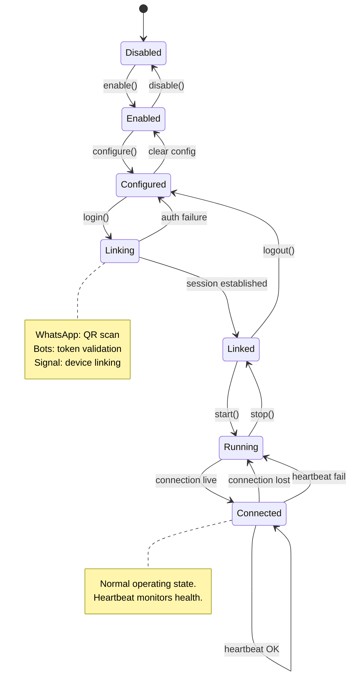
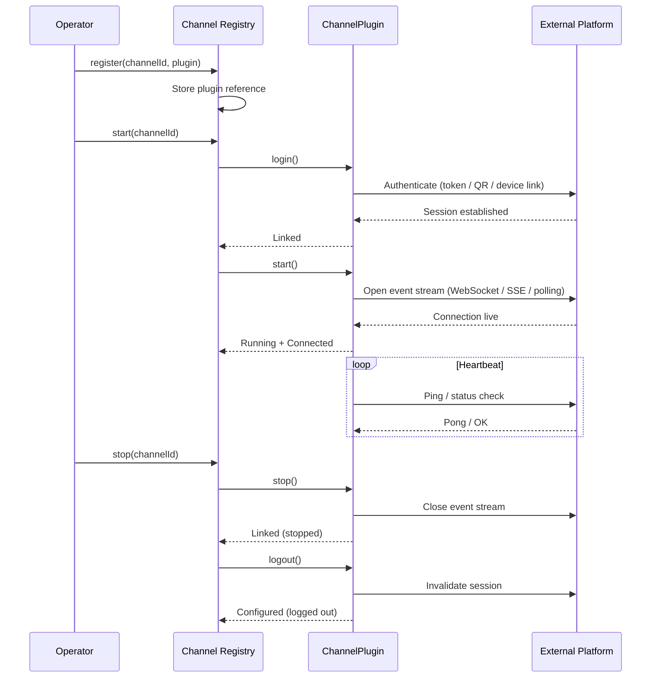
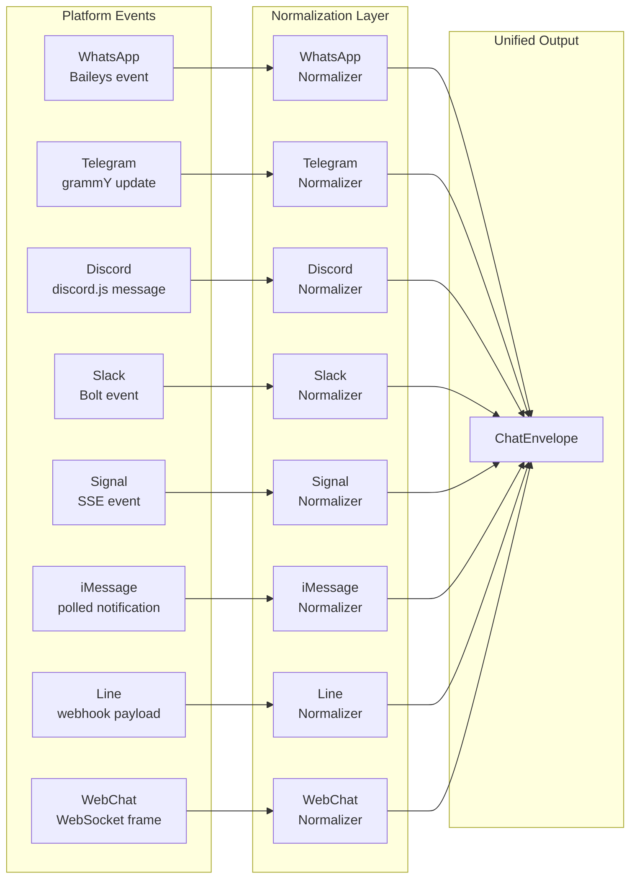
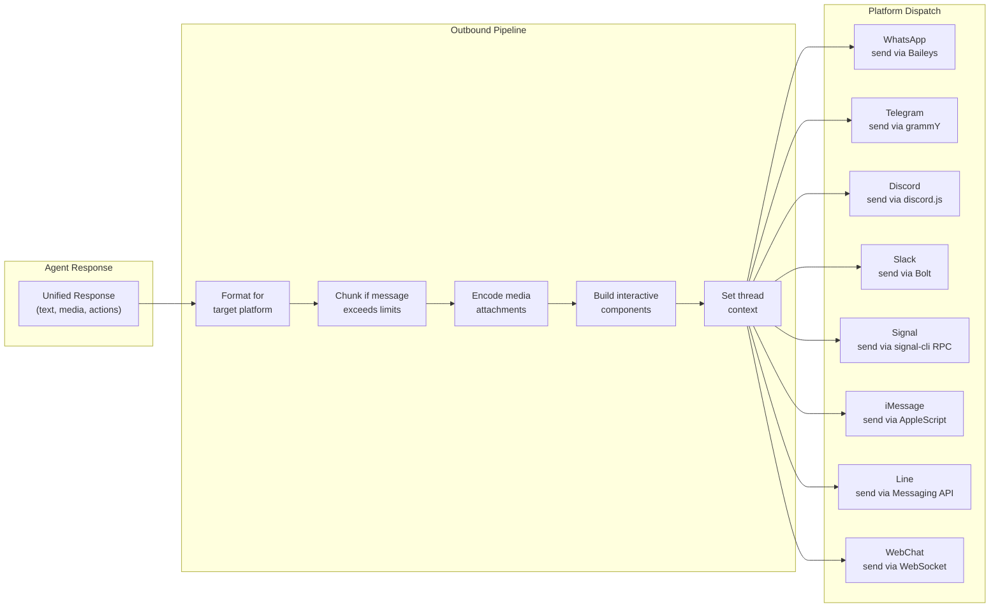
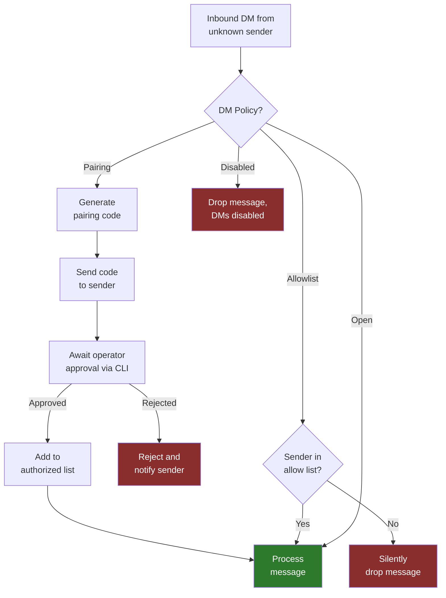
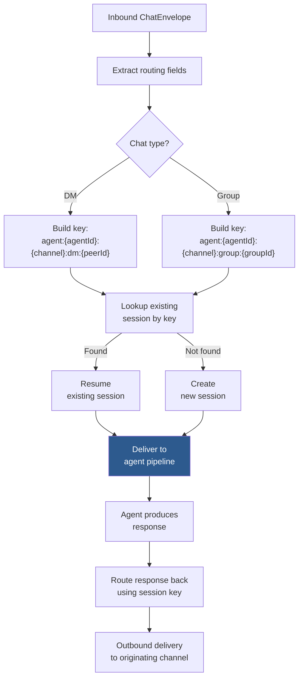
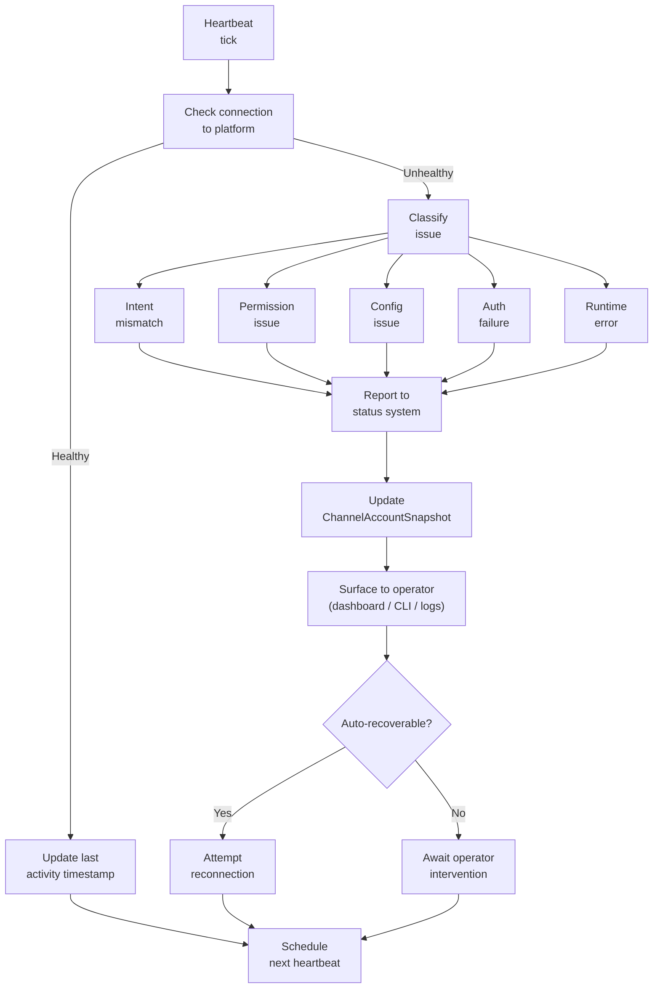

# OpenClaw Channel System

The Channel System is OpenClaw's abstraction layer for messaging platforms. It normalizes the wildly different protocols of WhatsApp, Telegram, Discord, Slack, Signal, iMessage, Line, and a built-in WebChat into a single unified interface. Every inbound message, regardless of origin, is transformed into a `ChatEnvelope`; every outbound reply is translated back into the target platform's native format. This document covers the full architecture: plugin interfaces, adapters, capabilities, lifecycle, routing, access control, normalization, outbound delivery, media handling, and health monitoring.

---

## Table of Contents

1. [Channel Plugin Architecture](#channel-plugin-architecture)
2. [Adapter Breakdown](#adapter-breakdown)
3. [Channel Capabilities](#channel-capabilities)
4. [Channel Account State](#channel-account-state)
5. [Built-in Channels](#built-in-channels)
6. [Channel Registry and Lifecycle](#channel-registry-and-lifecycle)
7. [Message Normalization](#message-normalization)
8. [Outbound Delivery](#outbound-delivery)
9. [Access Control](#access-control)
10. [Channel Routing and Sessions](#channel-routing-and-sessions)
11. [Channel Status and Health Monitoring](#channel-status-and-health-monitoring)
12. [Media Pipeline](#media-pipeline)

---

## Channel Plugin Architecture

Every messaging platform is represented as a **ChannelPlugin** -- a composite object that bundles a set of typed adapters behind a single interface. The plugin itself does not contain business logic; instead, it delegates to purpose-specific adapters. This composition-based design means each adapter can be developed, tested, and replaced independently.

The core types live in:

- `src/channels/plugins/types.core.ts` -- Foundational shared types (identifiers, envelopes, primitives)
- `src/channels/plugins/types.plugin.ts` -- The `ChannelPlugin` interface definition
- `src/channels/plugins/types.adapters.ts` -- Individual adapter interface contracts

```mermaid
graph TB
    subgraph "ChannelPlugin Composite"
        Plugin["ChannelPlugin Interface<br/>(types.plugin.ts)"]

        Plugin --> Auth["Authentication<br/>Adapter"]
        Plugin --> Config["Configuration<br/>Adapter"]
        Plugin --> Directory["Directory<br/>Adapter"]
        Plugin --> Gateway["Gateway<br/>Adapter"]
        Plugin --> Groups["Groups<br/>Adapter"]
        Plugin --> Heartbeat["Heartbeat<br/>Adapter"]
        Plugin --> LoginLogout["Login / Logout<br/>Adapter"]
        Plugin --> Outbound["Message Outbound<br/>Adapter"]
        Plugin --> Pairing["Pairing<br/>Adapter"]
        Plugin --> Security["Security Setup<br/>Adapter"]
        Plugin --> Messaging["Messaging<br/>Adapter"]
        Plugin --> Threading["Threading<br/>Adapter"]
        Plugin --> Mention["Mention<br/>Adapter"]
        Plugin --> MessageAction["Message Action<br/>Adapter"]
    end

    Auth -.- AuthDesc["Credentials, tokens,<br/>OAuth flows"]
    Config -.- ConfigDesc["Platform-specific<br/>settings"]
    Directory -.- DirDesc["User/group<br/>lookup"]
    Gateway -.- GwDesc["Inbound event<br/>ingestion"]
    Groups -.- GrpDesc["Group membership,<br/>metadata"]
    Heartbeat -.- HbDesc["Connection keep-alive,<br/>health pings"]
    LoginLogout -.- LlDesc["Session open/close,<br/>QR codes"]
    Outbound -.- ObDesc["Formatted message<br/>dispatch"]
    Pairing -.- PrDesc["Unknown sender<br/>authorization"]
    Security -.- SecDesc["Encryption, keys,<br/>verification"]
    Messaging -.- MsgDesc["Target normalization,<br/>directory formatting"]
    Threading -.- ThrDesc["Reply modes,<br/>thread context"]
    Mention -.- MenDesc["@mention text<br/>normalization"]
    MessageAction -.- MaDesc["Buttons, cards,<br/>rich messages"]

    style Plugin fill:#2d5a8e,color:#fff
```

---

## Adapter Breakdown

Each adapter within a ChannelPlugin serves a distinct responsibility. All adapter interfaces are defined in `src/channels/plugins/types.adapters.ts`.

### Authentication Adapter

Manages credential storage and validation for the platform connection. For bot-based platforms (Telegram, Discord, Slack), this holds the bot token. For session-based platforms (WhatsApp, Signal), this manages ephemeral session keys and device linking state.

### Configuration Adapter

Exposes platform-specific configuration knobs. Each channel has different requirements: webhook URLs for Telegram and Line, socket mode toggles for Slack, daemon paths for Signal, monitor intervals for iMessage.

### Directory Adapter

Provides user and group lookup. Given a platform-specific identifier, it returns a normalized user profile or group descriptor. This is used during message normalization to resolve display names, avatars, and membership lists.

### Gateway Adapter

The inbound event ingestion point. The gateway receives raw platform events (webhook payloads, WebSocket frames, SSE streams, polling results) and converts them into internal event representations that feed into the normalization pipeline.

### Groups Adapter

Handles group-specific operations: listing group members, fetching group metadata (name, description, avatar), detecting group migrations, and tracking membership changes. Platforms vary dramatically here -- Discord has guilds with nested channels, Telegram has supergroups with migration events, WhatsApp has groups with admin hierarchies.

### Heartbeat Adapter

Maintains connection health. Sends periodic pings or status checks to detect silent disconnections. WhatsApp in particular relies on heartbeat to detect when the multi-device session has dropped without an explicit disconnect event.

### Login / Logout Adapter

Manages session lifecycle. For WhatsApp, this involves QR code generation and scanning. For bot platforms, this validates and applies bot tokens. Logout tears down active connections and clears session state.

### Message Outbound Adapter

Transforms a normalized outbound message into the platform's native format and dispatches it. Handles chunking for platforms with message length limits, media attachment encoding, and delivery confirmation.

### Pairing Adapter

Manages the authorization flow for unknown senders. When a new user contacts the agent and the channel's DM policy is set to "pairing," this adapter generates a pairing code, presents it to the user, and validates it against an approval from an operator.

### Security Setup Adapter

Handles platform-specific security configuration: end-to-end encryption handshakes, key verification prompts, trust-on-first-use (TOFU) decisions, and security notification preferences.

### Messaging Adapter

Responsible for target normalization (converting platform-specific recipient identifiers into the unified format) and directory formatting (preparing user/group data for display within conversations).

### Threading Adapter

Manages reply modes and thread context. Platforms implement threading differently: Slack has explicit threads, Telegram has reply-to-message, Discord has threads and reply references. This adapter normalizes these into a consistent threading model with reply modes and context propagation.

### Mention Adapter

Normalizes @-mention syntax. Discord uses `<@userId>`, Slack uses `<@UXXXXXXX>`, Telegram uses entities with offset/length. This adapter converts all mention formats into a platform-agnostic representation during normalization and back to native format during outbound delivery.

### Message Action Adapter

Handles interactive message components: buttons, cards, select menus, modals, and other rich message elements. Discord uses Components (buttons, select menus), Slack uses Block Kit, Telegram uses inline keyboards, and this adapter provides a unified interface for all of them.

---

## Channel Capabilities

Each channel declares a `ChannelCapabilities` object that advertises what the platform supports. The runtime uses these declarations to make decisions about message formatting, feature gating, and UI presentation.

Capability categories include:

**Chat Types**
- Direct messages (DM) -- one-on-one conversations
- Group chats -- multi-participant conversations with shared context
- Channels -- broadcast-style or topic-organized spaces (Discord channels, Slack channels)

**Interactive Features**
- Polls -- native poll creation and vote collection
- Reactions -- emoji reactions to messages
- Editing -- modifying sent messages after delivery
- Threading -- reply chains and thread context

**Media Types**
- Image, audio, video, document support per platform
- Voice messages (platform-native audio recording format)
- Stickers, GIFs, and animated media

**Streaming Behaviors**
- Draft stream support -- edit-in-place streaming (Telegram and Slack support this; the bot edits its own message repeatedly to simulate streaming output)
- Typing indicators -- platform-native "user is typing" signals

The capabilities object is consulted throughout the pipeline. For example, if a channel does not declare threading support, the system will not attempt to set thread context on outbound messages. If a channel does not support editing, streaming responses fall back to sequential message sends rather than edit-in-place.

---

## Channel Account State

The `ChannelAccountSnapshot` type captures the full runtime state of a channel connection at a point in time. This is used for monitoring dashboards, health checks, and reconnection logic.

Defined in `src/channels/plugins/types.core.ts`.

**State Flags:**

| Flag | Meaning |
|------|---------|
| `enabled` | Channel is configured and intended to be active |
| `configured` | All required configuration fields are populated |
| `linked` | Session is established with the platform (device linked, bot token validated) |
| `running` | The channel's event loop is actively processing |
| `connected` | Network connection to the platform is live |

**Timestamps:**

| Timestamp | Meaning |
|-----------|---------|
| Last activity | Most recent inbound or outbound message |
| Last disconnect | Most recent unexpected connection drop |

The snapshot is a read-only view. State transitions are managed by the channel lifecycle within the registry.

---

## Built-in Channels

OpenClaw ships with eight channel implementations. Each lives in its own directory under the source tree and implements the full `ChannelPlugin` interface through its adapters.

### WhatsApp

**Source:** `src/web/`
**Library:** Baileys (unofficial WhatsApp Web API)

WhatsApp is the most complex channel due to its session-based authentication and multi-device protocol. Login requires scanning a QR code with the WhatsApp mobile app. Once linked, the session persists across restarts using stored credentials, but can be invalidated by the mobile app at any time.

Key characteristics:
- QR code login flow managed by the Login/Logout adapter
- Multi-device support (does not require phone to stay online after linking)
- Group and DM support with distinct message routing
- Full media handling: images, videos, documents, voice messages
- Heartbeat adapter monitors connection health aggressively due to Baileys' tendency for silent disconnects
- Connection state recovery on transient network failures

### Telegram

**Source:** `src/telegram/`
**Library:** grammY framework

Telegram uses bot token authentication -- a single token string issued by BotFather. The Gateway adapter supports two ingestion modes: webhook (HTTP POST from Telegram servers) and long polling (the bot pulls updates).

Key characteristics:
- Bot token authentication (simple, stateless)
- Webhook or polling mode (configurable per deployment)
- Inline keyboard buttons and model selection buttons via the Message Action adapter
- Draft stream support: the bot edits its own message in-place to simulate streaming, providing a smooth typing experience
- Custom command menu registration (slash commands visible in the Telegram UI)
- Group migration handling: Telegram sometimes migrates groups to supergroups, changing the group ID; the Groups adapter detects and handles this transparently

### Discord

**Source:** `src/discord/`
**Library:** discord.js

Discord's guild/channel model is the most hierarchically complex. A single bot connection spans multiple guilds (servers), each containing multiple text channels, voice channels, threads, and categories.

Key characteristics:
- Bot token authentication via the Discord developer portal
- Guild management: the bot tracks which guilds it belongs to and resolves channels within them
- Component-based interactions: buttons, select menus, and modals through discord.js's component system
- Voice message support (Opus-encoded audio attachments)
- PluralKit integration: detects and handles messages from PluralKit proxy bots, attributing them to the correct system member
- Presence management: sets the bot's online status and activity display
- Typing indicators: shows "bot is typing" while generating responses

### Slack

**Source:** `src/slack/`
**Library:** Bolt framework

Slack offers two connection modes: Socket Mode (WebSocket-based, no public URL required) and HTTP Events (webhook-based, requires a public endpoint). The Bolt framework abstracts both behind a unified event API.

Key characteristics:
- OAuth or direct bot token authentication
- Socket Mode or HTTP events (deployment-dependent)
- Block Kit UI: Slack's rich message format supporting blocks, sections, buttons, modals, and interactive elements through the Message Action adapter
- Thread resolution: Slack threads are identified by a parent message timestamp (`thread_ts`); the Threading adapter manages thread context propagation
- Channel migration: handles workspace restructuring events
- Draft stream support: edits messages in-place for streaming responses, similar to Telegram

### Signal

**Source:** `src/signal/`
**Library:** signal-cli (external daemon)

Signal is unusual in that it relies on an external daemon process (signal-cli) rather than a direct API library. The Gateway adapter connects to signal-cli's SSE (Server-Sent Events) stream to receive messages.

Key characteristics:
- Daemon mode: signal-cli runs as a separate process; OpenClaw connects via SSE
- Group support with group metadata lookup
- Reaction levels: Signal supports reactions on messages; the adapter normalizes these
- RPC context: commands to signal-cli are sent via JSON-RPC

### iMessage

**Source:** `src/imessage/`
**Integration:** Legacy AppleScript + BlueBubbles

The iMessage channel is the most platform-constrained: it only works on macOS and relies on either AppleScript automation of Messages.app or the BlueBubbles server project.

Key characteristics:
- Monitor-based polling: periodically checks for new messages rather than receiving push events
- Notification parsing: extracts message content from macOS notification structures
- Target parsing helpers: resolves iMessage handles (phone numbers, email addresses) into routable targets
- Limited feature set compared to other channels (no threading, no reactions, no rich messages)

### Line

**Source:** `src/line/`
**Library:** LINE Messaging API

Line is webhook-based and follows a request-reply model similar to Telegram's webhook mode.

Key characteristics:
- Webhook-based event ingestion
- Flex message templates: Line's rich message format for cards and interactive layouts
- Rich menu support: persistent bottom-of-screen menu UI

### WebChat

**Source:** `src/channel-web.ts`

The built-in web client channel. Unlike external platform channels, WebChat is served directly by OpenClaw and communicates over the agent's own HTTP/WebSocket interface.

Key characteristics:
- No external dependencies or API keys required
- Direct integration with the OpenClaw web interface
- Serves as a fallback channel for testing and direct browser-based interaction

---

## Channel Registry and Lifecycle

The **Channel Registry** is the central manager for all loaded channel plugins. It handles registration, startup, shutdown, and runtime queries.

**Source:** `src/channels/registry.ts`

The registry maintains the `ChannelAccountSnapshot` for each registered channel. External systems (monitoring dashboards, the CLI, the web admin panel) query the registry for current channel state.

Lifecycle operations are serialized per channel -- you cannot start a channel that is already starting, or stop one that is already stopping. The registry enforces this through state machine guards.

---

## Message Normalization

Normalization is the process of converting a platform-specific inbound message into the unified `ChatEnvelope` format. Each channel has its own normalization module.

**Source:** `src/channels/plugins/normalize/`

Per-channel normalizers:
- `src/channels/plugins/normalize/` contains normalizers for Discord, Slack, Telegram, WhatsApp, Signal, and iMessage

### What Normalization Extracts

Each normalizer extracts and maps the following from raw platform events:

**Sender Identity**
- Platform-specific user ID mapped to a canonical identifier
- Display name, avatar URL, and contact metadata
- Group membership role (admin, member, etc.) where applicable

**Message Content**
- Text body with mention normalization (platform @-mention syntax converted to canonical form)
- Media attachments (images, audio, video, documents) with URLs and metadata
- Reply context (which message is being replied to, if any)
- Thread context (thread ID, parent message reference)

**Conversation Context**
- Chat type (DM, group, channel)
- Group/channel identifier and metadata
- Platform-specific routing information preserved for outbound reply targeting

**Message Metadata**
- Timestamp
- Message ID (platform-native)
- Edit flag (is this an edit of a previous message)
- Forward/relay flag

The resulting `ChatEnvelope` is platform-agnostic and flows into the agent's processing pipeline without any downstream component needing to know which platform originated the message.

---

## Outbound Delivery

Outbound delivery is the reverse of normalization: converting a platform-agnostic response into the target platform's native message format and dispatching it.

**Source:** `src/channels/plugins/outbound/`

Per-channel outbound handlers exist for Discord, Slack, Telegram, WhatsApp, Signal, and iMessage.

### Outbound Pipeline Stages

**Formatting**
The raw response text is converted into the platform's native format. Markdown may be converted to platform-specific markup (Slack's mrkdwn, Telegram's MarkdownV2 or HTML, Discord's markdown subset). Mentions are converted from canonical form back to platform-native syntax.

**Chunking**
Platforms impose message length limits. WhatsApp limits messages to approximately 65,000 characters, Telegram to 4,096, Discord to 2,000, Slack to approximately 40,000 (but with practical limits for readability). The chunking stage splits long responses into multiple messages, preserving logical boundaries (paragraph breaks, code block integrity) where possible.

**Media Attachment Encoding**
Attached media is prepared for the platform: images may be resized or reformatted, audio may be transcoded, documents are checked against platform size limits. Each platform has specific upload requirements and the outbound handler ensures compliance.

**Interactive Component Building**
If the response includes actions (buttons, cards, select menus), the Message Action adapter builds platform-native components: Discord Components, Slack Block Kit, Telegram inline keyboards, Line Flex messages.

**Thread Context Setting**
If the conversation is threaded, the Threading adapter sets the appropriate reply reference: Slack's `thread_ts`, Telegram's `reply_to_message_id`, Discord's `message_reference`.

---

## Access Control

Access control determines who can communicate with the agent through each channel. Policies are configured per channel and enforce authorization at the DM and group level.

**DM Policies:**

| Policy | Behavior |
|--------|----------|
| **Pairing** (default) | Unknown sender receives a pairing code. An operator must approve the code via CLI before the conversation proceeds. |
| **Allowlist** | Only pre-configured user IDs may initiate DMs. All others are silently ignored. |
| **Open** | Any user can initiate a DM without authorization. |
| **Disabled** | DMs are completely disabled for this channel. |

### Group Access

Groups have separate access considerations:

**Group Mention Gating**
The agent can be configured to only respond in groups when explicitly @-mentioned. This prevents the agent from responding to every message in a busy group. The Mention adapter detects whether the agent was mentioned and the access control layer gates processing accordingly.

**Command Gating**
Specific commands can be restricted by channel, by chat type (DM vs. group), or by user role. This allows operators to expose different command sets in different contexts.

**Allow-From Lists**
Per-channel allow-from lists can restrict which groups the agent participates in. Groups not on the list are ignored even if the bot is a member.

---

## Channel Routing and Sessions

Routing determines how inbound messages are dispatched to the correct agent session and how outbound replies find their way back to the right conversation.

**Source:** `src/channels/session.ts`, `src/routing/`

### Session Key Format

Every conversation is identified by a structured session key that encodes all routing dimensions:

**DM Session Key:**
`agent:{agentId}:{channel}:dm:{peerId}`

**Group Session Key:**
`agent:{agentId}:{channel}:group:{groupId}`

### Routing Dimensions

The session key captures four orthogonal dimensions:

**Agent** -- Which agent instance handles this conversation. A single OpenClaw deployment can run multiple agents, each with different configurations and personalities.

**Channel** -- Which platform the conversation originates from (whatsapp, telegram, discord, slack, signal, imessage, line, web).

**Chat Type** -- DM or group. This determines conversation isolation: DMs are private per-peer, groups are shared across all participants.

**Peer/Group ID** -- The platform-specific identifier for the conversation partner (DM) or the group.

This four-dimensional key ensures complete isolation: the same user talking to the same agent over two different channels has two separate sessions. The same user in a DM and in a group has two separate sessions. There is no cross-contamination of conversation state.

---

## Channel Status and Health Monitoring

Continuous health monitoring ensures that channel issues are detected and surfaced promptly.

**Source:** `src/channels/plugins/status.ts`, `src/channels/plugins/status-issues/`

### Status Issue Categories

When a channel encounters a problem, it is classified into one of five categories:

| Category | Description | Examples |
|----------|-------------|----------|
| **Intent** | The operator's intended state does not match the actual state | Channel enabled but not started, channel disabled but still running |
| **Permissions** | The bot lacks required permissions on the platform | Cannot send messages, cannot read group members, missing OAuth scopes |
| **Config** | Configuration is missing or invalid | No bot token, malformed webhook URL, missing API key |
| **Auth** | Authentication has failed or expired | Token revoked, session invalidated, QR code expired |
| **Runtime** | Unexpected runtime errors | Connection dropped, API rate limited, platform outage |

### Health Check Flow

Runtime errors that are transient (network timeouts, temporary rate limits) trigger automatic reconnection attempts with exponential backoff. Persistent errors (revoked tokens, permission changes) require operator intervention and are surfaced prominently in the monitoring interface.

---

## Media Pipeline

The media pipeline handles the encoding, validation, and transport of media attachments across channels with different capabilities and constraints.

**Source:** `src/channels/plugins/media-limits.ts`

### Per-Channel Media Limits

Each channel has platform-imposed limits on media size and type:

| Channel | Max Image | Max Video | Max Audio | Max Document | Notes |
|---------|-----------|-----------|-----------|-------------|-------|
| WhatsApp | 16 MB | 16 MB | 16 MB | 100 MB | Voice messages use Opus in OGG |
| Telegram | 10 MB (photo), 50 MB (file) | 50 MB | 50 MB | 50 MB | Photos auto-compressed above 10 MB |
| Discord | 25 MB (Nitro: 100 MB) | 25 MB | 25 MB | 25 MB | Limits vary by server boost level |
| Slack | 1 GB | 1 GB | 1 GB | 1 GB | Workspace storage quota applies |
| Signal | 100 MB | 100 MB | 100 MB | 100 MB | Encrypted in transit |
| iMessage | Varies | Varies | Varies | Varies | Constrained by Messages.app |
| Line | 200 MB | 200 MB | 200 MB | 200 MB | Flex message image constraints differ |
| WebChat | Deployment-dependent | Deployment-dependent | Deployment-dependent | Deployment-dependent | Limited by server configuration |

### Media Processing Flow

Inbound media is downloaded from the platform, stored temporarily, and made available to the agent pipeline. The agent may use media for context (image understanding, audio transcription) or pass it through.

Outbound media is validated against the target channel's limits. If the media exceeds the limit, the pipeline may attempt to compress or transcode it. If the media cannot be made compliant, the outbound handler falls back to sending a link or an error notification.

**Transcription Hooks**
Audio and voice messages can be routed through transcription services before reaching the agent. This allows the agent to process voice messages as text, which is particularly useful for WhatsApp and Discord voice messages.
