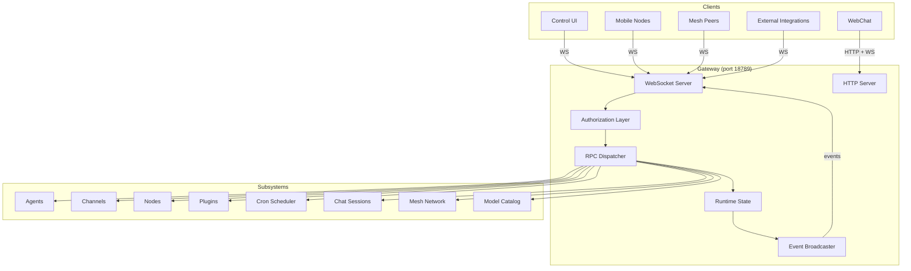
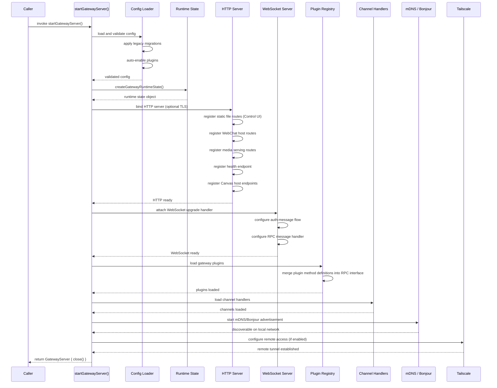
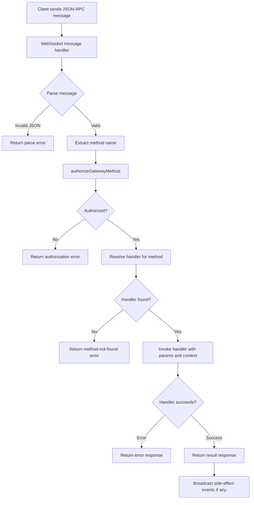
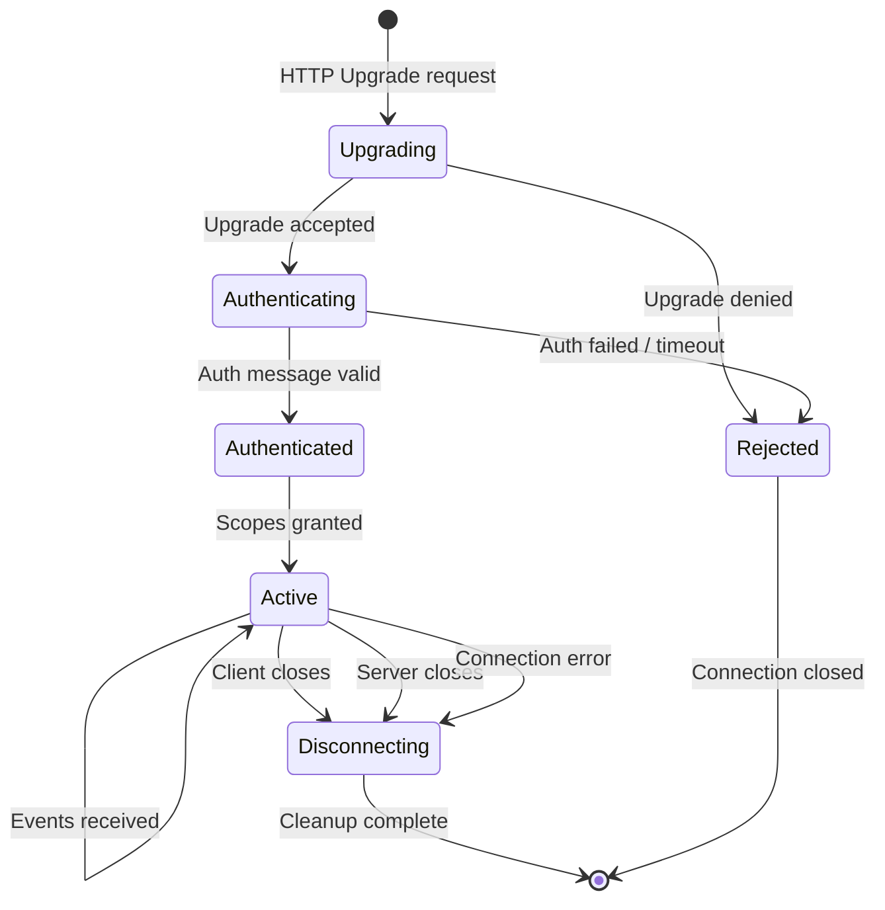
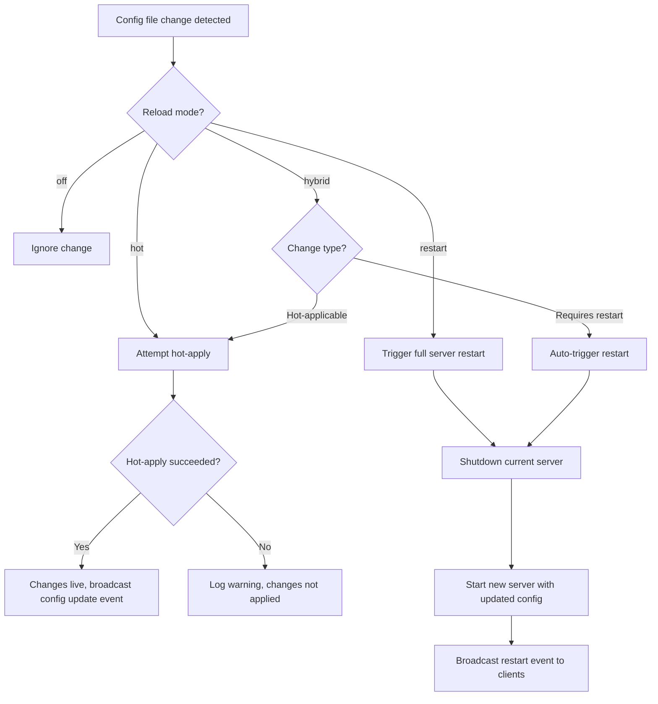

# OpenClaw Gateway Subsystem

The Gateway is OpenClaw's central control plane. It runs as a WebSocket server on port 18789 (by default) and orchestrates every other component in the system: agents, channels, nodes, devices, plugins, cron jobs, and chat sessions. All client interactions, whether from the Control UI, mobile nodes, or mesh peers, flow through the Gateway's unified RPC interface.

This document covers the Gateway's architecture in full depth: server lifecycle, RPC protocol, authorization, WebSocket management, HTTP layer, config reload, and supporting subsystems.

---

## Table of Contents

- [High-Level Architecture](#high-level-architecture)
- [Server Startup Sequence](#server-startup-sequence)
- [RPC Protocol](#rpc-protocol)
- [RPC Dispatch Flow](#rpc-dispatch-flow)
- [Authorization Model](#authorization-model)
- [WebSocket Connection Lifecycle](#websocket-connection-lifecycle)
- [HTTP Layer](#http-layer)
- [Event Broadcasting](#event-broadcasting)
- [Config Reload](#config-reload)
- [Supporting Subsystems](#supporting-subsystems)
- [Source File Reference](#source-file-reference)

---

## High-Level Architecture

The Gateway sits at the center of the OpenClaw topology. Every subsystem communicates through it, and it exposes a single JSON-RPC-over-WebSocket endpoint to all clients.

The Gateway combines an HTTP server (for static assets, health checks, media, and plugin routes) with a WebSocket server (for the RPC protocol). Both can optionally run over TLS. The `GatewayServer` object returned by `startGatewayServer()` encapsulates the entire runtime and provides a `close()` method for graceful shutdown.

---

## Server Startup Sequence

The entry point is `startGatewayServer()` in `src/gateway/server.impl.ts`. Startup proceeds through a deterministic sequence of phases. Each phase must complete before the next begins; a failure at any phase halts the server.

### Startup Phase Details

**Config Loading and Validation** -- The server reads the primary config file, validates it against the expected schema, and applies any legacy migrations needed for backward compatibility. Plugins marked for auto-enablement are activated at this stage. Source: `src/gateway/server.impl.ts`, `src/gateway/server-runtime-config.ts`.

**Runtime State Creation** -- `createGatewayRuntimeState()` builds the in-memory state container that all subsystems share. This includes connection registries, session maps, agent registries, and channel state. Source: `src/gateway/server-runtime-state.ts`.

**HTTP/WebSocket Server Binding** -- The HTTP server binds to the configured address and port. If TLS is configured, certificates are loaded and applied. The WebSocket upgrade handler is attached to the same HTTP server, so both protocols share a single port. Source: `src/gateway/server-http.ts`, `src/gateway/server.impl.ts`.

**Canvas Host Integration** -- If Canvas hosting is enabled, the appropriate endpoints are registered on the HTTP server to serve Canvas content. Source: `src/gateway/server.impl.ts`.

**Control UI Serving** -- The built Control UI assets are served as static files from the HTTP layer, making the management interface accessible via a browser. Source: `src/gateway/server-http.ts`.

**Plugin Loading** -- Gateway plugins are loaded from the configured plugin directory. Each plugin can contribute RPC method definitions, HTTP routes, and event handlers. Plugin method definitions are merged into the unified RPC interface so they appear indistinguishable from built-in methods to clients. Source: `src/gateway/server-plugins.ts`.

**Channel Handler Loading** -- Channel handlers (for Slack, Discord, Telegram, and other integrations) are loaded and registered. Each channel gets its own lifecycle management. Source: `src/gateway/server-channels.ts`.

**mDNS/Bonjour Discovery** -- The server advertises itself on the local network via mDNS (Bonjour), allowing other OpenClaw instances and compatible clients to discover it without manual configuration. Source: `src/gateway/server-discovery.ts`.

**Tailscale Configuration** -- If Tailscale is configured, the server establishes a tunnel for secure remote access without port forwarding. Source: `src/gateway/server.impl.ts`.

**Graceful Shutdown** -- The returned `GatewayServer` object exposes a `close()` method that tears down all subsystems in reverse order: stops Tailscale, removes mDNS advertisements, disconnects WebSocket clients, closes the HTTP server, and releases runtime state. Source: `src/gateway/server.impl.ts`.

---

## RPC Protocol

The Gateway exposes a JSON-RPC interface over WebSocket. Every operation, whether reading data, mutating state, or managing approvals, is expressed as a typed RPC call.

### Schema Modules

The protocol is defined across 17 schema modules in `src/gateway/protocol/`. Each module defines the request and response types for a domain:

| Module | Domain |
|---|---|
| `agent` | Individual agent operations |
| `agents-models-skills` | Agent, model, and skill registry queries |
| `channels` | Channel status and management |
| `config` | Configuration read/write |
| `cron` | Scheduled job management |
| `error-codes` | Standardized error code definitions |
| `exec-approvals` | Human-in-the-loop approval workflows |
| `devices` | Device registration and management |
| `frames` | UI frame management |
| `logs-chat` | Log streaming and chat history |
| `mesh` | Mesh network operations |
| `nodes` | Compute node management |
| `protocol-schemas` | Protocol-level type definitions |
| `sessions` | Session lifecycle |
| `snapshot` | System state snapshots |
| `types` | Shared type definitions |
| `wizard` | Setup wizard operations |

### Method Categories

The 40+ server methods in `src/gateway/server-methods/` are organized into four categories by their operational semantics:

**Read Methods (40+)** -- These are pure queries that do not modify state. They require the `operator.read` scope. Examples include:

- `health` -- Server health and version information
- `logs.tail` -- Stream recent log entries
- `agents.list` -- Enumerate registered agents
- `chat.history` -- Retrieve chat session history
- `mesh.status` -- Current mesh network topology
- `sessions.list` -- Active session enumeration
- `config.get` -- Read configuration values
- `channels.status` -- Channel connection states
- `cron.list` -- Scheduled job listing

**Write Methods (20+)** -- These mutate system state. They require the `operator.write` scope. Examples include:

- `send` -- Send a message through a channel
- `agent` -- Create or update an agent
- `chat.send` -- Send a chat message within a session
- `node.invoke` -- Invoke an operation on a compute node
- `mesh.run` -- Execute a mesh operation
- `config.set` -- Replace a configuration value
- `config.patch` -- Partially update a configuration value

**Approval Methods (3)** -- These manage the human-in-the-loop approval workflow, requiring the `operator.approvals` scope:

- `exec.approval.request` -- Submit an action for human approval
- `exec.approval.waitDecision` -- Block until approval/rejection
- `exec.approval.resolve` -- Approve or reject a pending request

**Pairing Methods (10)** -- These handle device and node registration, requiring the `operator.pairing` scope. They cover the complete pairing flow: initiation, challenge-response verification, and finalization for both nodes and end-user devices.

---

## RPC Dispatch Flow

Every incoming WebSocket message follows a strict dispatch pipeline. Authorization is evaluated before the handler is even resolved, ensuring that unauthorized requests never reach business logic.

### Dispatch Details

**Message Parsing** -- The raw WebSocket frame is parsed as JSON. Malformed messages receive an immediate error response without further processing.

**Method Extraction** -- The `method` field is extracted from the parsed JSON-RPC envelope. This string determines both the authorization scope and the handler to invoke.

**Authorization Gate** -- `authorizeGatewayMethod()` maps the method name to its required scope and checks the authenticated connection's granted scopes. This happens before handler resolution, so even the existence of a handler is not leaked to unauthorized clients.

**Handler Resolution** -- The method name is looked up in the unified handler registry. This registry contains both built-in handlers (from `src/gateway/server-methods/`) and plugin-contributed handlers (merged during startup). Plugin methods are indistinguishable from built-in methods at this stage.

**Handler Invocation** -- The resolved handler receives the parsed parameters and a context object containing the runtime state, the authenticated connection, and helper functions. Handlers are async and may perform I/O, invoke nodes, or interact with external services.

**Side-Effect Broadcasting** -- If the handler produces events (state changes, new messages, status updates), those events are broadcast to all connected clients that have subscribed to the relevant topics via the event broadcaster.

---

## Authorization Model

The Gateway implements role-based access control with five distinct scopes. Each scope grants access to a specific category of operations.

| Scope | Purpose | Typical Role |
|---|---|---|
| `operator.admin` | Full system access, including all other scopes | System administrator |
| `operator.read` | Query operations that do not modify state | Dashboard viewer, monitoring |
| `operator.write` | Mutation operations that change system state | Operator, automation |
| `operator.approvals` | Approval workflow participation | Human reviewer |
| `operator.pairing` | Device and node pairing operations | Setup technician |

### Scope Hierarchy

The `operator.admin` scope implicitly includes all other scopes. A connection authenticated with `operator.admin` can invoke any method. The remaining four scopes are independent; holding `operator.write` does not grant `operator.read`, though in practice most roles are assigned both.

### Authorization Flow

Authorization is evaluated on every RPC call, not just at connection time. A connection's granted scopes are determined during the authentication handshake (see WebSocket Connection Lifecycle below) and remain fixed for the lifetime of that connection. Scope changes require a new connection.

---

## WebSocket Connection Lifecycle

WebSocket connections follow a strict lifecycle from upgrade through authentication, active messaging, and eventual disconnection.

### Lifecycle Phase Details

**Upgrade** -- The client sends an HTTP Upgrade request to the Gateway's port. The server evaluates whether to accept the upgrade based on basic criteria (origin, path, protocol headers). Source: `src/gateway/server/ws-connection/`.

**Authentication** -- Once upgraded, the connection enters an authentication phase. The client must send an auth message containing credentials (token, key, or other configured method). The server validates these credentials and determines the scopes to grant. If authentication does not complete within a timeout window, the connection is dropped. Source: `src/gateway/server/ws-connection/` (auth-messages module).

**Active State** -- After successful authentication, the connection is registered in the runtime state's connection registry. It can now send RPC requests and receive event broadcasts. The server tracks connection presence for features like active-user lists and typing indicators. Source: `src/gateway/server/ws-connection/` (message-handler module), `src/gateway/server-runtime-state.ts`.

**Presence Management** -- The Gateway tracks which connections are active and their associated identities. This powers presence features across the system: who is online, which operators are watching which sessions, and so on. Source: `src/gateway/server/ws-connection/`.

**Disconnection** -- When a connection closes (whether initiated by client, server, or network failure), the server removes it from the connection registry, cleans up presence state, and releases any resources held by that connection (such as log tail subscriptions or event subscriptions). Source: `src/gateway/server/ws-connection/`.

---

## HTTP Layer

The Gateway's HTTP server handles all non-WebSocket traffic. It shares the same port as the WebSocket server (the WebSocket protocol upgrades from HTTP). Source: `src/gateway/server-http.ts`.

### Route Categories

**Health Endpoint** -- A simple health check endpoint that returns server status, version, and uptime. Used by load balancers, monitoring systems, and the startup sequence of dependent services.

**Control UI Static Files** -- The pre-built Control UI (a single-page application) is served as static files. The HTTP server handles path-based routing fallback so that deep links within the SPA work correctly.

**WebChat Hosting** -- The embeddable WebChat widget and its associated assets are served from dedicated HTTP routes. This allows external websites to embed an OpenClaw chat interface by loading a script from the Gateway.

**Plugin HTTP Routes** -- Plugins can register their own HTTP routes during the plugin loading phase. These routes are mounted under a plugin-specific prefix to avoid collisions with built-in routes. Source: `src/gateway/server-plugins.ts`.

**Media File Serving** -- Media files (images, documents, audio) generated or received during conversations are served via HTTP, with appropriate content-type headers and caching.

**Canvas Host Endpoints** -- If Canvas hosting is enabled, the Gateway serves Canvas applications through dedicated endpoints, providing the runtime environment for interactive Canvas experiences.

---

## Event Broadcasting

The Gateway's event broadcaster is responsible for pushing real-time updates to connected WebSocket clients. Unlike RPC (which is request-response), broadcasting is server-initiated.

Source: `src/gateway/server-broadcast.ts`.

### Broadcast Semantics

When a subsystem produces an event (for example, an agent completes a task, a channel receives a message, or a node changes status), it publishes that event through the broadcaster. The broadcaster then fans the event out to all connected clients whose scopes permit receiving it.

Events are fire-and-forget from the server's perspective. There is no acknowledgment protocol; if a client misses an event (due to network latency or disconnection), it must re-query the relevant state via an RPC read method.

### Common Event Types

- Agent state changes (started, stopped, error)
- Chat messages (new messages in any session)
- Channel status changes (connected, disconnected, error)
- Node status changes (online, offline, busy)
- Config changes (after hot-reload applies)
- Approval requests (new pending approvals)
- Cron job execution results
- Mesh topology changes

---

## Config Reload

The Gateway supports live configuration reload without requiring a full server restart (in most cases). The reload system watches config files for changes and applies them according to one of four modes.

Source: `src/gateway/config-reload.ts`, `src/gateway/server-reload-handlers.ts`.

### Reload Modes

| Mode | Behavior |
|---|---|
| `off` | Config file changes are ignored entirely. Manual restart required. |
| `hot` | Attempt to apply changes without restart. If the change cannot be hot-applied, it is logged as a warning and ignored. |
| `restart` | Always restart the entire server when config changes, regardless of change type. |
| `hybrid` | Attempt hot-apply for compatible changes; automatically restart for changes that require it. This is the recommended mode. |

### Hot-Applicable Changes

The following configuration sections can be applied without a server restart:

- **Channels** -- Adding, removing, or reconfiguring channel integrations
- **Agents** -- Adding, removing, or updating agent definitions
- **Tools** -- Adding, removing, or updating tool configurations
- **Automation settings** -- Cron schedules, auto-reply rules, and similar automation parameters

### Restart-Required Changes

The following configuration sections require a full server restart to take effect:

- **Port or bind address** -- The listening socket must be re-created
- **Authentication settings** -- Changing auth methods or credentials affects all connections
- **TLS configuration** -- Certificate changes require socket re-binding
- **Core server parameters** -- Any change to the fundamental server behavior

### Reload Handler Pipeline

When a hot-apply is attempted, the system walks through a set of reload handlers registered in `src/gateway/server-reload-handlers.ts`. Each handler is responsible for a specific configuration section. The handler compares the old and new values, computes the diff, and applies the minimal set of changes needed. If any handler reports that it cannot apply its section's changes, the hybrid mode escalates to a restart.

---

## Supporting Subsystems

The Gateway orchestrates numerous subsystems, each encapsulated in its own module.

### Channel Lifecycle Management

Channels represent external messaging integrations (Slack, Discord, Telegram, SMS, and others). The Gateway manages their full lifecycle: initialization, connection, message routing, reconnection on failure, and graceful shutdown. Each channel runs independently and communicates with the Gateway through an internal event interface.

Source: `src/gateway/server-channels.ts`.

### Chat Session Management

Chat sessions are the primary interaction model for end users. The Gateway tracks active sessions, routes messages between users and agents, maintains history, and manages session lifecycle (creation, continuation, archival). Sessions persist across Gateway restarts through the configured storage backend.

Source: `src/gateway/server-chat.ts`.

### Cron Job Scheduling

The Gateway includes a built-in cron scheduler that executes recurring tasks. Jobs can invoke agents, trigger mesh operations, send messages, or perform maintenance. The scheduler respects system time and handles missed executions (due to downtime) according to the job's configured catch-up policy.

Source: `src/gateway/server-cron.ts`.

### Execution Lanes

Execution lanes provide concurrency control for agent operations. They limit the number of simultaneous agent executions and queue excess requests. This prevents resource exhaustion when many requests arrive simultaneously.

Source: `src/gateway/server-lanes.ts`.

### Mesh Network

The mesh subsystem enables multiple Gateway instances to communicate and coordinate. This supports distributed deployments where agents, nodes, and resources are spread across multiple locations. The mesh handles peer discovery, message routing, and state synchronization.

Source: `src/gateway/server.impl.ts` (mesh integration within the startup sequence).

### Model Catalog

The model catalog discovers and registers available language models from configured providers. It maintains a registry of model capabilities, pricing, context windows, and availability. Agents reference models from this catalog rather than hard-coding provider details.

Source: `src/gateway/server-model-catalog.ts`.

### Mobile Node Management

Mobile nodes (iOS and Android devices) have special lifecycle requirements compared to persistent compute nodes. The Gateway handles their intermittent connectivity, push notification coordination, and capability negotiation.

Source: `src/gateway/server-mobile-nodes.ts`.

### Node Event Handling

Compute nodes emit events as they execute operations. The Gateway collects, processes, and routes these events to interested clients. Events include execution progress, output streaming, resource usage, and completion status.

Source: `src/gateway/server-node-events.ts`.

### Plugin Registry

The plugin system extends the Gateway's functionality without modifying core code. Plugins can contribute RPC methods, HTTP routes, event handlers, and UI components. The registry manages plugin lifecycle, dependency resolution, and isolation.

Source: `src/gateway/server-plugins.ts`.

### Maintenance Tasks

Background maintenance tasks handle housekeeping: log rotation, session cleanup, stale connection pruning, metric collection, and storage compaction. These run on internal timers and do not interfere with request handling.

Source: `src/gateway/server-maintenance.ts`.

### Session Key Operations

Session keys provide a mechanism for delegated authentication. A primary operator can generate a session key with a subset of their scopes, allowing limited-privilege access without sharing primary credentials.

Source: `src/gateway/server-session-key.ts`.

---

## Source File Reference

A complete mapping of Gateway source files to their responsibilities.

### Core Server

| File | Responsibility |
|---|---|
| `src/gateway/server.impl.ts` | Main entry point, `startGatewayServer()`, orchestrates full startup and shutdown |
| `src/gateway/server-runtime-state.ts` | `createGatewayRuntimeState()`, shared in-memory state container |
| `src/gateway/server-runtime-config.ts` | Runtime configuration management |
| `src/gateway/server-startup.ts` | Startup sequence orchestration |
| `src/gateway/server-ws-runtime.ts` | WebSocket runtime management |

### HTTP and WebSocket

| File | Responsibility |
|---|---|
| `src/gateway/server-http.ts` | HTTP route registration (static files, health, media, Canvas, WebChat, plugins) |
| `src/gateway/server/ws-connection/` | WebSocket connection management (auth, message handling, presence, state tracking) |

### RPC Protocol

| File | Responsibility |
|---|---|
| `src/gateway/protocol/` | 17 schema modules defining the full RPC type system |
| `src/gateway/server-methods/` | 40+ handler implementations organized by domain |

### Broadcasting and Events

| File | Responsibility |
|---|---|
| `src/gateway/server-broadcast.ts` | Event fan-out to connected WebSocket clients |
| `src/gateway/server-node-events.ts` | Node execution event collection and routing |

### Subsystem Management

| File | Responsibility |
|---|---|
| `src/gateway/server-channels.ts` | Channel lifecycle (init, connect, route, reconnect, shutdown) |
| `src/gateway/server-chat.ts` | Chat session management (create, route, archive) |
| `src/gateway/server-cron.ts` | Cron job scheduling and execution |
| `src/gateway/server-lanes.ts` | Execution concurrency control |
| `src/gateway/server-mobile-nodes.ts` | iOS/Android node management |
| `src/gateway/server-model-catalog.ts` | Language model discovery and registration |
| `src/gateway/server-plugins.ts` | Plugin lifecycle and registry |
| `src/gateway/server-maintenance.ts` | Background housekeeping tasks |
| `src/gateway/server-session-key.ts` | Delegated authentication key management |

### Configuration

| File | Responsibility |
|---|---|
| `src/gateway/config-reload.ts` | Config file watching and change detection |
| `src/gateway/server-reload-handlers.ts` | Per-section reload handlers for hot-apply |

### Discovery and Remote Access

| File | Responsibility |
|---|---|
| `src/gateway/server-discovery.ts` | mDNS/Bonjour local network advertisement |
| `src/gateway/server.impl.ts` | Tailscale remote access tunnel (configured within main startup) |
