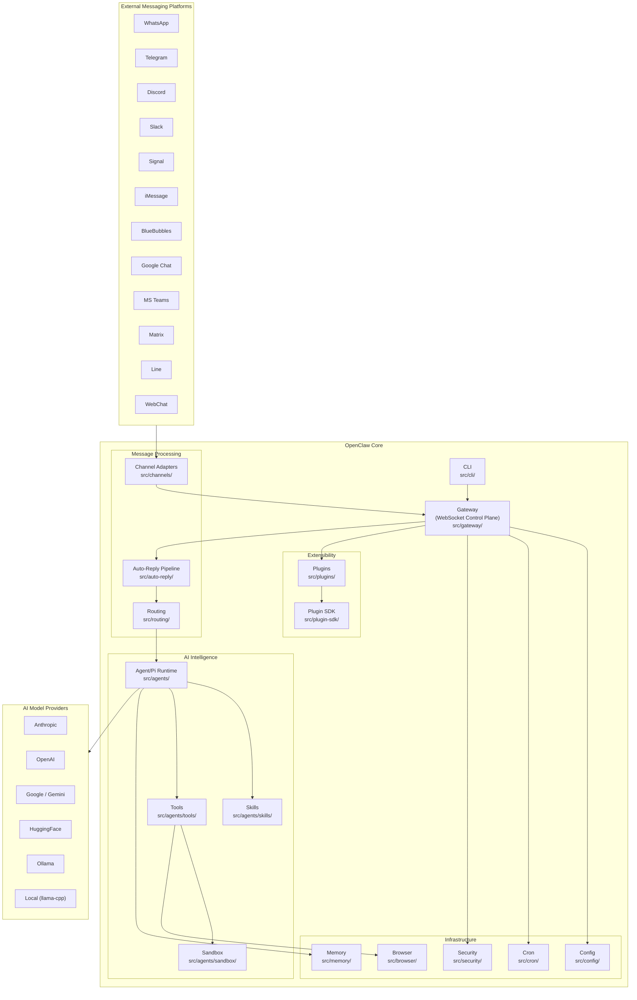
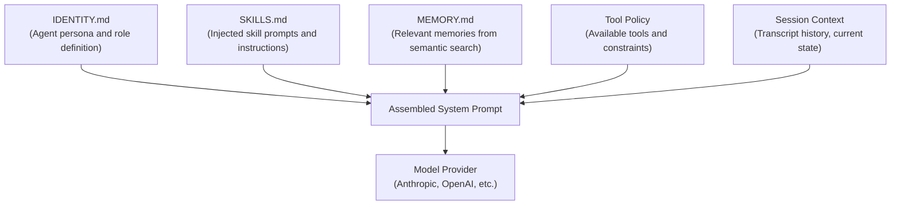
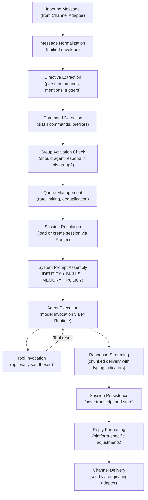
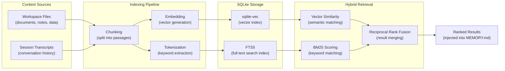
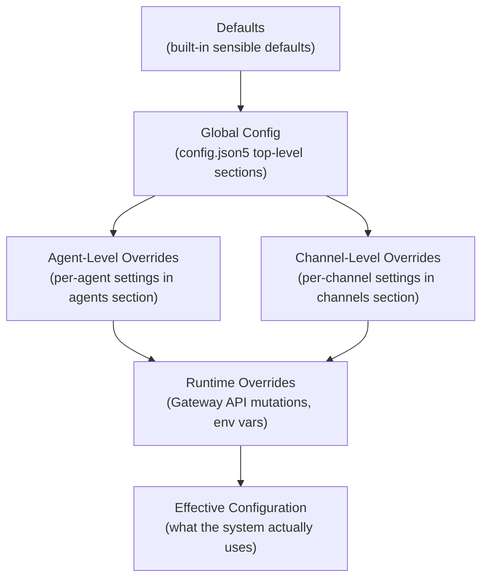
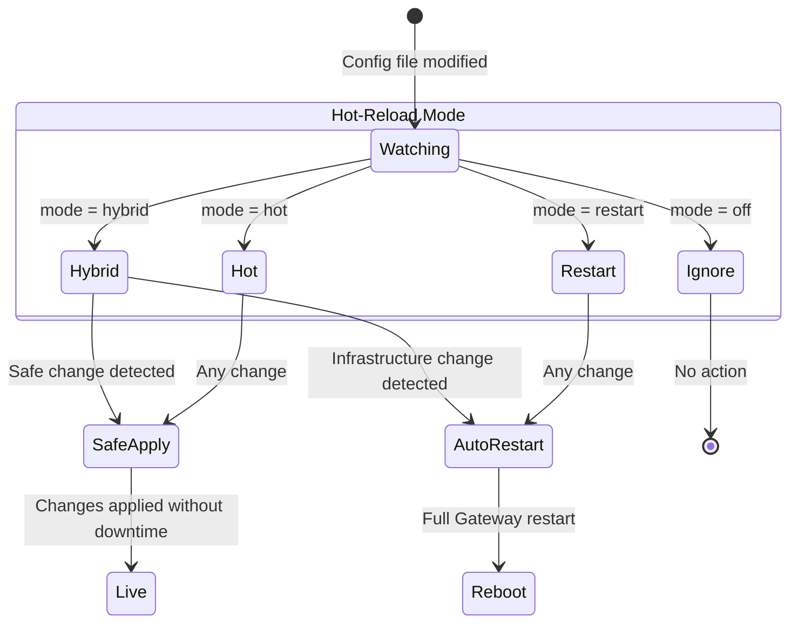
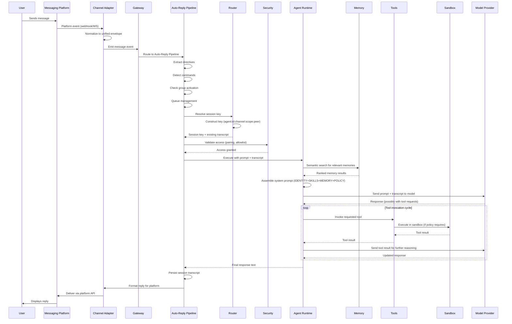
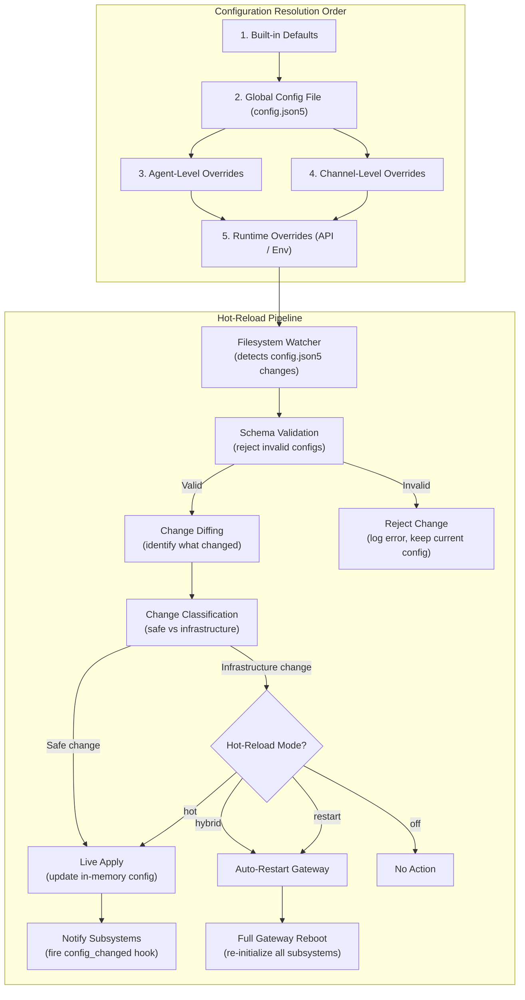
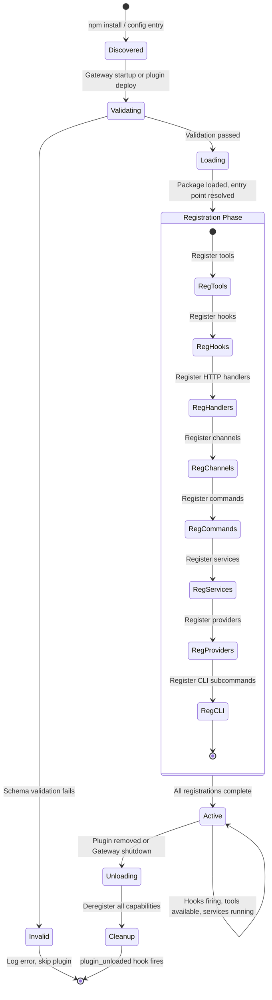
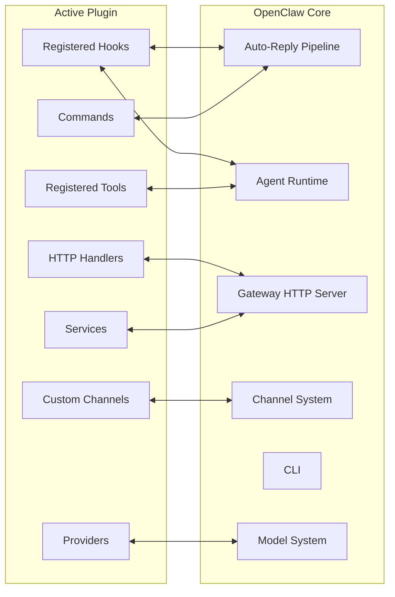

# OpenClaw Architecture Overview

OpenClaw is a self-hosted, multi-channel AI gateway that connects AI agents to messaging platforms through a centralized control plane. It follows a **hub-and-spoke model** where a central Gateway orchestrates all communication between agents, channels, tools, plugins, and external services.

This document provides a comprehensive reference to every major subsystem, how they interconnect, and how data flows through the platform from an inbound message to a delivered reply.

---

## Table of Contents

1. [High-Level Architecture](#high-level-architecture)
2. [Gateway — The Control Plane](#gateway--the-control-plane)
3. [Channels — Messaging Platform Adapters](#channels--messaging-platform-adapters)
4. [Agent/Pi Runtime — AI Execution Engine](#agentpi-runtime--ai-execution-engine)
5. [Auto-Reply Pipeline — Message Processing Core](#auto-reply-pipeline--message-processing-core)
6. [Routing — Session Key Construction](#routing--session-key-construction)
7. [Skills — Bundled Knowledge Sets](#skills--bundled-knowledge-sets)
8. [Plugins — Extension System](#plugins--extension-system)
9. [Tools — Agent Capabilities](#tools--agent-capabilities)
10. [Memory — Semantic Search and Indexing](#memory--semantic-search-and-indexing)
11. [Configuration — Schema-Validated Hot-Reload](#configuration--schema-validated-hot-reload)
12. [Browser — Headless Chrome Control](#browser--headless-chrome-control)
13. [Cron — Scheduled Task Execution](#cron--scheduled-task-execution)
14. [CLI — Command-Line Interface](#cli--command-line-interface)
15. [Security — Access Control and Isolation](#security--access-control-and-isolation)
16. [Sandbox — Docker-Based Tool Isolation](#sandbox--docker-based-tool-isolation)
17. [End-to-End Message Flow](#end-to-end-message-flow)
18. [Configuration Hierarchy and Hot-Reload](#configuration-hierarchy-and-hot-reload)
19. [Plugin Lifecycle](#plugin-lifecycle)
20. [Design Principles](#design-principles)

---

## High-Level Architecture

The following diagram shows how every major subsystem relates to the central Gateway and to each other. The Gateway sits at the center, mediating between external messaging platforms (channels), AI model execution (agents), persistent state (memory, config), and extensibility layers (plugins, tools, skills).



The diagram above establishes the fundamental topology: every external interaction enters through a **Channel Adapter**, is mediated by the **Gateway**, processed through the **Auto-Reply Pipeline**, routed to the correct **Agent** session, and ultimately results in a reply delivered back through the originating channel.

---

## Gateway -- The Control Plane

**Source:** `src/gateway/`

The Gateway is the single orchestrating process in an OpenClaw deployment. It runs an HTTP server on port **18789** that upgrades connections to WebSocket for persistent, bidirectional communication. All operations -- reads, writes, approvals, pairing -- flow through a **JSON-RPC protocol** over this WebSocket connection.

### Responsibilities

- **Lifecycle management** for all subsystems: starting and stopping channels, agents, plugins, cron jobs, and nodes.
- **Configuration distribution**: the Gateway holds the canonical config and pushes updates to subsystems when hot-reload triggers.
- **Session orchestration**: creating, resuming, and destroying agent sessions with their associated transcripts and memory.
- **Authorization enforcement**: every JSON-RPC call is checked against role-based scopes before execution.

### JSON-RPC Method Surface

The Gateway exposes a large API surface organized by operation type:

| Category       | Approximate Count | Examples                                         |
|----------------|-------------------|--------------------------------------------------|
| Read methods   | 40+               | List agents, get session, query channels, read config |
| Write methods  | 20+               | Create agent, update config, start channel, deploy plugin |
| Approval methods | Varies           | Approve tool invocation, approve pairing request |
| Pairing methods | Varies            | Initiate DM pairing, confirm pairing code        |

### Authorization Scopes

Access is governed by role-based scopes attached to each connecting operator:

| Scope                  | Grants                                           |
|------------------------|--------------------------------------------------|
| `operator.admin`       | Full system control, including destructive operations |
| `operator.read`        | Read-only access to all subsystem state          |
| `operator.write`       | Mutating operations on agents, channels, config  |
| `operator.approvals`   | Authority to approve or deny pending requests    |
| `operator.pairing`     | Authority to manage DM pairing workflows         |

A single operator connection may hold multiple scopes. The Gateway validates scopes on every JSON-RPC invocation before dispatching to the target subsystem.

---

## Channels -- Messaging Platform Adapters

**Source:** `src/channels/`, with platform-specific implementations in `src/discord/`, `src/telegram/`, `src/slack/`, `src/signal/`, `src/imessage/`, `src/web/`, `src/line/`

Channels are the boundary between OpenClaw and the outside world. Each channel adapter encapsulates the protocol, authentication, and message format of a specific messaging platform, normalizing everything into a **unified message envelope** that the rest of the system can process uniformly.

### Supported Platforms

| Platform     | Adapter Library / Protocol       | Source Directory   |
|--------------|----------------------------------|--------------------|
| WhatsApp     | Baileys (Web API)                | `src/channels/`    |
| Telegram     | grammY                           | `src/telegram/`    |
| Discord      | discord.js                       | `src/discord/`     |
| Slack        | Bolt                             | `src/slack/`       |
| Signal       | signal-cli                       | `src/signal/`      |
| iMessage     | Native macOS bridge              | `src/imessage/`    |
| BlueBubbles  | BlueBubbles API                  | `src/channels/`    |
| Google Chat  | Google Workspace API             | `src/channels/`    |
| MS Teams     | Bot Framework                    | `src/channels/`    |
| Matrix       | Matrix SDK                       | `src/channels/`    |
| Line         | Line Messaging API               | `src/line/`        |
| WebChat      | Built-in HTTP/WS                 | `src/web/`         |

### Normalization

Every adapter performs the same fundamental job regardless of platform:

1. **Receive** a platform-native event (webhook, WebSocket frame, polling response).
2. **Extract** the sender identity, message content (text, media, reactions), conversation context (group, thread, DM), and platform metadata.
3. **Construct** a unified envelope containing all of the above in a platform-agnostic schema.
4. **Emit** the envelope into the Auto-Reply Pipeline for processing.

For outbound delivery, the reverse occurs: the pipeline produces a platform-agnostic reply, and the channel adapter translates it back into platform-native API calls, handling chunking, media upload, typing indicators, and rate limiting as required by the target platform.

---

## Agent/Pi Runtime -- AI Execution Engine

**Source:** `src/agents/`

The Agent subsystem is responsible for executing AI model interactions. It is built on **Pi Agent Core**, an internal execution framework, with `runEmbeddedPiAgent` serving as the primary entry point for all agent invocations.

### System Prompt Construction

Before every agent invocation, the runtime assembles a system prompt from multiple sources, layered in a specific order:



- **IDENTITY.md** defines who the agent is -- its name, personality, behavioral constraints, and domain expertise.
- **SKILLS.md** injects knowledge from all active skills, providing the agent with specialized capabilities.
- **MEMORY.md** surfaces semantically relevant memories retrieved from the Memory subsystem based on the current conversation context.
- **Tool Policy** determines which tools the agent is permitted to invoke and under what constraints (approvals required, sandboxing, etc.).
- **Session Context** provides the conversation transcript so the model has full history.

### Model Provider Integration

The runtime abstracts over multiple AI providers through a unified interface:

| Provider     | Models                        | Notes                          |
|--------------|-------------------------------|--------------------------------|
| Anthropic    | Claude family                 | Primary recommended provider   |
| OpenAI       | GPT family                    | Full tool-use support          |
| Google       | Gemini family                 | Multimodal capable             |
| HuggingFace  | Open-source models            | Via Inference API              |
| Ollama       | Local open-source models      | Self-hosted, no API key needed |
| Local        | node-llama-cpp                | Fully offline execution        |

The provider is selected per-agent in configuration, allowing different agents in the same deployment to use different models.

---

## Auto-Reply Pipeline -- Message Processing Core

**Source:** `src/auto-reply/`

The Auto-Reply Pipeline is the central nervous system of OpenClaw's message processing. Every inbound message passes through a defined sequence of stages before a reply is generated and delivered.



### Stage Details

1. **Message Normalization**: The raw platform event has already been converted into a unified envelope by the channel adapter. The pipeline validates and enriches this envelope.

2. **Directive Extraction**: The pipeline scans the message for explicit directives -- mentions of the agent, reply chains, quoted messages, and other signals that indicate the message is intended for processing.

3. **Command Detection**: Certain messages are commands rather than conversational input. The pipeline recognizes slash commands, prefix-triggered commands, and built-in control phrases, routing them to dedicated handlers rather than the agent.

4. **Group Activation Check**: In group conversations, the agent should not respond to every message. This stage evaluates activation rules (direct mention, reply chain, keyword triggers, always-on mode) to decide whether processing should continue.

5. **Queue Management**: Messages are queued per-session to prevent race conditions when multiple messages arrive in rapid succession. The queue also handles deduplication (identical messages within a short window) and rate limiting.

6. **Session Resolution**: The Router constructs a session key and either loads an existing session (with its transcript history) or creates a new one.

7. **System Prompt Assembly**: The full system prompt is built from identity, skills, memory, and tool policy as described in the Agent section.

8. **Agent Execution**: The assembled prompt and transcript are sent to the configured model provider. The model generates a response, potentially requesting tool invocations.

9. **Tool Invocation**: If the model requests tool use, the tools are executed (subject to policy, approvals, and sandboxing). Results are fed back into the model for further reasoning. This loop may repeat multiple times.

10. **Response Streaming**: As the model generates its response, chunks are streamed to the channel adapter, which converts them into typing indicators and partial message updates where the platform supports it.

11. **Session Persistence**: The complete interaction (user message, agent response, tool calls and results) is persisted to the session transcript for future context and memory indexing.

12. **Reply Formatting**: The raw agent response is adapted to the target platform's formatting capabilities (Markdown, HTML, plain text, character limits, media embeds).

13. **Channel Delivery**: The formatted reply is sent through the originating channel adapter back to the user.

---

## Routing -- Session Key Construction

**Source:** `src/routing/`

The Routing subsystem determines which agent session handles a given message. It constructs deterministic **session keys** that uniquely identify a conversation context.

### Session Key Pattern

Session keys follow a structured format:

```
agent:{agentId}:{channel}:{scope}:{peerId}
```

| Segment     | Description                                              |
|-------------|----------------------------------------------------------|
| `agentId`   | The unique identifier of the target agent                |
| `channel`   | The messaging platform (telegram, discord, slack, etc.)  |
| `scope`     | The conversation scope (dm, group ID, channel ID)        |
| `peerId`    | The unique identifier of the other participant           |

For threaded conversations, an additional segment is appended:

```
agent:{agentId}:{channel}:{scope}:{peerId}:thread:{threadId}
```

### Routing Granularity

The routing system supports multiple levels of conversation isolation:

- **Per-peer**: Each individual user gets their own session with the agent, maintaining private context.
- **Per-group**: All members of a group share a single session, so the agent has full group conversation context.
- **Per-channel**: All messages in a platform channel share a session (useful for support channels or announcement bots).
- **Per-thread**: Within a group or channel, individual threads get their own session, preventing cross-thread context contamination.

---

## Skills -- Bundled Knowledge Sets

**Source:** `src/agents/skills/`

Skills are self-contained knowledge packages that extend an agent's capabilities without modifying its core identity. They are automatically injected into the agent's system prompt at runtime.

### Skill Composition

Each skill consists of:

- **Prompts**: Instructions and knowledge that get injected into the system prompt, teaching the agent how to use the skill's capabilities.
- **Scripts**: Executable logic that the skill may provide, often registered as tools.
- **Metadata**: Name, description, version, dependencies, and activation conditions.

### Skill Types

| Type       | Source                                   | Management                          |
|------------|------------------------------------------|-------------------------------------|
| Bundled    | Ships with OpenClaw                      | Updated with platform releases      |
| Managed    | Installed from a registry or repository  | Updated independently via CLI/Gateway |
| Workspace  | Defined in the agent's workspace directory | Managed by the operator directly    |

Skills are resolved per-agent based on the agent's configuration. Multiple agents in the same deployment can have different skill sets, allowing specialization (e.g., one agent with coding skills, another with customer support skills).

---

## Plugins -- Extension System

**Source:** `src/plugins/`, `src/plugin-sdk/`

Plugins are the primary extensibility mechanism in OpenClaw. They are npm packages that register capabilities with the platform at startup and participate in the system's lifecycle through hooks.

### Plugin Capabilities

A single plugin can register any combination of the following:

| Capability    | Description                                                    |
|---------------|----------------------------------------------------------------|
| Tools         | New tools available to agents during execution                 |
| Hooks         | Callbacks invoked at specific lifecycle events                 |
| HTTP Handlers | Custom HTTP endpoints mounted on the Gateway server            |
| Channels      | Entirely new messaging platform adapters                       |
| Commands      | New slash commands recognized by the Auto-Reply Pipeline       |
| Services      | Long-running background services managed by the Gateway        |
| Providers     | New AI model providers for the Agent Runtime                   |
| CLI Subcommands | Extensions to the CLI tool                                   |

### Hook System

Plugins can subscribe to **20 lifecycle events** that fire at key moments during system operation:

| Hook Category        | Events                                                     |
|----------------------|------------------------------------------------------------|
| Agent lifecycle      | `before_agent_start`, `after_agent_start`, `before_agent_stop`, `after_agent_stop` |
| Message processing   | `message_received`, `before_reply`, `after_reply`          |
| Tool execution       | `before_tool_call`, `after_tool_call`                      |
| Session management   | `session_created`, `session_destroyed`                     |
| System lifecycle     | `gateway_start`, `gateway_stop`, `config_changed`          |
| Channel events       | `channel_connected`, `channel_disconnected`                |
| Security events      | `pairing_requested`, `pairing_completed`                   |
| Cron events          | `cron_triggered`                                           |
| Plugin events        | `plugin_loaded`, `plugin_unloaded`                         |

Each hook receives relevant context and can modify behavior (e.g., `before_tool_call` can block or alter a tool invocation, `message_received` can filter or transform inbound messages).

---

## Tools -- Agent Capabilities

**Source:** `src/agents/tools/`

Tools are the mechanism by which agents interact with the world beyond text generation. When a model decides it needs to take an action, it invokes a tool, which executes real logic and returns results to the model.

### Core Tool Categories

| Category        | Tools                                          | Purpose                                    |
|-----------------|------------------------------------------------|--------------------------------------------|
| Browser         | Browser control, screenshots, navigation       | Web browsing and interaction               |
| Canvas          | Drawing and image manipulation                 | Visual content creation                    |
| Nodes           | Camera, screen capture                         | Hardware device access via remote nodes    |
| Cron            | Schedule creation, listing, deletion           | Timed and recurring task management        |
| Sessions        | Session list, switch, history                  | Multi-session management                   |
| Memory          | Semantic search, recall                        | Long-term knowledge retrieval              |
| Web             | HTTP fetch, web search                         | Internet information access                |
| Messaging       | Discord, Slack, Telegram, WhatsApp actions     | Cross-platform messaging operations        |
| TTS             | Text-to-speech synthesis                       | Audio output generation                    |

### Tool Policy Enforcement

Not every agent has access to every tool. Tool availability is governed by **policy**, which is configured per-agent and enforced at runtime:

- **Allowed tools**: An explicit allowlist of tools the agent may invoke.
- **Approval-required tools**: Tools the agent may invoke only after an operator approves the request via the Gateway.
- **Denied tools**: Tools explicitly blocked for this agent.
- **Sandbox-required tools**: Tools that must execute inside a Docker sandbox (see Sandbox section).

---

## Memory -- Semantic Search and Indexing

**Source:** `src/memory/`

The Memory subsystem provides agents with long-term recall by indexing workspace files and session transcripts into a searchable store. It uses a **hybrid retrieval** approach combining vector similarity and keyword matching.

### Indexing Architecture



### Embedding Providers

| Provider       | Model                     | Notes                           |
|----------------|---------------------------|---------------------------------|
| OpenAI         | text-embedding-ada-002+   | Cloud-hosted, high quality      |
| Gemini         | Gemini embedding models   | Google cloud-hosted             |
| Voyage         | Voyage embedding models   | Specialized retrieval embeddings|
| Local          | node-llama-cpp            | Fully offline, no API key       |

### Retrieval Strategy

When an agent needs memory, the system:

1. Takes the current conversation context as a query.
2. Generates an embedding vector for the query.
3. Performs a **vector similarity search** (cosine distance) against the sqlite-vec index.
4. Performs a **BM25 keyword search** against the FTS5 index.
5. Merges results using **Reciprocal Rank Fusion**, which combines the ranking positions from both retrieval methods to produce a single ranked list.
6. Returns the top results, which are formatted and injected into **MEMORY.md** for the agent's system prompt.

---

## Configuration -- Schema-Validated Hot-Reload

**Source:** `src/config/`

OpenClaw uses **JSON5 configuration files** that are validated against a schema at load time. The configuration system supports hot-reload, allowing operators to modify behavior without restarting the entire system.

### Configuration Sections

| Section    | Governs                                                      |
|------------|--------------------------------------------------------------|
| `gateway`  | Port, TLS, authentication, CORS, WebSocket settings          |
| `agents`   | Agent definitions, model assignments, tool policies, skills  |
| `channels` | Platform credentials, channel-specific settings              |
| `tools`    | Global tool settings, API keys for tool backends             |
| `models`   | Model provider configuration, API keys, endpoints            |
| `plugins`  | Plugin installation, activation, per-plugin settings         |
| `hooks`    | Global hook configuration, hook ordering                     |
| `memory`   | Embedding provider, indexing settings, retention policies    |
| `sandbox`  | Docker settings, resource limits, networking rules           |

### Configuration Hierarchy

Configuration values are resolved through a layered hierarchy where more specific values override more general ones:



Each layer can override values from the layer above it. For example, a global tool policy might allow web browsing, but a specific agent's configuration can override that to deny it. Runtime overrides (applied via the Gateway API or environment variables) take highest precedence.

### Hot-Reload Modes



| Mode      | Behavior                                                                 |
|-----------|--------------------------------------------------------------------------|
| `hybrid`  | Analyzes each change: applies safe changes live (agent settings, tool policies), auto-restarts for infrastructure changes (port, TLS, plugin additions) |
| `hot`     | Applies all changes live without restarting, regardless of change type   |
| `restart` | Restarts the entire Gateway process on any configuration change          |
| `off`     | Disables file watching entirely; changes require manual restart          |

---

## Browser -- Headless Chrome Control

**Source:** `src/browser/`

The Browser subsystem provides agents with the ability to control a headless Chrome or Chromium instance. This is used for web browsing, page interaction, screenshot capture, and automated form filling.

### Capabilities

- **Page snapshots**: Capture the full DOM state or a rendered screenshot at any point.
- **Actions**: Click, type, scroll, navigate, wait for elements, execute JavaScript.
- **File uploads**: Programmatically upload files to web forms.
- **Profile management**: Maintain persistent browser profiles with cookies and local storage across sessions.
- **Dual protocol**: Uses both Playwright (high-level automation) and CDP (Chrome DevTools Protocol, low-level control) depending on the operation.

---

## Cron -- Scheduled Task Execution

**Source:** `src/cron/`

The Cron subsystem allows agents to schedule tasks for future execution. Each cron job is **agent-isolated**, meaning one agent's scheduled tasks cannot interfere with another's.

Agents can create, list, and delete their own cron jobs through the cron tool. When a cron job fires, it triggers agent execution in the same way an inbound message would, except the "message" is the cron job's configured payload rather than a user-sent message.

---

## CLI -- Command-Line Interface

**Source:** `src/cli/`

The CLI provides full administrative control over an OpenClaw deployment from the terminal. It communicates with the Gateway over the same JSON-RPC WebSocket protocol used by all other clients.

### Command Groups

| Command     | Purpose                                              |
|-------------|------------------------------------------------------|
| `gateway`   | Start, stop, and manage the Gateway process          |
| `agent`     | Create, configure, and interact with agents          |
| `send`      | Send a message to an agent from the command line     |
| `wizard`    | Interactive setup and configuration wizard           |
| `doctor`    | Diagnose common configuration and connectivity issues|
| `models`    | List, test, and configure model providers            |
| `channels`  | Manage messaging platform connections                |
| `plugins`   | Install, update, remove, and configure plugins       |

---

## Security -- Access Control and Isolation

**Source:** `src/security/`

Security in OpenClaw operates at multiple layers, from network-level access control to per-tool policy enforcement.

### Security Mechanisms

- **DM Pairing**: Before an agent will respond to a new user in direct messages, the user must complete a pairing flow. This prevents unauthorized access to agents.
- **Allowlists**: Operators can restrict which users, groups, or channels an agent will interact with.
- **Audit Logging**: All significant operations (tool invocations, configuration changes, pairing events) are logged for audit.
- **Secret Detection**: Outbound messages are scanned for patterns that resemble secrets (API keys, tokens, passwords) to prevent accidental leakage.
- **Tool Policy Enforcement**: As described in the Tools section, each agent has a policy governing which tools it can use and under what conditions.

---

## Sandbox -- Docker-Based Tool Isolation

**Source:** `src/agents/sandbox/`

The Sandbox subsystem provides Docker-based isolation for tool execution. When a tool runs inside a sandbox, it executes in a container with constrained resources, limited network access, and no direct access to the host filesystem.

### Sandbox Modes

| Mode       | Behavior                                                     |
|------------|--------------------------------------------------------------|
| `off`      | All tools run directly on the host (no isolation)            |
| `non-main` | Tools run sandboxed except for the main/primary agent        |
| `all`      | All tool executions are sandboxed regardless of agent        |

### Sandbox Scopes

| Scope     | Container Lifecycle                                           |
|-----------|---------------------------------------------------------------|
| `session` | A new container is created for each session and destroyed when the session ends |
| `agent`   | A container persists for the lifetime of the agent, shared across all its sessions |
| `shared`  | A single container is shared across all agents (least isolation, most resource-efficient) |

The scope determines the tradeoff between isolation strength and resource consumption. Session-scoped sandboxes provide the strongest isolation (each conversation gets a clean environment) but consume the most resources. Shared sandboxes are the most efficient but provide the weakest isolation between agents.

---

## End-to-End Message Flow

The following diagram traces a single message from arrival to reply delivery, showing every subsystem it touches:



---

## Configuration Hierarchy and Hot-Reload

The following diagram combines the configuration resolution hierarchy with the hot-reload decision flow, showing how a configuration change propagates through the system:



---

## Plugin Lifecycle

The following diagram shows how a plugin moves from installation through its full operational lifecycle, including hook registration and eventual removal:



### Plugin Interaction Points

Once active, a plugin participates in the system through its registered capabilities:



---

## Design Principles

OpenClaw's architecture reflects several deliberate design decisions:

### Hub-and-Spoke Centralization

The Gateway serves as the single point of coordination. This simplifies reasoning about system state (there is one authoritative source), simplifies security (there is one enforcement point), and simplifies operations (there is one process to monitor). The tradeoff is that the Gateway is a single point of failure, mitigated by its relatively simple role as an orchestrator rather than a data-intensive processor.

### Uniform Abstraction Boundaries

Every external system -- whether a messaging platform, an AI model provider, or a tool backend -- is accessed through an adapter that normalizes its interface. This means adding a new messaging platform or model provider requires implementing one adapter without modifying any core logic.

### Layered Extensibility

Extension points exist at multiple levels of abstraction: plugins for broad system-level extensions, tools for agent-level capabilities, skills for knowledge-level augmentation, and hooks for fine-grained lifecycle interception. This layering means most customization needs can be met without forking the core.

### Security by Default

DM pairing, tool policy enforcement, secret detection, and sandbox isolation are all built into the default processing path rather than being opt-in additions. An operator must explicitly weaken security (e.g., setting sandbox mode to `off`) rather than explicitly strengthening it.

### Configuration as the Single Source of Truth

All system behavior is driven by the configuration file, which is schema-validated and supports hot-reload. This means the running system's behavior can always be understood by reading one file, and changes can be made without code modifications.
