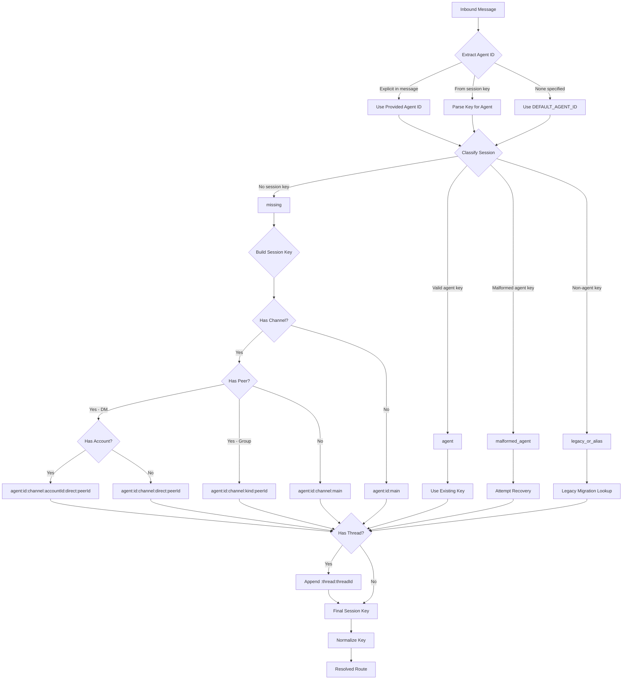
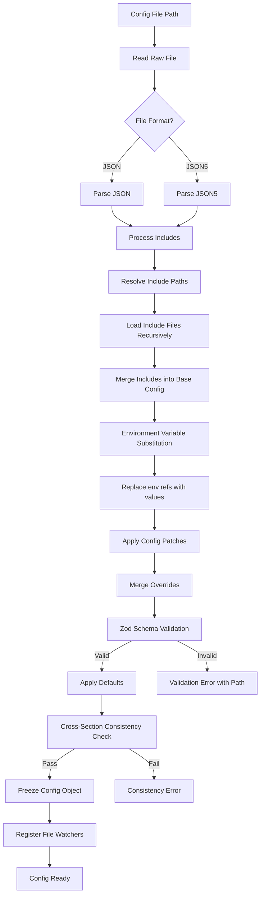
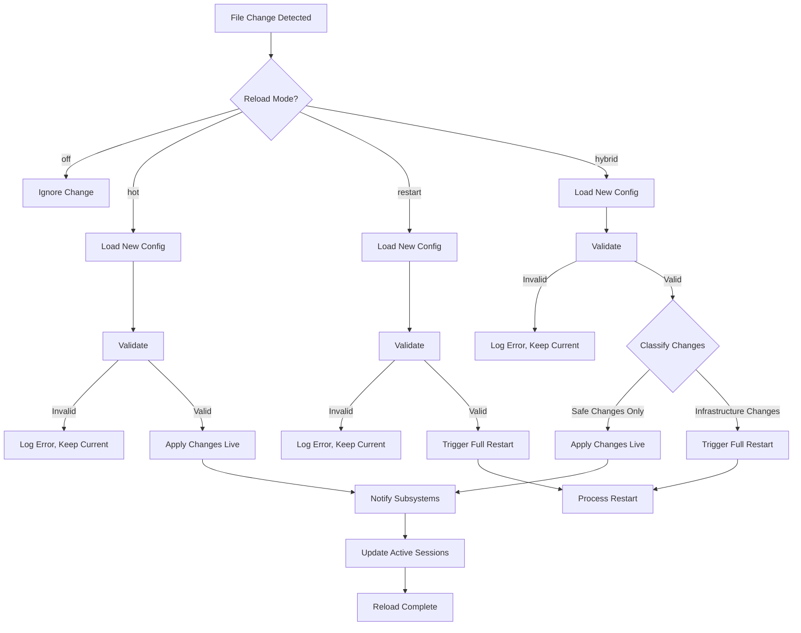
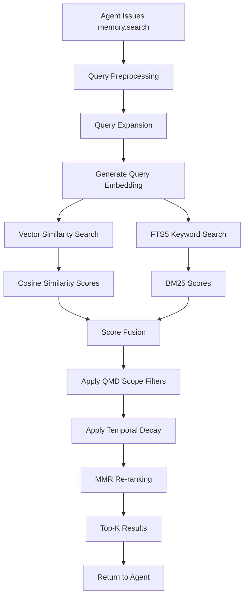
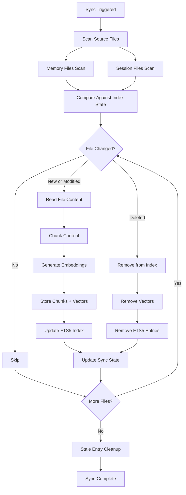
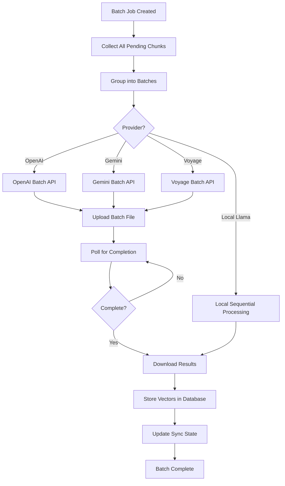

# Routing, Configuration, and Memory Subsystems

This document covers three foundational subsystems in OpenClaw: the **Routing** system that determines how messages reach agents, the **Configuration** system that governs all runtime behavior, and the **Memory** system that provides semantic recall over workspace knowledge and session history.

---

## Table of Contents

- [Routing System](#routing-system)
  - [Session Key Architecture](#session-key-architecture)
  - [Key Format and Patterns](#key-format-and-patterns)
  - [Normalization Rules](#normalization-rules)
  - [Route Resolution](#route-resolution)
  - [Identity Linking](#identity-linking)
  - [Bindings](#bindings)
- [Configuration System](#configuration-system)
  - [Schema Validation](#schema-validation)
  - [Schema Sections](#schema-sections)
  - [Config Loading Pipeline](#config-loading-pipeline)
  - [Environment Variable Substitution](#environment-variable-substitution)
  - [Config Merge and Patch](#config-merge-and-patch)
  - [Config Paths](#config-paths)
  - [Legacy Migration](#legacy-migration)
  - [Sessions Configuration](#sessions-configuration)
  - [Hot-Reload System](#hot-reload-system)
- [Memory System](#memory-system)
  - [Architecture Overview](#architecture-overview)
  - [Storage Layer](#storage-layer)
  - [Embedding Providers](#embedding-providers)
  - [Index Management](#index-management)
  - [Search Pipeline](#search-pipeline)
  - [Memory Manager](#memory-manager)
  - [Batch Processing](#batch-processing)

---

## Routing System

The routing system lives in `src/routing/` and is responsible for mapping every inbound message to the correct agent session. It does this through **session keys** -- structured identifiers that encode the full routing context of a conversation.

### Session Key Architecture

A session key is the single source of truth for where a message belongs. Every active conversation in OpenClaw is identified by exactly one session key. The key encodes four dimensions of routing context:

1. **Agent** -- which agent definition handles this conversation
2. **Scope** -- what kind of conversation this is (main, direct, group, thread)
3. **Channel** -- which platform or transport the message arrived on
4. **Peer** -- who the external participant is

Session keys are immutable once created for a given conversation. They serve as the primary key for session storage, transcript files, delivery tracking, and memory indexing.

### Key Format and Patterns

The base format for all session keys is:

`agent:{agentId}:{scope}:{qualifier}`

The system recognizes several key patterns, each representing a different conversation topology:

**Main Session** -- The default session for an agent with no specific peer or channel context. Used for system-level interactions and fallback routing.

Format: `agent:{agentId}:main`

**Per-Peer Direct Message** -- A one-on-one conversation between an agent and a specific peer, without channel qualification. Used when a peer can be uniquely identified across all channels.

Format: `agent:{agentId}:direct:{peerId}`

**Per-Channel-Peer Direct Message** -- A direct message scoped to a specific channel. This is the most common pattern for platform-specific DMs (e.g., a Telegram DM vs. a Discord DM with the same person).

Format: `agent:{agentId}:{channel}:direct:{peerId}`

**Per-Account-Channel-Peer Direct Message** -- Adds account-level scoping for multi-account deployments where the same agent operates under different platform accounts.

Format: `agent:{agentId}:{channel}:{accountId}:direct:{peerId}`

**Group Conversation** -- A multi-party conversation in a channel, qualified by the peer kind (e.g., "group", "room", "server") and the group identifier.

Format: `agent:{agentId}:{channel}:{peerKind}:{peerId}`

**Thread** -- Any of the above patterns can be further qualified with a thread suffix. Threads create sub-conversations within an existing session context.

Format: `{anyKey}:thread:{threadId}`

**Default Constants:**
- `DEFAULT_AGENT_ID` = `"main"` -- used when no agent is explicitly specified
- `DEFAULT_ACCOUNT_ID` = `"default"` -- used when no account is explicitly specified

### Normalization Rules

All session key components are normalized to ensure deterministic routing. The normalization rules are:

- All identifiers are lowercased
- The valid character pattern is `^[a-z0-9][a-z0-9_-]{0,63}$`
- Any character not matching `[a-z0-9_-]` is replaced with a hyphen
- Leading and trailing hyphens are stripped after replacement
- Each segment is truncated to a maximum of 64 characters
- Empty segments after normalization fall back to their respective defaults

These rules guarantee that session keys are filesystem-safe (for transcript storage), database-safe (for memory indexing), and URL-safe (for API references).

### Route Resolution

Route resolution is the process of taking a raw inbound message and determining which session key it belongs to. This logic lives in `src/routing/resolve-route.ts`.

The resolution process involves four classification states:

- **missing** -- No existing session key is present. The resolver builds one from the message context (channel, peer, account).
- **agent** -- A well-formed agent session key exists. The resolver validates it and passes it through.
- **malformed_agent** -- The key starts with `agent:` but does not conform to a known pattern. The resolver attempts best-effort recovery by re-parsing the components.
- **legacy_or_alias** -- The key does not start with `agent:`. This triggers a legacy migration lookup to map old-format keys to the current format.

### Identity Linking

A critical feature of route resolution is **identity linking**, which maps a single real-world person across multiple channels. If a user has both a Telegram account and a Discord account, identity linking allows the agent to recognize them as the same peer.

Identity links are configured in the agent or channel configuration. During route resolution, the system checks whether the inbound peer ID has a linked identity. If so, the session key may be resolved to a shared session rather than a channel-specific one, depending on the agent's routing policy.

This enables scenarios such as:
- A user starts a conversation on Telegram and continues it on Discord
- An agent maintains a unified memory of a person regardless of which channel they use
- Cross-channel notifications where a message on one platform triggers a response on another

### Bindings

Bindings, defined in `src/routing/bindings.ts`, control which agents are active on which channels. A binding is a mapping from an agent ID to one or more channel configurations.

Bindings serve as the first filter in routing: if an agent is not bound to the channel a message arrived on, that message will never reach that agent. This allows multi-agent deployments where different agents handle different channels, or where multiple agents share a channel with different routing rules.

Route rules within bindings can specify:
- Which peer kinds an agent responds to (DMs only, groups only, or both)
- Account-level filtering for multi-account channels
- Priority ordering when multiple agents are bound to the same channel

---

## Configuration System

The configuration system lives in `src/config/` and manages all runtime settings for an OpenClaw deployment. It handles loading, validation, merging, hot-reloading, and persistence of configuration data.

### Schema Validation

Configuration is validated against a JSON Schema (draft-07) definition in `src/config/schema.ts`, with runtime validation powered by Zod schemas in `src/config/zod-schema.ts`. The dual-schema approach provides:

- **JSON Schema** for external tooling compatibility (IDE autocompletion, documentation generation, third-party validators)
- **Zod schemas** for runtime type safety with TypeScript inference, detailed error messages, and transformation pipelines

Validation is strict by default: unknown fields are rejected to catch typos and misconfigurations early. Each schema section corresponds to a specific concern and is independently validated before the merged config is checked for cross-section consistency.

### Schema Sections

The configuration is divided into domain-specific type files, each governing a distinct subsystem:

**Core Infrastructure:**
- `types.gateway.ts` -- Gateway server settings including port, bind address, authentication method, and TLS certificate configuration
- `types.auth.ts` -- Authentication configuration for API access, webhook verification, and inter-service communication
- `types.sandbox.ts` -- Sandbox configuration for code execution isolation, resource limits, and network policies
- `types.queue.ts` -- Message queue settings for async processing, retry policies, and dead-letter handling

**Agent and Model:**
- `types.agents.ts` -- Agent definitions including system prompts, model assignments, tool access policies, memory settings, and per-agent defaults
- `types.models.ts` -- Model provider settings covering API endpoints, authentication, rate limits, fallback chains, and token budgets
- `types.skills.ts` -- Skill settings for specialized agent capabilities and their activation conditions

**Channel Integrations:**
- `types.channels.ts` -- Base channel configuration shared across all platforms
- `types.discord.ts` -- Discord-specific configuration (bot token, guild settings, slash commands, reaction handling)
- `types.slack.ts` -- Slack-specific configuration (app credentials, workspace settings, event subscriptions)
- `types.telegram.ts` -- Telegram-specific configuration (bot token, webhook URL, inline mode, group privacy settings)
- `types.whatsapp.ts` -- WhatsApp-specific configuration (Business API credentials, phone number, message templates)
- `types.signal.ts` -- Signal-specific configuration (signal-cli integration, group handling)
- `types.imessage.ts` -- iMessage-specific configuration (AppleScript bridge, contact matching)
- `types.googlechat.ts` -- Google Chat configuration (service account, space settings)
- `types.msteams.ts` -- MS Teams configuration (Azure AD app, tenant settings, adaptive cards)
- `types.browser.ts` -- Browser control configuration for web automation agents

**Features:**
- `types.tools.ts` -- Tool policies and profiles defining which tools agents can access and under what conditions
- `types.plugins.ts` -- Plugin enable/disable switches and per-plugin configuration
- `types.hooks.ts` -- Hook configurations for pre/post processing of messages, tool calls, and lifecycle events
- `types.memory.ts` -- Memory and embedding settings (provider selection, index paths, search parameters)
- `types.cron.ts` -- Cron job definitions for scheduled agent tasks
- `types.tts.ts` -- Text-to-speech configuration for voice output
- `types.approvals.ts` -- Execution approval configuration for human-in-the-loop workflows

### Config Loading Pipeline

The configuration loading process is a multi-stage pipeline defined across `src/config/config.ts` and `src/config/io.ts`.

Key stages in detail:

**File Reading** -- The system supports both JSON and JSON5 formats. JSON5 allows comments, trailing commas, and unquoted keys, making configuration files more human-friendly.

**Include Processing** (`src/config/includes.ts`) -- Configuration files can reference other files via an `$include` directive. Includes are resolved relative to the parent file's directory and loaded recursively. Circular includes are detected and rejected. This enables splitting large configurations into modular, reusable fragments.

**Environment Variable Substitution** (`src/config/env-substitution.ts`) -- String values in the configuration can reference environment variables using a substitution syntax. This allows secrets and deployment-specific values to be injected at runtime without hardcoding them in configuration files.

**Merge and Patch** (`src/config/merge-config.ts`, `src/config/merge-patch.ts`) -- Multiple configuration sources are merged using a deep merge strategy. Later sources override earlier ones at the leaf level. Patch operations allow targeted modifications without replacing entire sections.

**Validation** -- The merged configuration is validated against Zod schemas. Validation errors include the full path to the offending field, the expected type, and the received value.

**Backup Rotation** (`src/config/backup-rotation.ts`) -- Before writing any changes, the system rotates backup copies of the configuration file. This provides a safety net for recovery if a config change causes problems.

### Environment Variable Substitution

Environment variable substitution, implemented in `src/config/env-substitution.ts`, allows configuration values to reference runtime environment variables. This is critical for:

- Keeping secrets (API keys, tokens) out of configuration files
- Supporting different values across deployment environments (dev, staging, production)
- Enabling container-based deployments where configuration is injected via environment

The substitution engine walks every string value in the parsed configuration tree and replaces references with their corresponding environment variable values. Missing variables can either cause a hard error or fall back to a default value, depending on the syntax used.

### Config Merge and Patch

The merge system, split across `src/config/merge-config.ts` and `src/config/merge-patch.ts`, implements two distinct strategies:

**Deep Merge** -- Used when combining base configuration with overrides (e.g., include files, environment-specific layers). Objects are merged recursively; arrays are replaced wholesale (not concatenated). Leaf values from the later source always win.

**JSON Merge Patch (RFC 7396)** -- Used for targeted updates. Setting a field to `null` removes it. This enables surgical configuration changes without affecting sibling fields.

### Config Paths

Path resolution, handled in `src/config/config-paths.ts` and `src/config/paths.ts`, determines where configuration and data files are stored on disk.

The system uses platform-specific conventions:
- Configuration directories follow XDG Base Directory specification on Linux
- macOS uses `~/Library/Application Support/` or `~/.config/` depending on context
- Agent-specific configuration gets its own subdirectory within the main config directory
- Home directory resolution accounts for containerized environments where `$HOME` may not be set

### Legacy Migration

Legacy migration, implemented across `src/config/legacy.ts` and `src/config/legacy-migrate.ts`, handles upgrading old configuration formats to the current schema. Migration is divided into three sequential phases:

**Phase 1 (part-1)** -- Structural changes. Renames top-level keys, restructures nested objects, and moves fields to their new locations in the schema.

**Phase 2 (part-2)** -- Value transformations. Converts deprecated enum values, normalizes formats, and applies type coercions.

**Phase 3 (part-3)** -- Cleanup. Removes fully deprecated fields, consolidates duplicated settings, and validates the result against the current schema.

Each phase is idempotent: running migration on an already-migrated configuration produces no changes. Migrations run automatically on config load when the detected schema version is older than the current version. Backward compatibility is maintained by preserving old field names as aliases during a deprecation period.

### Sessions Configuration

Session configuration lives in `src/config/sessions/` and manages per-session state and metadata:

- `session-key.ts` -- Key construction utilities that build session keys from component parts, applying normalization rules
- `store.ts` -- Session persistence layer that serializes session state to disk or database
- `transcript.ts` -- Transcript file management for conversation history, including rotation and archival policies
- `delivery-info.ts` -- Message delivery tracking that records which messages were successfully delivered to which channels and peers
- `metadata.ts` -- Session metadata storage for arbitrary key-value data attached to sessions (e.g., user preferences, context flags)
- `group.ts` -- Group session configuration for multi-participant conversations, including member tracking and role assignment
- `main-session.ts` -- Default session configuration applied to the main (fallback) session for each agent
- `reset.ts` -- Session reset logic that clears session state while optionally preserving certain metadata or transcript history

### Hot-Reload System

The hot-reload system monitors configuration files for changes and applies updates without requiring a full process restart. The behavior is controlled by a reload mode setting.

**Reload Modes:**

- **off** -- File watching is disabled. Configuration changes require a manual restart.
- **hot** -- All valid changes are applied live. No automatic restart ever occurs. This is the least disruptive mode but may not fully apply certain infrastructure changes.
- **restart** -- Any configuration change triggers a full process restart. This is the safest mode but causes brief downtime during restart.
- **hybrid** -- The default and recommended mode. Changes are classified as either safe or infrastructure-level. Safe changes are applied live; infrastructure changes trigger a restart.

**Safe Changes (applied live):**
- Channel configurations (adding, removing, or modifying channels)
- Agent definitions (prompt changes, model reassignment, tool policy updates)
- Tool configurations
- Automation settings (cron jobs, hooks)

**Infrastructure Changes (require restart):**
- Gateway port or bind address
- Authentication method or credentials
- TLS certificate or key paths
- Core runtime settings

When changes are applied live, the system notifies all affected subsystems. Active sessions receive updated agent configurations, channel handlers are reconfigured, and tool registries are refreshed.

---

## Memory System

The memory system lives in `src/memory/` and provides semantic recall over workspace documents and conversation history. It enables agents to search their knowledge base using natural language queries, returning contextually relevant results from both curated Markdown files and past session transcripts.

### Architecture Overview

The memory system implements a **hybrid search** strategy that combines two complementary retrieval methods:

1. **Vector Similarity Search** -- Documents are converted to dense vector embeddings. Queries are embedded using the same model, and results are ranked by cosine similarity. This captures semantic meaning regardless of exact wording.

2. **Keyword Search (BM25)** -- Documents are indexed using SQLite FTS5 (Full-Text Search 5). Queries are matched using the BM25 ranking function, which considers term frequency, inverse document frequency, and document length normalization. This captures exact term matches that vector search might miss.

The hybrid approach produces a combined score, weighted to balance semantic understanding with lexical precision. Results are then re-ranked using **MMR (Maximal Marginal Relevance)** to ensure diversity -- preventing the top results from being near-duplicates of each other.

### Storage Layer

The memory system uses **SQLite** as its storage backend, extended with the **sqlite-vec** extension for efficient vector operations.

The database schema contains:
- A **documents table** storing chunked text content, source file paths, and metadata
- A **vectors table** (via sqlite-vec) storing dense embeddings aligned to document chunks
- An **FTS5 virtual table** providing full-text search indexes over document content
- A **sync state table** tracking which files have been indexed and their last-modified timestamps

SQLite was chosen for its zero-configuration deployment, single-file portability, and robust concurrent read access. The sqlite-vec extension adds approximate nearest neighbor search capabilities without requiring a separate vector database.

### Embedding Providers

The memory system supports multiple embedding providers, allowing users to choose based on quality, cost, latency, and privacy requirements. Provider selection is configured in `types.memory.ts`.

**OpenAI Embeddings** (`src/memory/embeddings-openai.ts`)
- Uses OpenAI's embedding API (e.g., `text-embedding-3-small`, `text-embedding-3-large`)
- Highest ecosystem compatibility
- Requires API key and network access

**Google Gemini Embeddings** (`src/memory/embeddings-gemini.ts`)
- Uses Google's Gemini embedding models
- Alternative cloud provider option
- Requires Google AI API key

**Voyage AI Embeddings** (`src/memory/embeddings-voyage.ts`)
- Uses Voyage AI's specialized embedding models
- Optimized for retrieval tasks
- Requires Voyage API key

**Local Llama Embeddings** (`src/memory/node-llama.ts`)
- Uses node-llama-cpp to run embedding models locally
- No network access required -- fully offline operation
- Higher latency but complete data privacy
- Suitable for air-gapped or privacy-sensitive deployments

All providers implement a common embedding interface, making them interchangeable. The system handles dimension normalization and batching transparently regardless of which provider is active.

### Index Management

Index management handles the synchronization between source files on disk and the search index in the database. The indexing pipeline is designed to be incremental -- only processing files that have changed since the last sync.

The index management components are:

- `sync-index.ts` -- The main synchronization coordinator that orchestrates the full sync cycle
- `sync-memory-files.ts` -- Handles indexing of workspace Markdown files (curated knowledge base documents)
- `sync-session-files.ts` -- Handles indexing of session transcript files (conversation history)
- `sync-stale.ts` -- Identifies and removes index entries whose source files no longer exist
- `sync-progress.ts` -- Tracks and reports sync progress for UI feedback and logging

### Search Pipeline

Search is exposed to agents via the `memory.search` tool and is managed by the search layer in `src/memory/manager-search.ts` and `src/memory/search-manager.ts`.

**Query Preprocessing** -- The raw query string is cleaned, normalized, and optionally expanded. Query expansion generates additional query terms or paraphrases to improve recall for ambiguous or terse queries.

**QMD (Query Metadata) Scope Filtering** -- Queries can be scoped to specific sources. For example, an agent might search only within workspace files, only within session transcripts, or only within files matching a particular path pattern. QMD filters are applied before scoring to reduce the candidate set.

**Temporal Decay** -- Results are weighted by recency. More recent documents and transcript entries receive a scoring boost, reflecting the assumption that newer information is more likely to be relevant. The decay function is configurable, allowing tuning of how aggressively recency is favored over pure relevance.

**MMR Re-ranking** -- After scoring, the top candidate results are re-ranked using Maximal Marginal Relevance. MMR balances relevance against diversity by penalizing results that are too similar to already-selected results. This prevents the agent from receiving multiple near-identical passages and instead surfaces a broader range of relevant context.

### Memory Manager

The memory manager, implemented in `src/memory/manager.ts`, is the central coordinator for all memory operations. Its responsibilities include:

- **Embedding Operations** -- Manages the lifecycle of embedding requests, including batching multiple chunks into single API calls for efficiency
- **Cache Key Management** -- Maintains a mapping between content hashes and embedding vectors, avoiding redundant embedding of unchanged content
- **Sync Coordination** -- Orchestrates index sync operations, ensuring that file scanning, embedding, and database writes happen in the correct order without race conditions
- **Provider Management** -- Handles embedding provider initialization, health checking, and failover

### Batch Processing

For large-scale indexing operations (initial setup, bulk re-indexing), the memory system supports batch processing through provider-specific batch APIs.

The batch processing components are:

- `batch-runner.ts` -- Orchestrates batch embedding jobs, managing the queue of pending work and coordinating with provider-specific implementations
- `batch-openai.ts` -- OpenAI Batch API integration, which allows submitting large embedding requests at reduced cost with higher latency
- `batch-gemini.ts` -- Gemini batch embedding integration
- `batch-voyage.ts` -- Voyage AI batch embedding integration
- `batch-upload.ts` -- Manages the upload of batch input files and the download of result files

Batch processing is particularly valuable during initial deployment when an entire workspace of Markdown files needs to be indexed. The batch APIs offered by cloud providers typically provide significant cost savings (often 50% or more) compared to real-time embedding requests, at the expense of higher latency (minutes to hours rather than seconds).

---

## Cross-Subsystem Interactions

These three subsystems interact in several important ways:

**Routing informs Memory scope.** When an agent issues a `memory.search` call, the current session key is used to determine the default search scope. A session scoped to a specific channel or peer may prioritize memories from that context.

**Configuration governs Memory behavior.** The memory configuration section (`types.memory.ts`) controls which embedding provider is used, the dimensions of the embedding vectors, the hybrid search weight balance, and the temporal decay parameters. Changes to these settings via hot-reload trigger re-initialization of the memory subsystem.

**Configuration defines Routing rules.** Agent bindings, channel configurations, and identity links are all defined in the configuration system. Hot-reloading these settings updates the routing table in real time, allowing agents to be added to or removed from channels without downtime.

**Session configuration bridges Routing and Memory.** Session keys generated by the routing system are used by the session configuration layer (`src/config/sessions/`) to manage transcripts. These same transcripts are then indexed by the memory system for semantic search, completing the cycle from message arrival to searchable knowledge.
