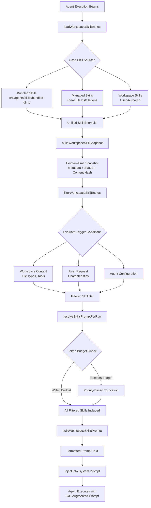
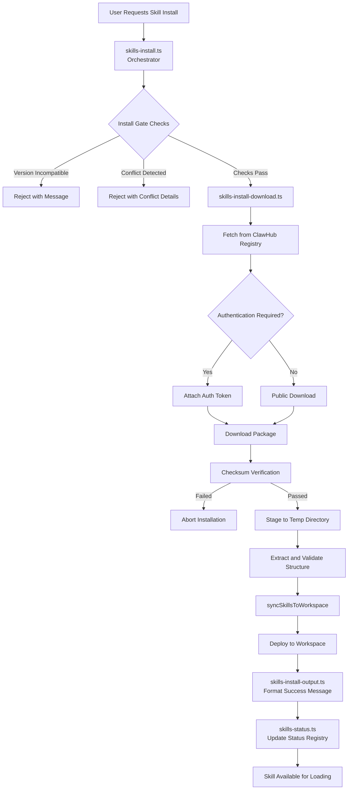
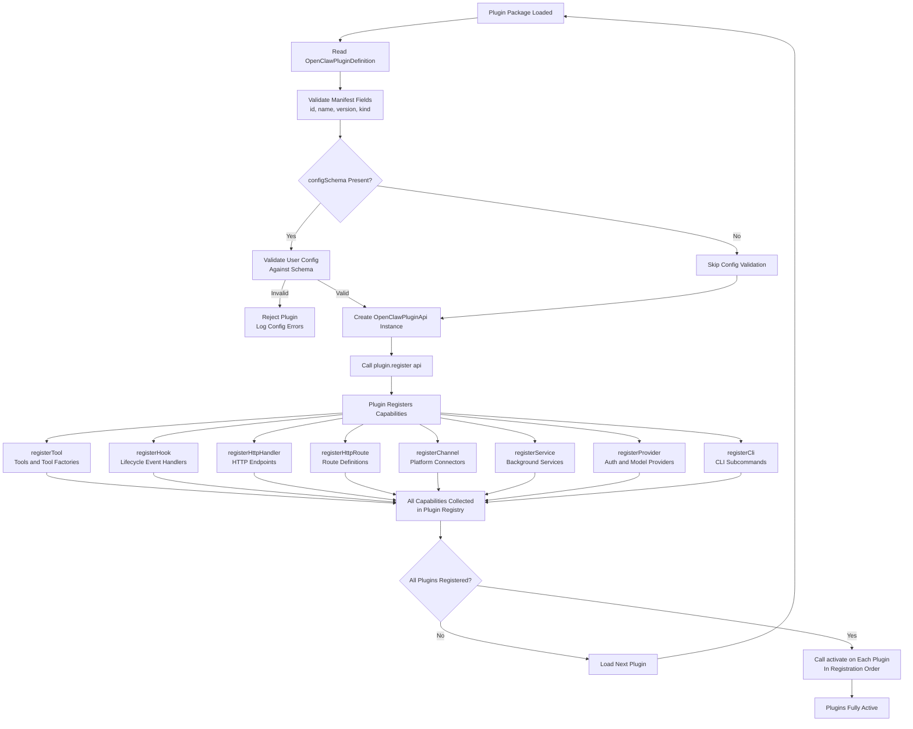
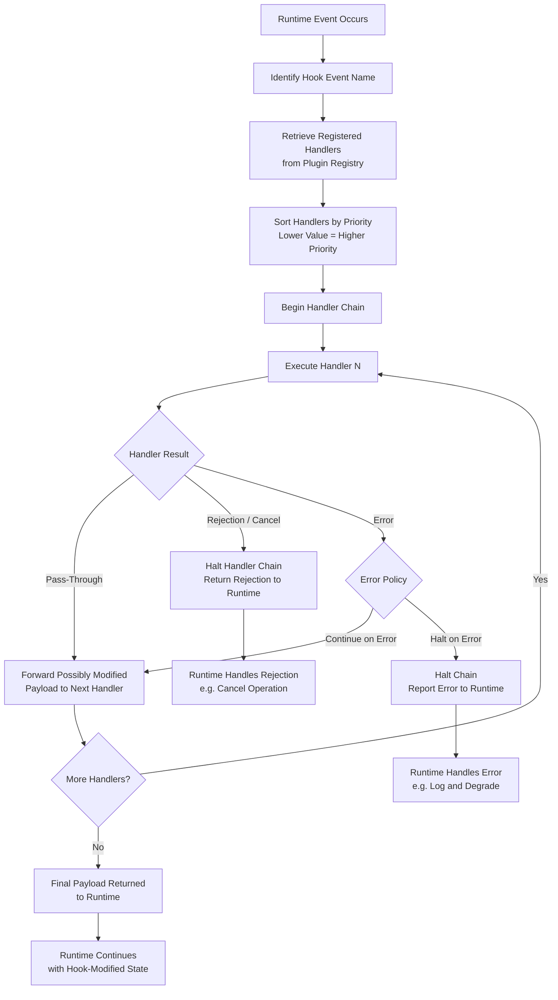
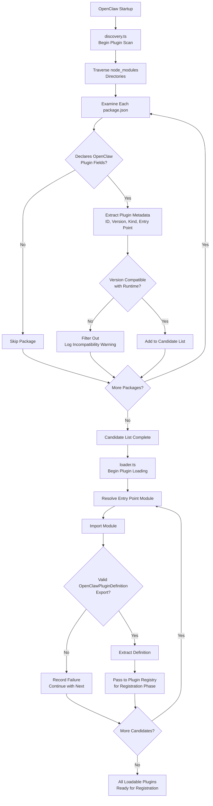
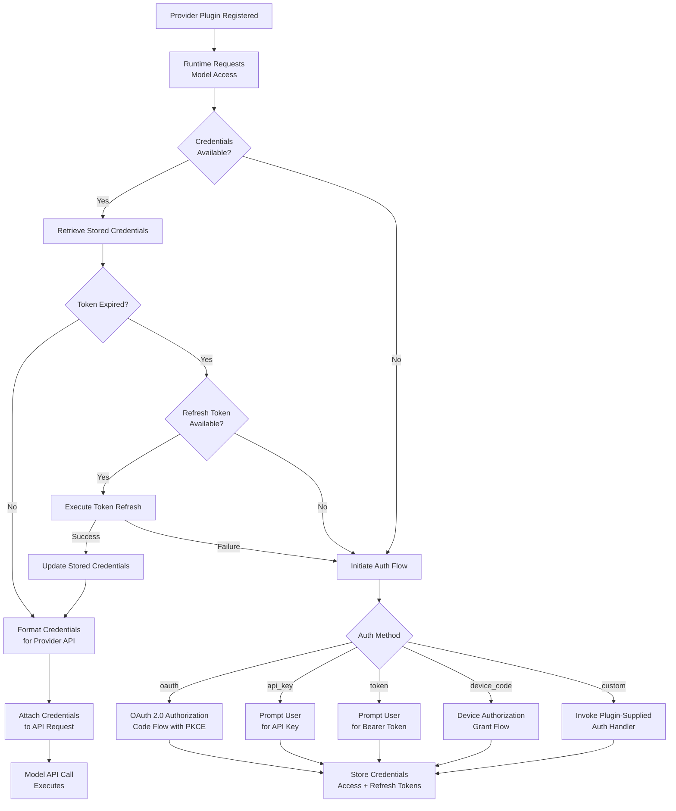
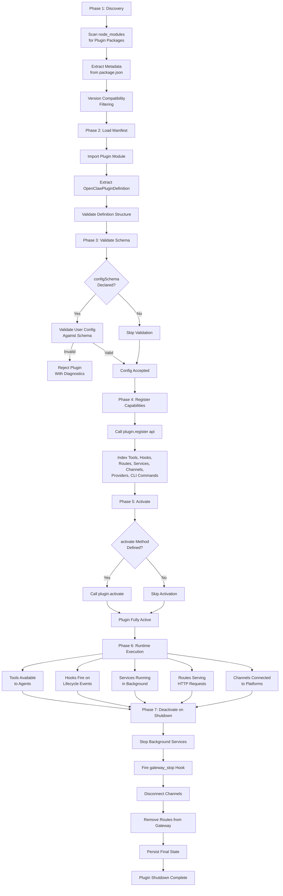

# Skills and Plugin Systems

This document provides a comprehensive reference for OpenClaw's two primary extensibility mechanisms: the **Skills system**, which injects domain-specific knowledge into agent prompts, and the **Plugin system**, which extends platform capabilities through npm packages with a structured registration API.

---

## Table of Contents

- [Skills System](#skills-system)
  - [Concept and Purpose](#concept-and-purpose)
  - [Skill Categories](#skill-categories)
  - [Skill Structure](#skill-structure)
  - [Skill Loading and Registration Pipeline](#skill-loading-and-registration-pipeline)
  - [Skill Injection Flow](#skill-injection-flow)
  - [Skill Installation Pipeline](#skill-installation-pipeline)
  - [Skill Commands and Environment Management](#skill-commands-and-environment-management)
  - [Skill Source Files](#skill-source-files)
- [Plugin System](#plugin-system)
  - [Architecture Overview](#architecture-overview)
  - [Plugin Manifest](#plugin-manifest)
  - [Plugin API Surface](#plugin-api-surface)
  - [Plugin Registration Flow](#plugin-registration-flow)
  - [Plugin Configuration Schema](#plugin-configuration-schema)
  - [Hook System](#hook-system)
  - [Hook Lifecycle Flow](#hook-lifecycle-flow)
  - [Plugin Discovery and Loading](#plugin-discovery-and-loading)
  - [Plugin Discovery Flow](#plugin-discovery-flow)
  - [Plugin Registry](#plugin-registry)
  - [Plugin SDK](#plugin-sdk)
  - [Provider Plugins](#provider-plugins)
  - [Provider Authentication Flow](#provider-authentication-flow)
  - [Full Plugin Lifecycle](#full-plugin-lifecycle)
  - [Plugin Source Files](#plugin-source-files)

---

## Skills System

### Concept and Purpose

Skills are self-contained knowledge bundles that live within agent workspaces. During agent execution, the runtime evaluates which skills are relevant to the current context and auto-injects their content into the system prompt. This gives agents domain-specific capabilities -- such as knowledge of a particular API, a coding standard, or an operational runbook -- without requiring the user to manually craft prompts.

Skills are distinct from plugins in a critical way: skills augment what the agent **knows**, while plugins augment what the agent **can do**. A skill might teach an agent how to write idiomatic Rust code, whereas a plugin might give the agent a tool to execute Rust compilation.

### Skill Categories

OpenClaw supports three categories of skills, each with a different provenance and management model.

**Bundled Skills** are shipped as part of the OpenClaw distribution itself. They are defined in `src/agents/skills/bundled-dir.ts` and represent the baseline knowledge that every OpenClaw installation has access to. These skills cannot be uninstalled or modified by users. They cover foundational capabilities that the OpenClaw team considers essential for general-purpose agent operation.

**Managed Skills** are installed from the ClawHub skill directory, which is OpenClaw's centralized marketplace for community-contributed skills. Managed skills go through an install gating process that validates compatibility, checks version constraints, and presents a UI confirmation before deployment. Once installed, managed skills are tracked and can be updated or removed through the standard skill management interface.

**Workspace Skills** are user-authored skills that live directly in the agent's workspace directory. These require no installation process -- the user simply creates the skill files in the appropriate workspace location. Workspace skills take precedence in resolution order, allowing users to override bundled or managed skill behavior for specific use cases.

### Skill Structure

Every skill is composed of several distinct parts that together define its identity, trigger conditions, content, and optional executable components.

**Frontmatter Metadata** is a structured header block that declares the skill's name, a human-readable description, and the trigger conditions under which the skill should activate. Triggers can be keyword-based, context-based (such as detecting a particular file type in the workspace), or explicit (invoked by name). The metadata block also includes versioning information and author attribution.

**Prompt Content** is the body of the skill, written as markdown instructions. When the skill is injected into an agent's system prompt, this content is what the agent receives. Prompt content can include detailed instructions, examples, constraints, formatting guidance, and any other natural language directives. The quality and specificity of this content directly determines the skill's effectiveness.

**Optional Scripts and Tools** allow a skill to bundle executable logic alongside its knowledge content. A skill might include helper scripts that the agent can invoke during execution, or tool definitions that register new capabilities in the agent's tool inventory. This bridges the gap between passive knowledge (prompt content) and active capability (tool invocation).

**Environment Overrides** let a skill modify environment variables during agent execution. This is useful for skills that need to configure external tool behavior -- for example, a skill focused on a specific cloud provider might set credential environment variables or endpoint URLs.

**Config Options** expose tunable parameters that users or administrators can adjust without modifying the skill's source. Config options are validated against a schema and can influence both the prompt content generation and any script/tool behavior.

### Skill Loading and Registration Pipeline

The skill system uses a multi-stage pipeline to move from raw skill files on disk to injected prompt content. Each stage is handled by a dedicated function.

**`loadWorkspaceSkillEntries()`** performs the initial scan of all skill sources -- bundled directory, managed skill installations, and workspace skill locations. It reads each skill's frontmatter metadata and returns a unified list of skill entries regardless of their provenance. This function handles deduplication when the same skill name appears in multiple sources, applying the precedence order: workspace > managed > bundled.

**`buildWorkspaceSkillSnapshot()`** takes the loaded skill entries and captures a point-in-time snapshot of their collective state. This snapshot includes each skill's metadata, activation status, configuration values, and content hash. Snapshots are used for change detection -- the runtime can compare the current snapshot against a previous one to determine whether re-injection is needed.

**`filterWorkspaceSkillEntries()`** applies context-sensitive filtering to the skill snapshot. Not every loaded skill should be active for every agent run. This function evaluates each skill's trigger conditions against the current execution context (workspace contents, user request characteristics, active tools) and produces a reduced set of skills that are relevant to the current operation.

**`resolveSkillsPromptForRun()`** is the per-execution resolver that determines the final set of skills to include in a specific agent run. This function considers the filtered skill list, the agent's configuration, token budget constraints, and priority ordering. When the total skill content exceeds the token budget, lower-priority skills are dropped. The output is an ordered list of skills ready for prompt generation.

**`buildWorkspaceSkillsPrompt()`** takes the resolved skill list and generates the textual representation that will be injected into the agent's system prompt. This function handles formatting, section delimitation, and any dynamic content interpolation within skill prompt bodies. The output is a single string ready for concatenation into the system prompt.

**`syncSkillsToWorkspace()`** ensures that all managed and bundled skills are properly deployed to the workspace filesystem. This function runs during workspace initialization and after skill installation operations. It handles file copying, permission setting, and directory structure creation. If a skill's on-disk state diverges from the expected state (due to manual editing or filesystem corruption), this function restores it.

### Skill Injection Flow

The following diagram illustrates how skills move from storage through filtering and resolution into the agent's system prompt.

### Skill Installation Pipeline

Managed skill installation is a multi-step process with dedicated modules for each concern.

**`src/agents/skills-install.ts`** is the top-level orchestrator for skill installation. It coordinates the download, validation, extraction, and deployment of a managed skill from ClawHub. This module handles the install gating logic -- verifying that the user has confirmed the installation, that the skill is compatible with the current OpenClaw version, and that no conflicting skills are already installed.

**`src/agents/skills-install-download.ts`** handles the network retrieval of skill packages. It manages HTTP requests to the ClawHub registry, handles authentication tokens for private skills, performs integrity verification (checksum validation), and writes the downloaded package to a temporary staging area.

**`src/agents/skills-install-output.ts`** manages the user-facing output during installation. It formats progress indicators, success/failure messages, and any warnings or advisories that arise during the installation process. This module ensures a consistent and informative installation experience regardless of the installation's complexity.

**`src/agents/skills-status.ts`** provides ongoing status tracking for installed skills. It reports whether each skill is active, inactive, errored, or pending update. This module is consulted both by the CLI status commands and by the runtime's skill loading pipeline to determine which skills are eligible for activation.

### Skill Commands and Environment Management

Skills can define executable commands and environment variable overrides, managed through dedicated configuration modules.

**`src/agents/skills/config.ts`** houses skill-level configuration logic. Each skill can declare configuration options in its frontmatter, and this module provides the runtime evaluation of those options -- reading user-set values, applying defaults, and validating against declared schemas.

**`buildWorkspaceSkillCommandSpecs()`** aggregates command specifications from all active skills into a unified command registry. Each skill can define one or more commands that become available to the agent during execution. Command specs include the command name, argument schema, description, and the script or handler to invoke.

**`applySkillEnvOverrides()`** processes environment variable declarations from active skills and applies them to the agent's execution environment. Overrides are applied in skill precedence order (workspace > managed > bundled), with later overrides taking precedence over earlier ones for the same variable name. This function also handles environment variable interpolation, where one skill's variable can reference another.

### Skill Source Files

| File | Responsibility |
|------|---------------|
| `src/agents/skills/bundled-dir.ts` | Bundled skill definitions shipped with OpenClaw |
| `src/agents/skills/config.ts` | Skill configuration schema and evaluation |
| `src/agents/skills-install.ts` | Top-level skill installation orchestrator |
| `src/agents/skills-install-download.ts` | Network download and integrity verification |
| `src/agents/skills-install-output.ts` | Installation progress and result formatting |
| `src/agents/skills-status.ts` | Skill activation status tracking |

---

## Plugin System

### Architecture Overview

Plugins are npm packages that extend OpenClaw's runtime capabilities through a structured registration API. Unlike skills, which operate purely at the prompt level, plugins integrate deeply with the platform -- they can register new tools, intercept lifecycle events through hooks, expose HTTP endpoints, provide authentication mechanisms, and run background services.

The plugin architecture follows a **declare-then-register** pattern. Each plugin ships a manifest declaring its identity and capabilities in `package.json`. At load time, OpenClaw calls the plugin's `register()` function, passing it an API object through which the plugin declares its concrete contributions. An optional `activate()` lifecycle method runs after all plugins have registered, allowing late-binding initialization that depends on other plugins' registrations.

### Plugin Manifest

The plugin manifest, defined in `src/plugins/manifest.ts`, is the `OpenClawPluginDefinition` interface that every plugin must export. It serves as the plugin's identity card and entry point.

**`id`** is a globally unique identifier for the plugin, typically following reverse-domain or scoped-package naming conventions. This ID is used for dependency resolution, configuration namespacing, and logging.

**`name`** is a human-readable display name shown in UI surfaces such as the plugin management panel and configuration screens.

**`description`** provides a brief summary of the plugin's purpose and capabilities, used in directory listings and help text.

**`version`** follows semantic versioning and is used for compatibility checking during discovery and loading.

**`kind`** classifies the plugin's primary function. The `"memory"` kind, for example, indicates a plugin that provides persistent memory capabilities to agents. Kind classification enables the runtime to make intelligent decisions about plugin loading order and conflict resolution.

**`configSchema`** is an optional schema definition that declares the plugin's configurable parameters. When present, the runtime validates user-provided configuration against this schema before passing it to the plugin.

**`register()`** is the mandatory entry point function. OpenClaw calls this function during plugin initialization, passing the `OpenClawPluginApi` object. The plugin uses this API to declare all of its capabilities -- tools, hooks, routes, services, and so on. This function must be synchronous and should not perform heavy initialization; that work belongs in `activate()`.

**`activate()`** is an optional lifecycle method called after all plugins have completed their `register()` phase. This is the appropriate place for initialization that depends on the full plugin ecosystem being registered -- for example, querying which other plugins are present or establishing inter-plugin communication channels.

### Plugin API Surface

The `OpenClawPluginApi` object passed to a plugin's `register()` function exposes the following registration methods. Each method corresponds to a distinct capability category.

**`registerTool()`** adds new tools or tool factories to the agent's tool inventory. Each registered tool includes metadata (name, description, parameter schema) and an implementation function. Tool factories allow dynamic tool generation based on runtime context -- for example, a database plugin might generate a tool per configured database connection.

**`registerHook()`** attaches handlers to lifecycle events in the OpenClaw runtime. Each hook registration includes the event name, a handler function, and a priority value that determines execution order when multiple plugins register handlers for the same event. Lower priority values execute first. See the Hook System section for the complete event catalog.

**`registerHttpHandler()`** exposes custom HTTP endpoints through the OpenClaw gateway. Handlers receive standard request/response objects and can implement arbitrary HTTP logic. This is used for webhook receivers, status pages, and custom API surfaces.

**`registerHttpRoute()`** provides a higher-level route definition mechanism compared to raw HTTP handlers. Routes include path patterns, HTTP method constraints, middleware chains, and handler functions. This is the preferred mechanism for plugins that expose multiple related endpoints.

**`registerChannel()`** integrates communication platform connectors. A channel registration includes message receive/send adapters, platform-specific formatting logic, and connection lifecycle management. This mechanism powers integrations with platforms such as Slack, Discord, and Microsoft Teams.

**`registerService()`** declares a background service with explicit start/stop lifecycle management. Services are long-running processes that operate independently of individual agent executions. The runtime manages service lifecycle -- starting services when the plugin activates and stopping them during shutdown. Each service registration includes `start()` and `stop()` functions.

**`registerProvider()`** adds authentication and model provider capabilities. Provider registrations include model configurations, credential management, and token refresh logic. See the Provider Plugins section for detailed coverage.

**`registerCli()`** extends the OpenClaw command-line interface with new subcommands. CLI registrations include the command name, argument/option schema, help text, and handler function. This allows plugins to expose administrative and diagnostic capabilities through the standard CLI.

### Plugin Registration Flow

### Plugin Configuration Schema

The `OpenClawPluginConfigSchema` interface provides a type-safe configuration validation and transformation layer for plugins.

**`safeParse()`** attempts to validate and parse a configuration object against the schema, returning a result type that indicates success or failure without throwing exceptions. On success, the result contains the parsed and type-coerced configuration. On failure, it contains structured error information describing which fields failed validation and why.

**`parse()`** performs the same validation and type coercion as `safeParse()` but throws an exception on validation failure. This is appropriate for contexts where invalid configuration is a fatal error.

**`validate()`** performs validation only, returning a success/error discriminated result without type coercion. This is useful for pre-flight checks where the raw configuration values should be preserved.

**`uiHints`** provides rendering metadata for configuration UIs. This includes field groupings, display labels, help text, input types (text, number, toggle, select), and conditional visibility rules. UI surfaces use these hints to generate dynamic configuration forms.

**`jsonSchema`** exposes the underlying JSON Schema representation of the configuration, suitable for documentation generation and external tooling integration.

### Hook System

The hook system provides 20 lifecycle events organized into six categories. Each event represents a point in the OpenClaw runtime where plugins can observe, modify, or intercept behavior.

#### Agent Execution Hooks

**`before_model_resolve`** fires before the runtime selects which model to use for an agent execution. Hook handlers receive the resolution context (requested model, available providers, user preferences) and can modify the selection criteria or force a specific model. This is essential for plugins that implement model routing, A/B testing, or cost optimization strategies.

**`before_prompt_build`** fires after model selection but before the system prompt is assembled. Handlers receive the prompt building context and can inject additional content, modify the prompt template, or alter the skill injection decisions. This hook operates at a higher level than skill injection -- it can modify the prompt assembly process itself.

**`before_agent_start`** fires immediately before the agent begins its execution loop. All configuration, prompt assembly, and tool registration is complete at this point. Handlers receive the fully configured agent context and can perform final adjustments or logging. This is the last interception point before the agent starts processing.

**`llm_input`** fires each time a request is about to be sent to the language model. Handlers receive the complete request payload (messages, tools, parameters) and can modify any aspect of it. This hook enables request logging, token counting, content filtering, and request transformation.

**`llm_output`** fires each time a response is received from the language model. Handlers receive the raw response and can modify it before the agent processes it. Use cases include response logging, output filtering, cost tracking, and response transformation.

**`agent_end`** fires when the agent completes its execution, whether through natural completion, error, or cancellation. Handlers receive the execution summary including token usage, duration, tool call counts, and the final result. This hook is essential for analytics, billing, and cleanup.

#### Message Flow Hooks

**`message_received`** fires when an inbound message arrives from any channel (CLI, HTTP, platform connector). Handlers receive the raw message and its source metadata. This hook enables message logging, spam filtering, rate limiting, and message transformation before the agent sees the message.

**`message_sending`** fires when the runtime is about to send an outbound message but has not yet dispatched it. Handlers receive the formatted message and its destination. This hook enables content review, formatting adjustments, and send cancellation.

**`message_sent`** fires after an outbound message has been successfully dispatched to its destination. Handlers receive the sent message and delivery confirmation details. This hook enables delivery logging, read receipt tracking, and post-send analytics.

**`before_message_write`** fires before a message is persisted to the conversation store. Handlers receive the message content and storage metadata. This hook enables content redaction, metadata enrichment, and write interception for custom storage backends.

#### Session Hooks

**`session_start`** fires when a new conversation session is initiated. Handlers receive the session configuration including the workspace, agent identity, and initial context. This hook enables session logging, resource allocation, and initialization of session-scoped plugin state.

**`session_end`** fires when a session is terminated, whether by user action, timeout, or error. Handlers receive the session summary and can perform cleanup operations. This hook is the counterpart to `session_start` and should release any resources acquired during that hook.

**`before_reset`** fires before a session reset operation clears conversation history and state. Handlers receive the current session state and can preserve specific data elements or perform pre-reset archival. This hook can also cancel the reset operation by returning a rejection.

#### Tool Invocation Hooks

**`before_tool_call`** fires before the runtime executes a tool invocation requested by the agent. Handlers receive the tool name, arguments, and invocation context. This hook enables argument validation, access control enforcement, audit logging, and tool call interception (blocking or redirecting calls).

**`after_tool_call`** fires after a tool invocation completes, whether successfully or with an error. Handlers receive the tool name, arguments, result, duration, and any error information. This hook enables result logging, error recovery, result transformation, and performance tracking.

**`tool_result_persist`** fires before a tool's result is persisted to the conversation context. Handlers receive the result content and storage metadata. This hook enables result redaction (removing sensitive data from conversation history), result summarization (compacting large results), and custom storage logic.

#### Context Compaction Hooks

**`before_compaction`** fires when the runtime determines that the conversation context needs compaction (typically because it is approaching the model's context window limit). Handlers receive the current context and compaction parameters. This hook enables custom compaction strategies, content preservation rules, and compaction logging.

**`after_compaction`** fires after compaction is complete. Handlers receive both the pre-compaction and post-compaction context, along with metrics about what was removed or summarized. This hook enables compaction quality assessment, lost-context recovery, and analytics.

#### Infrastructure Hooks

**`gateway_start`** fires when the OpenClaw HTTP gateway begins listening for connections. Handlers receive the gateway configuration (port, host, TLS settings). This hook enables gateway-level middleware registration, startup logging, and health check initialization.

**`gateway_stop`** fires when the gateway is shutting down. Handlers receive a shutdown context with the reason and timeout. This hook enables graceful connection draining, shutdown logging, and final state persistence.

### Hook Lifecycle Flow

The following diagram shows how a single hook event propagates through registered handlers and how priority ordering and early termination work.

### Plugin Discovery and Loading

Plugin discovery and loading are handled by two dedicated modules that separate the concerns of finding plugins from instantiating them.

**`src/plugins/discovery.ts`** is responsible for scanning the environment for available plugins. It traverses `node_modules` directories looking for packages that declare themselves as OpenClaw plugins through specific `package.json` fields. The discovery module extracts metadata from each candidate package -- plugin ID, version, kind, entry point path, and compatibility declarations. It builds a candidate list without loading any plugin code, keeping the discovery phase lightweight and side-effect-free. Discovery also performs version compatibility checking, filtering out plugins that declare incompatibility with the running OpenClaw version.

**`src/plugins/loader.ts`** takes the candidate list from discovery and performs the actual loading of plugin code. For each candidate, it resolves the entry point module, imports it, and extracts the `OpenClawPluginDefinition` export. The loader validates the definition structure, ensuring that required fields are present and that the `register()` function exists. If a plugin fails to load (due to missing dependencies, syntax errors, or invalid exports), the loader records the failure and continues with remaining plugins -- a single broken plugin does not prevent others from loading.

### Plugin Discovery Flow

### Plugin Registry

The plugin registry, implemented in `src/plugins/registry.ts`, is the central authority for plugin state management throughout the OpenClaw runtime.

The registry maintains a mapping from plugin IDs to their loaded definitions, registration state, and runtime status. When a plugin completes its `register()` call, all declared capabilities are indexed in the registry -- tools are added to the tool catalog, hooks are added to the hook dispatch tables, routes are added to the HTTP router, and so on.

The registry supports dynamic enable/disable operations. Disabling a plugin removes its capabilities from the active catalogs without unloading the plugin code. Re-enabling restores them. This allows administrators to temporarily disable a misbehaving plugin without restarting the system.

Configuration state tracking is another registry responsibility. When a plugin's configuration changes (through UI, CLI, or API), the registry validates the new configuration against the plugin's schema, updates the stored state, and notifies the plugin through a configuration change callback if one is registered.

### Plugin SDK

The plugin SDK, housed in `src/plugin-sdk/`, provides a collection of helper utilities that simplify common tasks for plugin authors. These utilities encapsulate patterns that would otherwise require plugin authors to understand OpenClaw internals.

**`account-id.ts`** provides utilities for working with OpenClaw account identifiers. It includes parsing, validation, formatting, and comparison functions for account IDs across different contexts (local, multi-tenant, scoped).

**`allow-from.ts`** implements access control helpers that plugins can use to restrict which accounts, roles, or channels can invoke their capabilities. It provides declarative allow/deny list evaluation and integrates with the runtime's permission system.

**`command-auth.ts`** handles authentication for plugin-defined CLI commands and HTTP endpoints. It provides middleware functions that validate tokens, check permissions, and inject authenticated identity into request contexts.

**`config-paths.ts`** resolves standard file system paths for plugin configuration, data storage, and cache directories. It respects platform conventions (XDG on Linux, Application Support on macOS) and multi-workspace isolation.

**`json-store.ts`** provides a simple key-value persistence layer backed by JSON files. It handles atomic writes, file locking, and schema migration. Plugins use this for storing state that must survive restarts but does not warrant a full database.

**`onboarding.ts`** implements a guided setup flow for plugins that require initial configuration. It provides step-by-step prompts, validation, and state tracking for the onboarding process. This ensures that plugins with complex setup requirements provide a consistent user experience.

**`text-chunking.ts`** offers message chunking utilities for platforms with message length limits. It splits long messages into appropriately sized chunks while respecting formatting boundaries (not splitting mid-word, mid-code-block, or mid-table).

**`webhook-path.ts`** constructs properly formatted webhook URLs for plugin endpoints. It handles base URL resolution, path prefix injection, and authentication token embedding for webhook receivers.

**`webhook-targets.ts`** manages the registry of webhook delivery targets for a plugin. It provides CRUD operations for target URLs, delivery retry configuration, and target health tracking.

### Provider Plugins

Provider plugins are a specialized plugin category that integrates external AI model providers and authentication systems into OpenClaw. A `ProviderPlugin` bundles several related concerns into a unified registration.

**Model Configurations** declare the models available through this provider, including model identifiers, capability flags (vision, function calling, streaming), context window sizes, and pricing information. The runtime uses these declarations for model resolution, capacity planning, and cost estimation.

**Environment Variable Expectations** specify which environment variables the provider requires (such as API keys or endpoint URLs) and which are optional. The runtime checks these expectations during provider activation and provides diagnostic messages when required variables are missing.

**Credential Formatting** handles the transformation of stored credentials into the format required by the provider's API. Different providers expect credentials in different locations (Authorization header, query parameter, request body) and formats (Bearer token, API key, custom scheme).

**OAuth Token Refresh** implements automatic token renewal for providers that use OAuth-based authentication. The refresh logic handles token expiration detection, refresh token exchange, and credential store updates. This runs transparently -- agents are never exposed to token management.

**Auth Methods** define the authentication mechanisms the provider supports. OpenClaw recognizes five standard auth methods:

- **`oauth`** -- Full OAuth 2.0 authorization code flow with PKCE support
- **`api_key`** -- Static API key provided by the user
- **`token`** -- Bearer token authentication (distinct from OAuth in that it does not involve a refresh flow)
- **`device_code`** -- OAuth 2.0 device authorization grant for environments without a browser
- **`custom`** -- Provider-defined authentication mechanism with a plugin-supplied handler

### Provider Authentication Flow

### Full Plugin Lifecycle

The complete lifecycle of a plugin from discovery through shutdown encompasses seven distinct phases.

### Plugin Source Files

| File | Responsibility |
|------|---------------|
| `src/plugins/manifest.ts` | `OpenClawPluginDefinition` interface and manifest types |
| `src/plugins/discovery.ts` | Plugin scanning and candidate list building |
| `src/plugins/loader.ts` | Plugin code loading and definition extraction |
| `src/plugins/registry.ts` | Plugin state management, enable/disable, config tracking |
| `src/plugin-sdk/account-id.ts` | Account identifier utilities |
| `src/plugin-sdk/allow-from.ts` | Access control evaluation helpers |
| `src/plugin-sdk/command-auth.ts` | Command and endpoint authentication middleware |
| `src/plugin-sdk/config-paths.ts` | Platform-aware configuration path resolution |
| `src/plugin-sdk/json-store.ts` | JSON file-backed key-value persistence |
| `src/plugin-sdk/onboarding.ts` | Guided plugin setup flow |
| `src/plugin-sdk/text-chunking.ts` | Message splitting for length-limited platforms |
| `src/plugin-sdk/webhook-path.ts` | Webhook URL construction |
| `src/plugin-sdk/webhook-targets.ts` | Webhook target registry management |
