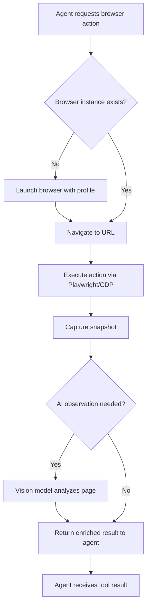
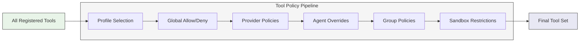
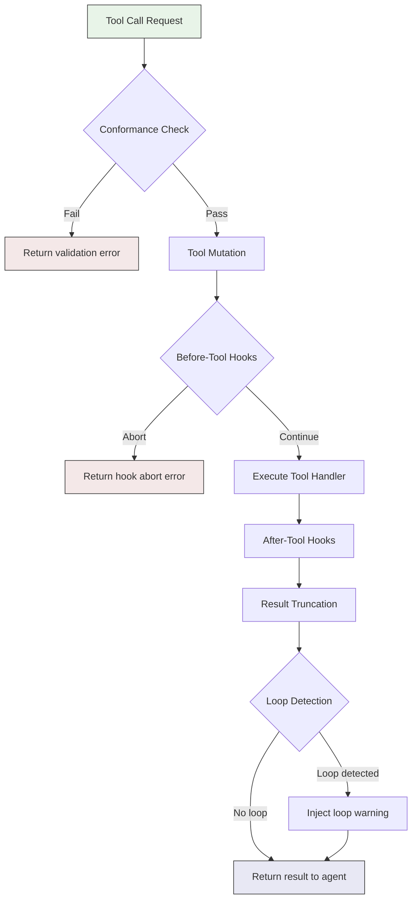
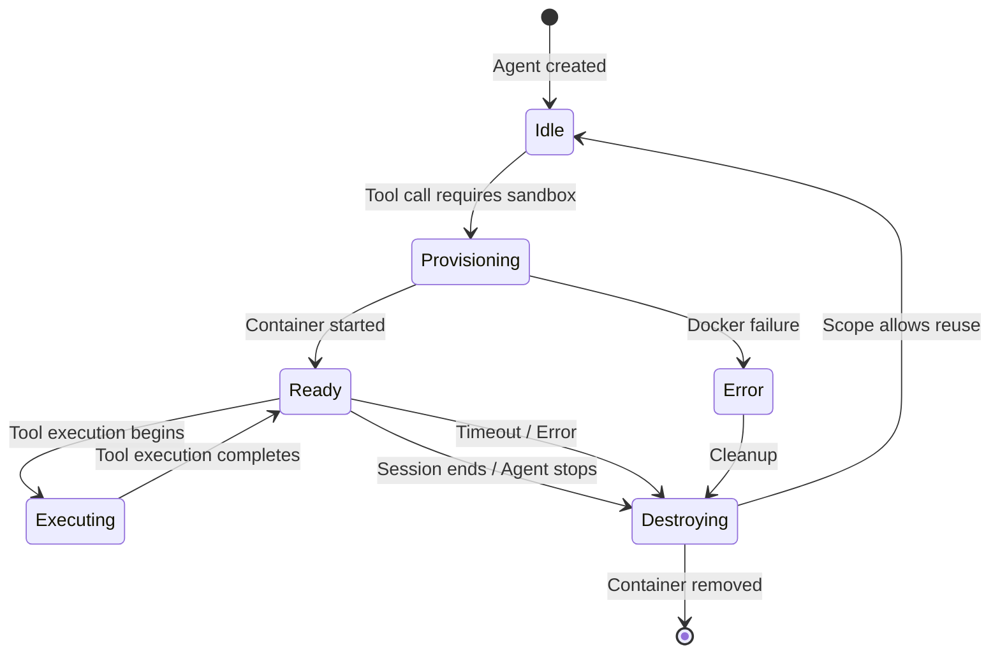
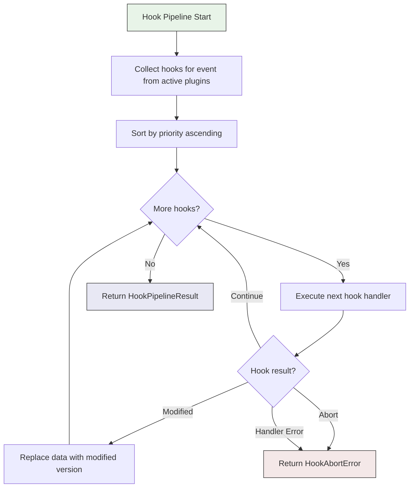
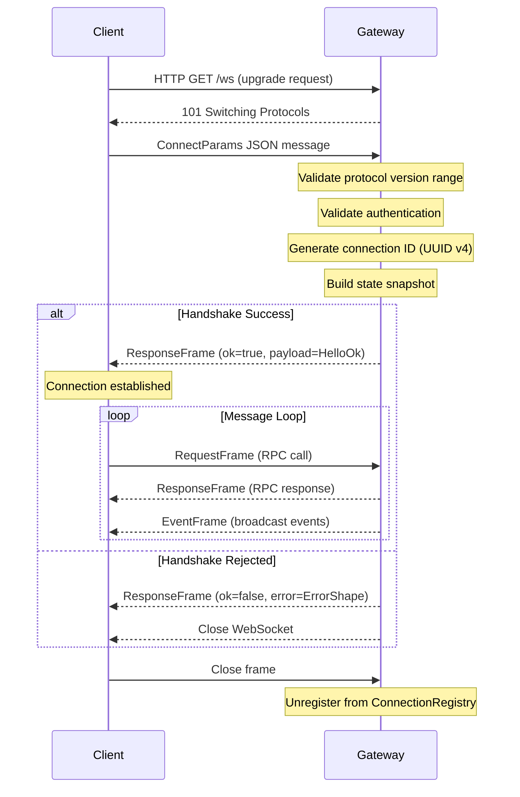
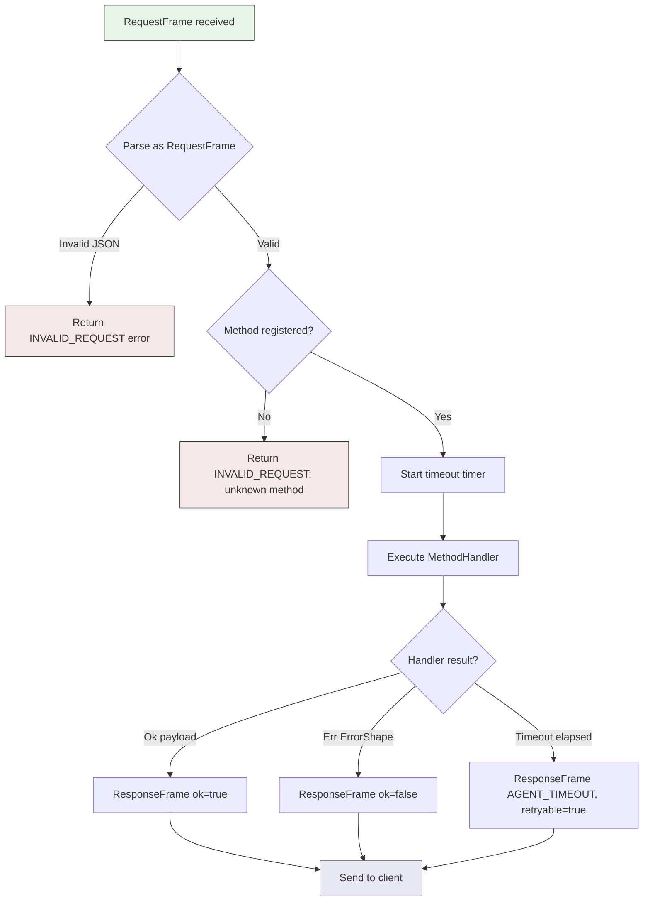
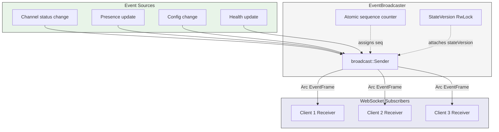
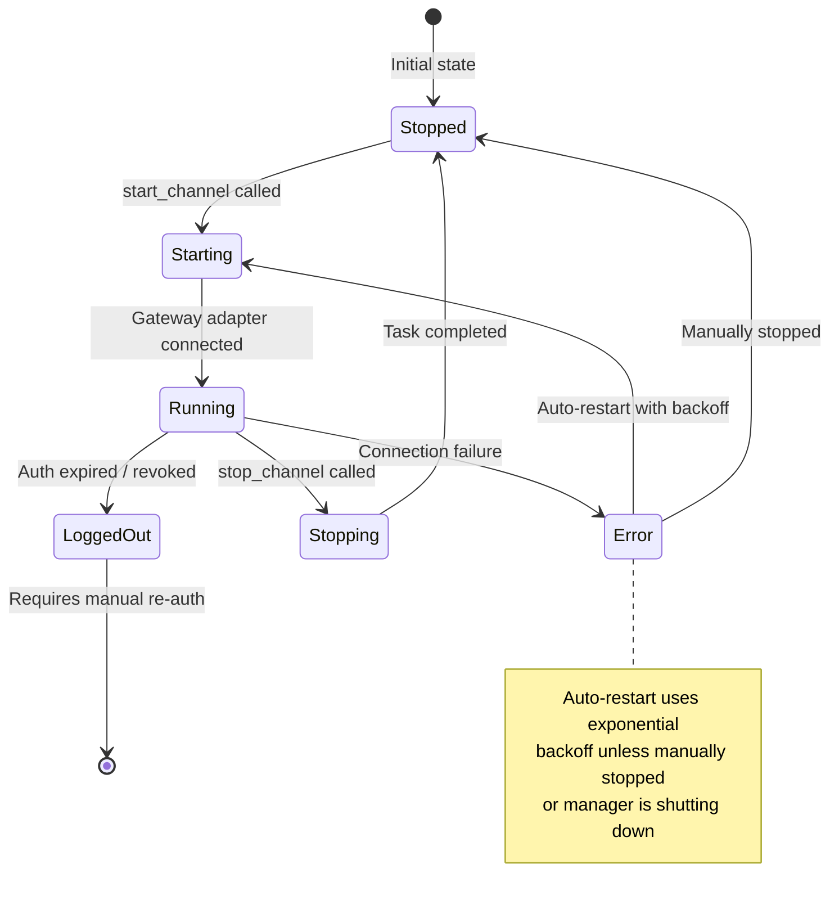

# OpenClaw Tool System and Gateway API

This document provides a comprehensive reference for OpenClaw's tool system -- the mechanism by which agents interact with the world beyond conversation -- and the Gateway API that exposes these capabilities over a WebSocket-based JSON-RPC protocol.

---

## Table of Contents

1. [Tool System Overview](#tool-system-overview)
2. [Core Tool Categories](#core-tool-categories)
3. [Tool Policy System](#tool-policy-system)
4. [Tool Policy Pipeline](#tool-policy-pipeline)
5. [Sandbox System](#sandbox-system)
6. [Plugin-Registered Tools](#plugin-registered-tools)
7. [Hook Pipeline and Tool Lifecycle](#hook-pipeline-and-tool-lifecycle)
8. [Gateway API Overview](#gateway-api-overview)
9. [Connection Protocol and Handshake](#connection-protocol-and-handshake)
10. [Frame Types and Wire Format](#frame-types-and-wire-format)
11. [RPC Method Dispatch](#rpc-method-dispatch)
12. [API Method Categories](#api-method-categories)
13. [Event Broadcasting](#event-broadcasting)
14. [Error Handling](#error-handling)
15. [Channel Management via Gateway](#channel-management-via-gateway)

---

## Tool System Overview

Tools are the primary mechanism through which agents interact with external systems. Each tool is a named capability with a handler function that accepts structured parameters and returns structured results. Tools are exposed to agents through a multi-layered policy-based filtering system that determines which tools are available in any given context.

The tool system is designed around two core principles:

- **Extensibility**: Plugins can register custom tools at runtime via the `PluginApi` interface, meaning the tool surface is not fixed at compile time.
- **Safety**: A layered policy pipeline ensures that tools are filtered, restricted, and audited before an agent can invoke them. Sandbox isolation provides an additional containment boundary for tool execution.

### Source Files

- Tool handler trait: `crates/claw-plugins/src/types.rs` (the `ToolHandler` trait)
- Tool registration: `crates/claw-plugins/src/types.rs` (`ToolRegistration` struct and `PluginApi::register_tool`)
- Tool query across plugins: `crates/claw-plugins/src/registry.rs` (`PluginRegistry::get_all_tools`)

---

## Core Tool Categories

OpenClaw organizes tools into functional categories. Each category groups related capabilities that an agent may need during a conversation turn.

### File Operations

Tools for reading, writing, and editing files within the agent's workspace. These tools are sandbox-aware, meaning their behavior changes based on the sandbox configuration -- they may operate directly on the host filesystem or be routed through a filesystem bridge into a container.

**Source**: `src/agents/tools/` (OpenClaw TypeScript codebase)

### Execution Tools

Shell command execution tools that give agents the ability to run arbitrary commands, manage processes, and interact with interactive terminals.

- **Shell execution** (`bash-tools.ts`): Runs shell commands with configurable timeouts, working directory persistence, and output capture.
- **Process registry**: Tracks running background processes across agent turns so they can be referenced later.
- **PTY support**: Pseudo-terminal allocation for commands that require interactive input.
- **Exec runtime with approval IDs**: Every execution request can be gated behind an approval flow where the human operator must explicitly approve the command before it runs.
- **Background process management**: Spawning long-running processes that outlive a single agent turn.
- **Send-keys for interactive processes**: Sending keystrokes to already-running interactive processes (for example, responding to prompts).

### Browser Control

A dedicated subsystem for controlling Chrome/Chromium browsers, enabling agents to navigate web pages, interact with elements, and capture page state.

- **Source**: `src/browser/browser-tool.ts`
- **Playwright and CDP integration**: Uses both Playwright's high-level API and the Chrome DevTools Protocol (CDP) for fine-grained browser control.
- **Snapshots**: Captures the current state of the page (DOM, accessibility tree, visual screenshot) for the agent to reason about.
- **Actions**: Click, type, scroll, navigate, wait for selectors, and other standard browser interactions.
- **Uploads**: File upload support through input element interaction.
- **Profile management**: Multiple browser profiles for maintaining separate sessions (cookies, local storage, etc.).
- **AI-powered element observation**: Uses vision models to identify and describe page elements when standard selectors are insufficient.
- **Cookie/storage state management**: Saving and restoring browser state across sessions.

### Canvas Tools

The Canvas tool provides Agent-to-UI (A2UI) push capabilities, allowing agents to render content directly into the client UI.

- **A2UI push/reset**: Push structured content to the client canvas or reset it to a blank state.
- **JavaScript eval in canvas**: Execute JavaScript within the canvas context for dynamic content manipulation.
- **Snapshot capture**: Capture the current canvas state for agent reference.

**Source**: `src/agents/tools/canvas-tool.ts`

### Messaging Tools

Tools for sending messages across various platforms and channels.

| Tool | Platform | Capabilities |
|------|----------|-------------|
| `message-tool.ts` | Generic | Send messages to any configured channel |
| `discord-actions.ts` | Discord | Guild management, messaging, moderation, presence updates |
| `slack-actions.ts` | Slack | Workspace actions, channel messaging, thread management |
| `telegram-actions.ts` | Telegram | Bot API actions, message sending, inline queries |
| `whatsapp-actions.ts` | WhatsApp | Message sending, media handling |

### Session Management Tools

Tools for managing agent sessions -- the stateful conversation contexts in which agents operate.

| Tool | Purpose |
|------|---------|
| `sessions-send-tool.ts` | Send a message to another active session |
| `sessions-spawn-tool.ts` | Spawn a new subagent session with its own context |
| `sessions-list-tool.ts` | List all currently active sessions |
| `sessions-history-tool.ts` | View the conversation history of a session |
| `session-status-tool.ts` | Query the current status of a session |

### Memory and Search Tools

Tools for persistent memory, web content retrieval, and search.

- **`memory-tool.ts`**: Semantic memory search -- stores and retrieves information using vector embeddings for similarity-based lookup.
- **`web-fetch.ts`**: Fetches web content from a URL, converting HTML to a text representation suitable for agent consumption.
- **`web-search.ts`**: Performs web searches and returns structured results.
- **`web-tools.ts`**: Utility functions for web-related operations (URL validation, content extraction, etc.).

### Automation Tools

Tools for scheduled tasks, device capabilities, and gateway configuration.

- **`cron-tool.ts`**: Schedule, list, and manage recurring jobs. Each job has a cron expression, a target session, and a message payload.
- **`nodes-tool.ts`**: Access device-level capabilities through connected nodes -- camera, screen capture, geolocation, and push notifications.
- **`gateway-tool.ts`**: Inspect and modify gateway configuration at runtime.

### Agent Operations Tools

Tools for managing agents and subagents within the system.

- **`agents-list-tool.ts`**: List all configured agents with their capabilities and status.
- **`subagents-tool.ts`**: Create, manage, and communicate with subagents.
- **`agent-step.ts`**: Execute a single agent step -- one iteration of the agent loop (receive context, call LLM, execute tools, return result).

### Media Tools

Tools for processing media content.

- **`image-tool.ts`**: Image processing operations -- resize, crop, format conversion, and visual analysis.
- **`tts-tool.ts`**: Text-to-speech synthesis -- convert text into audio using configured TTS providers.

---

## Tool Policy System

The tool policy system controls which tools are available to an agent in any given context. It implements a layered filtering pipeline where each layer can add, remove, or modify the available tool set.

**Source**: `src/agents/tool-policy.ts`

### Tool Profiles

Tool profiles define baseline sets of tools appropriate for different use cases. Each profile is a named collection that serves as the starting point for the policy pipeline.

| Profile | Description | Typical Tools |
|---------|-------------|---------------|
| `minimal` | Bare minimum for conversation | Memory, basic file read |
| `coding` | Software development tasks | File read/write/edit, bash execution, web search |
| `messaging` | Communication-focused agents | Messaging tools, session tools, channel actions |
| `full` | All available tools | Every registered tool |

### Filtering Layers

The policy system applies filters in a specific order, each layer narrowing (or in some cases expanding) the tool set:

1. **Global allow/deny lists**: Configuration-level tool filtering that applies to all agents and all providers. Defined in the system config file.

2. **Provider-specific policies**: Per-LLM-provider restrictions. For example, some providers may not support certain tool schemas, or you may want to restrict tool access when using less capable models.

3. **Agent overrides**: Per-agent tool customization. An agent configuration can explicitly include or exclude specific tools beyond what the profile provides.

4. **Group policies**: Different tool sets for group conversations versus direct messages. Group contexts may restrict destructive tools to prevent unintended side effects in shared conversations.

5. **Sandbox restrictions**: When sandbox mode is active, tools that cannot operate within a container are removed from the available set.

---

## Tool Policy Pipeline

The tool policy pipeline extends beyond simple filtering to include runtime behavior around tool invocations.

**Source**: `src/agents/tool-policy-pipeline.ts`

### Pipeline Stages

The pipeline processes each tool call through several stages:

1. **Conformance checking**: Validates that the tool call parameters match the tool's expected schema. Malformed calls are rejected before execution.

2. **Tool mutation (dynamic tool modification)**: The pipeline can dynamically modify tool definitions at runtime. This enables scenarios like injecting additional parameters, adjusting descriptions based on context, or transforming tool schemas for specific providers.

3. **Before-tool-call hooks**: Plugin-registered hooks that fire before a tool executes. These hooks can inspect the call, modify parameters, or abort the call entirely. Hooks run in priority order and can short-circuit the pipeline.

4. **Tool execution**: The actual tool handler runs with the (potentially modified) parameters.

5. **After-tool-call hooks**: Plugin-registered hooks that fire after a tool returns. These can inspect results, modify the output, or trigger side effects.

6. **Tool result truncation**: For context management, large tool results are truncated to fit within the LLM's context window. The truncation strategy preserves the most important parts of the result (typically the beginning and end).

7. **Tool loop detection**: The pipeline monitors for repetitive tool call patterns that indicate the agent is stuck in a loop (for example, repeatedly calling the same tool with the same parameters). When a loop is detected, the pipeline can inject a warning or terminate the agent turn.

### Hook Integration Points

The hook pipeline (implemented in `crates/claw-plugins/src/hooks.rs`) defines two hook events specifically for tool calls:

- **`BeforeToolCall`**: Fires before the tool handler executes. Hooks receive the tool name and parameters. A hook returning `HookResult::Abort` prevents the tool from running. A hook returning `HookResult::Modified` replaces the parameters with new values.

- **`AfterToolCall`**: Fires after the tool handler returns. Hooks receive the tool name and result. A hook returning `HookResult::Modified` replaces the result before it is sent back to the agent.

Hooks are sorted by priority (ascending) and execute in that order. Multiple plugins can register hooks for the same event, forming a chain where each hook sees the output of the previous one.

---

## Sandbox System

The sandbox system provides Docker-based isolation for tool execution, preventing agents from making uncontrolled changes to the host system.

**Source**: `src/agents/sandbox/`

### Sandbox Modes

| Mode | Behavior |
|------|----------|
| `off` | No sandboxing -- tools execute directly on the host |
| `non-main` | Only non-main agents run in sandboxes; the primary agent runs on the host |
| `all` | Every agent runs in a sandbox container |

### Sandbox Scopes

Scopes determine the lifetime and sharing behavior of sandbox containers:

| Scope | Lifetime | Sharing |
|-------|----------|---------|
| `session` | Lives for the duration of a single session | Each session gets its own container |
| `agent` | Lives for the duration of an agent's lifecycle | The agent reuses its container across sessions |
| `shared` | Lives for the duration of the gateway process | Multiple agents share the same container |

### Workspace Access Levels

The sandbox controls how much access the contained agent has to the host workspace:

| Level | Description |
|-------|-------------|
| `none` | No access to the host filesystem |
| `read-only` | Can read files from the workspace but cannot modify them |
| `read-write` | Full read/write access to the workspace (mounted into the container) |

### Container Lifecycle

### Filesystem Bridge

When sandbox mode is active, file operation tools do not access the host filesystem directly. Instead, they communicate through a filesystem bridge that:

1. Translates file paths between the host and container namespaces.
2. Enforces the configured workspace access level (none, read-only, read-write).
3. Handles file content transfer between the host and the container.
4. Provides virtual file listings that reflect the container's view of the workspace.

### Browser Bridges

Browser tools present a special challenge in sandboxed environments because the browser process may need to run on the host (for display access) while the agent controlling it runs in a container. The browser bridge:

1. Proxies browser commands from the sandbox to the host-side browser instance.
2. Transfers screenshots and DOM snapshots back into the container.
3. Manages browser lifecycle independently of the container lifecycle.

---

## Plugin-Registered Tools

Plugins extend the tool system at runtime through the `PluginApi` interface. When a plugin registers a tool, it provides a name and a handler that implements the `ToolHandler` trait.

**Source**: `crates/claw-plugins/src/types.rs`

### Registration Flow

1. The plugin system calls the plugin's setup function, passing a `PluginApi` instance.
2. The plugin calls `api.register_tool("tool_name", handler)` for each tool it wants to expose.
3. The registration is stored in a `PluginRegistrations` collection associated with the plugin.
4. When the plugin is activated (via `PluginRegistry::activate`), its tools become visible to the system.
5. The `PluginRegistry::get_all_tools` method aggregates tools from all active plugins.

### Tool Handler Contract

Every tool handler implements the `ToolHandler` trait:

- **Input**: A `serde_json::Value` containing the tool's parameters.
- **Output**: A `Result<serde_json::Value, anyhow::Error>` containing either the tool's result or an error.

The handler is `Send + Sync`, meaning it must be safe to call from multiple threads concurrently. Tool handlers should not hold long-lived locks or block the async runtime.

### Plugin Kinds

Plugins (and their tools) come in four kinds:

| Kind | Origin |
|------|--------|
| `bundled` | Ships with OpenClaw -- core functionality |
| `managed` | Installed and updated by the package manager |
| `workspace` | Defined in the workspace configuration |
| `extension` | Third-party extensions loaded at runtime |

---

## Hook Pipeline and Tool Lifecycle

The hook pipeline provides extension points throughout the tool execution lifecycle. Hooks are registered by plugins and executed in priority order.

**Source**: `crates/claw-plugins/src/hooks.rs`

### Relevant Hook Events

The full hook event list includes 20 events. The following are directly relevant to tool execution:

| Event | When It Fires |
|-------|---------------|
| `before_tool_call` | Before a tool handler executes |
| `after_tool_call` | After a tool handler returns |
| `tool_result_persist` | When a tool result is being persisted to the session store |
| `before_model_resolve` | Before the LLM provider is selected (affects which tools are available) |
| `before_prompt_build` | Before the prompt is assembled (tool descriptions are part of the prompt) |

### Pipeline Execution Semantics

A `HookPipelineResult` includes:

- **`data`**: The final (possibly modified) event data after all hooks have run.
- **`hooks_executed`**: The number of hooks that executed successfully.
- **`was_modified`**: Whether any hook returned `HookResult::Modified`.

A `HookAbortError` includes:

- **`plugin_id`**: The ID of the plugin whose hook aborted the pipeline.
- **`reason`**: A human-readable reason for the abort.
- **`hooks_executed_before_abort`**: How many hooks ran before the abort occurred.

---

## Gateway API Overview

The Gateway API provides remote access to OpenClaw's capabilities over a WebSocket connection using a JSON-RPC-inspired protocol. Clients connect, authenticate, and then exchange request/response frames for RPC calls and receive asynchronous event broadcasts.

**Source**: `crates/claw-gateway/src/` (Rust port), `src/gateway/` (OpenClaw TypeScript original)

### Architecture

The gateway is built on `actix-web` and `actix-ws`, providing both HTTP endpoints and WebSocket connections on a single port (default: `18789`).

Key components:

| Component | Source File | Purpose |
|-----------|-------------|---------|
| `GatewayServer` | `crates/claw-gateway/src/server.rs` | Server lifecycle management |
| `GatewayState` | `crates/claw-gateway/src/server.rs` | Shared state across all connections |
| `Dispatcher` | `crates/claw-gateway/src/dispatch.rs` | Routes RPC requests to method handlers |
| `MethodRegistry` | `crates/claw-gateway/src/dispatch.rs` | Stores registered method handlers |
| `EventBroadcaster` | `crates/claw-gateway/src/events.rs` | Fans out events to all subscribers |
| `ConnectionRegistry` | `crates/claw-gateway/src/handshake.rs` | Tracks active WebSocket connections |
| `ChannelManager` | `crates/claw-gateway/src/channel_manager.rs` | Manages channel account lifecycles |

### Bind Modes

The gateway supports multiple bind modes to control which network interfaces it listens on:

| Mode | Bind Address | Use Case |
|------|-------------|----------|
| `Auto` | `127.0.0.1` | Development (defaults to loopback) |
| `Loopback` | `127.0.0.1` | Local-only access |
| `Lan` | `0.0.0.0` | LAN access for other devices |
| `Tailnet` | `0.0.0.0` | Tailscale network access |
| `Custom(addr)` | User-specified | Custom network configuration |

### HTTP Endpoints

In addition to the WebSocket endpoint, the gateway exposes HTTP endpoints:

| Endpoint | Method | Purpose |
|----------|--------|---------|
| `/health` | GET | Health check -- returns `{"status": "ok"}` |
| `/status` | GET | Server info -- returns server name, version, uptime, and connection count |
| `/ws` | GET | WebSocket upgrade endpoint |

---

## Connection Protocol and Handshake

Every WebSocket connection begins with a handshake phase. The client sends connection parameters as the first message, and the server responds with either a success payload or a rejection error.

**Source**: `crates/claw-gateway/src/handshake.rs`, `crates/claw-gateway/src/protocol/handshake.rs`

### Handshake Sequence

### ConnectParams

The client sends a `ConnectParams` message as its first WebSocket text frame:

| Field | Type | Required | Description |
|-------|------|----------|-------------|
| `minProtocol` | `u32` | Yes | Minimum protocol version the client supports |
| `maxProtocol` | `u32` | Yes | Maximum protocol version the client supports |
| `clientName` | `string` | No | Human-readable client name |
| `clientVersion` | `string` | No | Client version string |
| `clientType` | `string` | No | Client type identifier (e.g., "web", "cli", "mobile") |
| `caps` | `string[]` | No | Client capabilities (e.g., "streaming") |
| `auth` | `object` | No | Authentication credentials |
| `device` | `string` | No | Device identifier |

### Protocol Version Negotiation

The server and client each advertise a range of supported protocol versions (`minProtocol` through `maxProtocol`). The negotiation algorithm finds the highest version both sides support:

1. Compute the overlap: `lo = max(client_min, server_min)`, `hi = min(client_max, server_max)`.
2. If `lo <= hi`, the negotiated version is `hi` (the highest common version).
3. If `lo > hi`, there is no overlap and the handshake is rejected with an `INVALID_REQUEST` error.

### Authentication Modes

The gateway supports four authentication modes:

| Mode | Auth Field | Validation |
|------|-----------|------------|
| `None` | Not required | Always succeeds |
| `Token` | `{"token": "..."}` | Exact string match against configured token |
| `Password` | `{"password": "..."}` | Exact string match against configured password |
| `TrustedProxy` | Not required | Trusted at the HTTP layer; proxy header validation |

### HelloOk Response

On successful handshake, the server returns a `HelloOk` payload:

| Field | Type | Description |
|-------|------|-------------|
| `protocol` | `u32` | Negotiated protocol version |
| `serverName` | `string` | Server name |
| `serverVersion` | `string` | Server version |
| `features` | `string[]` | Server feature flags |
| `snapshot` | `Snapshot` | Current server state snapshot |
| `policy` | `object` | Optional client policy constraints |
| `auth` | `object` | Optional auth metadata |

### Snapshot

The snapshot gives newly connected clients a complete picture of the server's current state:

| Field | Type | Description |
|-------|------|-------------|
| `presence` | `PresenceEntry[]` | List of all currently connected clients |
| `health` | `object` | Current system health status |
| `stateVersion` | `StateVersion` | Monotonic version counters for presence and health |
| `uptimeMs` | `u64` | Server uptime in milliseconds |
| `configPath` | `string` | Path to the active configuration file |
| `stateDir` | `string` | Path to the state directory |

### PresenceEntry

Each connected client is represented as a `PresenceEntry`:

| Field | Type | Description |
|-------|------|-------------|
| `id` | `string` | Unique connection identifier (UUID v4) |
| `name` | `string` | Client name |
| `clientType` | `string` | Client type |
| `connectedAt` | `string` | ISO 8601 timestamp of connection time |
| `device` | `string` | Device identifier |

### Connection Registry

The `ConnectionRegistry` is a thread-safe store of all active WebSocket connections. It uses `Arc<RwLock<HashMap>>` for concurrent read access (presence queries) with exclusive write access (connect/disconnect). The registry supports:

- **`register`**: Add a new connection after successful handshake.
- **`unregister`**: Remove a connection on disconnect or error.
- **`get_presence_entries`**: Retrieve all active connections as `PresenceEntry` values.
- **`get_presence_entries_sync`**: Non-async variant for use during handshake construction; falls back to an empty list if the lock is contended.

---

## Frame Types and Wire Format

All WebSocket messages use JSON-encoded frames discriminated by a `type` field. The protocol defines three frame types.

**Source**: `crates/claw-gateway/src/protocol/frames.rs`

### GatewayFrame Discriminated Union

The top-level `GatewayFrame` enum is tagged on the `"type"` field:

| Type Value | Frame | Direction |
|------------|-------|-----------|
| `"req"` | `RequestFrame` | Client to Server |
| `"res"` | `ResponseFrame` | Server to Client |
| `"event"` | `EventFrame` | Server to Client |

### RequestFrame

Client-to-server RPC request:

| Field | Type | Description |
|-------|------|-------------|
| `type` | `"req"` | Frame discriminator |
| `id` | `string` | Unique request ID (client-generated) |
| `method` | `string` | RPC method name (e.g., `"chat.send"`, `"config.get"`) |
| `params` | `object` | Method-specific parameters |

### ResponseFrame

Server-to-client RPC response:

| Field | Type | Description |
|-------|------|-------------|
| `type` | `"res"` | Frame discriminator |
| `id` | `string` | Matches the request ID |
| `ok` | `boolean` | `true` for success, `false` for error |
| `payload` | `object` | Present on success -- method-specific result |
| `error` | `ErrorShape` | Present on failure -- structured error |

### EventFrame

Server-to-client event broadcast:

| Field | Type | Description |
|-------|------|-------------|
| `type` | `"event"` | Frame discriminator |
| `event` | `string` | Event type name (e.g., `"presence.update"`) |
| `payload` | `object` | Event-specific data |
| `seq` | `u64` | Monotonically increasing sequence number |
| `stateVersion` | `StateVersion` | Updated state version counters (if the event modifies state) |

### StateVersion

Monotonic version counters that clients use to detect stale data:

| Field | Type | Description |
|-------|------|-------------|
| `presence` | `u64` | Incremented when presence state changes |
| `health` | `u64` | Incremented when health state changes |

---

## RPC Method Dispatch

When the server receives a `RequestFrame`, it routes it through the `Dispatcher` to the appropriate `MethodHandler`.

**Source**: `crates/claw-gateway/src/dispatch.rs`

### Dispatch Flow

### MethodHandler Trait

Every RPC method implements the `MethodHandler` trait:

- **Input**: `params` (`serde_json::Value`) and `ctx` (`MethodContext` containing the `conn_id`).
- **Output**: `Result<Value, ErrorShape>` -- either a success payload or a structured error.

The trait is `Send + Sync` and uses `async_trait` for async handler execution.

### MethodRegistry

The `MethodRegistry` stores all registered method handlers. It supports:

- **`register`**: Add or replace a method handler.
- **`has_method`**: Check if a method is registered.
- **`method_names`**: List all registered method names.

The registry also holds a `default_timeout` duration. If a handler does not return within this timeout, the dispatcher returns an `AGENT_TIMEOUT` error with `retryable: true`.

### Plugin-Registered Gateway Methods

Plugins can register custom gateway methods via `PluginApi::register_gateway_method`. These methods are stored as `GatewayMethodRegistration` records and can be looked up via `PluginRegistry::get_gateway_method`.

**Source**: `crates/claw-plugins/src/types.rs` (`GatewayMethodRegistration`), `crates/claw-plugins/src/registry.rs` (`get_gateway_method`)

---

## API Method Categories

The gateway registers a set of built-in methods. In the current Rust port, most are stub implementations that return `UNAVAILABLE` errors, with real implementations being wired in as subsystems are built.

**Source**: `crates/claw-gateway/src/dispatch.rs` (`builtin_registry` function)

### Currently Registered Methods (14 total)

#### System

| Method | Description | Status |
|--------|-------------|--------|
| `ping` | Health check -- returns `{"pong": true}` | Implemented |

#### Chat

| Method | Description | Status |
|--------|-------------|--------|
| `chat.send` | Send a message to an agent | Stub |
| `chat.history` | Retrieve conversation history | Stub |
| `chat.cancel` | Cancel an in-progress agent turn | Stub |

#### Configuration Management

| Method | Description | Status |
|--------|-------------|--------|
| `config.get` | Read current configuration | Stub |
| `config.set` | Update configuration | Stub |

#### Channel Control

| Method | Description | Status |
|--------|-------------|--------|
| `channel.start` | Start a channel account | Stub |
| `channel.stop` | Stop a channel account | Stub |
| `channel.status` | Query channel health status | Stub |

#### Session Operations

| Method | Description | Status |
|--------|-------------|--------|
| `session.list` | List all sessions | Stub |
| `session.get` | Get session details | Stub |
| `session.delete` | Delete a session | Stub |

#### Agent Operations

| Method | Description | Status |
|--------|-------------|--------|
| `agent.list` | List configured agents | Stub |

#### Diagnostics

| Method | Description | Status |
|--------|-------------|--------|
| `health.get` | System health status | Stub |

### Extended Methods (OpenClaw TypeScript)

The TypeScript codebase defines additional method categories that will be ported:

#### Cron Management

| Method | Description |
|--------|-------------|
| `cron.list` | List all scheduled jobs |
| `cron.add` | Add a new scheduled job |
| `cron.remove` | Remove a scheduled job |

#### Mesh Operations

| Method | Description |
|--------|-------------|
| `mesh.status` | Query mesh network status |
| `mesh.run` | Execute a mesh operation |

#### Node Operations

| Method | Description |
|--------|-------------|
| `node.invoke` | Invoke a capability on a connected node |
| `nodes.list` | List all connected nodes |

#### Exec Approvals

| Method | Description |
|--------|-------------|
| `exec.approval.request` | Request human approval for a command |
| `exec.approval.waitDecision` | Wait for the human to approve or deny |
| `exec.approval.resolve` | Resolve a pending approval (approve/deny) |

---

## Event Broadcasting

The `EventBroadcaster` distributes server-to-client events to all connected WebSocket clients using a `tokio::sync::broadcast` channel. Events are wrapped in `Arc` for zero-copy fan-out to multiple subscribers.

**Source**: `crates/claw-gateway/src/events.rs`

### Broadcasting Architecture

### Built-in Event Types

| Event | Description |
|-------|-------------|
| `presence.update` | A client connected or disconnected |
| `health.update` | System health status changed |
| `channel.status` | A channel account's status changed |
| `config.changed` | Configuration was modified |

### State Version Updates

When broadcasting events that change system state, the broadcaster atomically updates the `StateVersion` counters. Four update strategies are available:

| Strategy | Effect |
|----------|--------|
| `IncrementPresence` | Increments the presence counter by 1 |
| `IncrementHealth` | Increments the health counter by 1 |
| `Both` | Increments both counters by 1 |
| `Custom(StateVersion)` | Replaces the entire state version with custom values |

Events broadcast with a state version update include the new `StateVersion` in the `EventFrame`, allowing clients to track state freshness and detect missed updates.

### Event Filtering

Subscribers can configure per-connection event filters to reduce noise:

- **`EventFilter::all()`**: Receive all events (default).
- **`EventFilter::only(&["presence.update", "health.update"])`**: Only receive specified event types.
- **`EventFilter::except(&["config.changed"])`**: Receive all events except specified types.

### Sequence Numbers

Every event is assigned a monotonically increasing sequence number from a shared `AtomicU64` counter. Both `broadcast` (without state version) and `broadcast_with_state` (with state version) share the same sequence counter, ensuring globally ordered event streams.

Clients can use sequence numbers to detect gaps (missed events due to slow consumption or reconnection).

### Subscriber Management

Each WebSocket connection calls `broadcaster.subscribe()` after a successful handshake to receive a `broadcast::Receiver`. The `subscriber_count()` method reports the number of active receivers. When a receiver is dropped (client disconnects), the count decreases automatically.

---

## Error Handling

The gateway uses structured errors throughout the protocol. Every error is represented as an `ErrorShape` with optional retry semantics.

**Source**: `crates/claw-core/src/error.rs`

### ErrorShape

| Field | Type | Required | Description |
|-------|------|----------|-------------|
| `code` | `string` | Yes | Machine-readable error code |
| `message` | `string` | Yes | Human-readable error description |
| `details` | `object` | No | Additional structured error context |
| `retryable` | `boolean` | No | Whether the client should retry the request |
| `retryAfterMs` | `u64` | No | Suggested retry delay in milliseconds |

### Error Codes

| Code | Meaning |
|------|---------|
| `NOT_LINKED` | The requested resource is not linked/associated |
| `NOT_PAIRED` | The client/agent is not paired |
| `AGENT_TIMEOUT` | A method handler exceeded its timeout |
| `INVALID_REQUEST` | Malformed request, unknown method, or validation failure |
| `UNAVAILABLE` | The requested method/service is not yet implemented |

### Error Scenarios in the Dispatch Pipeline

| Scenario | Error Code | Retryable |
|----------|-----------|-----------|
| Malformed JSON frame | `INVALID_REQUEST` | No |
| Unknown method name | `INVALID_REQUEST` | No |
| Handler timeout | `AGENT_TIMEOUT` | Yes |
| Handler returns error | (handler-defined) | (handler-defined) |
| Protocol version mismatch (handshake) | `INVALID_REQUEST` | No |
| Authentication failure (handshake) | `INVALID_REQUEST` | No |
| Stub method called | `UNAVAILABLE` | No |

---

## Channel Management via Gateway

The `ChannelManager` manages the lifecycle of channel accounts -- the bridge connections between OpenClaw and external messaging platforms (Telegram, Discord, Slack, WhatsApp, etc.).

**Source**: `crates/claw-gateway/src/channel_manager.rs`

### Account Lifecycle States

### Account Status Values

| Status | Description |
|--------|-------------|
| `starting` | The account is initializing its connection |
| `running` | The account is connected and processing messages |
| `stopping` | The account is gracefully shutting down |
| `stopped` | The account is not running |
| `error` | The account encountered an error (may auto-restart) |
| `logged_out` | Authentication expired or was revoked (no auto-restart) |

### Auto-Restart with Backoff

When a channel account fails, the manager automatically restarts it using an exponential backoff strategy, unless one of these conditions is true:

1. The account was **manually stopped** (via `stop_channel`).
2. The account was **marked as logged out** (via `mark_channel_logged_out`).
3. The **manager is shutting down** (cancellation token fired).
4. The account **exited cleanly** (returned `Ok(())`).

The backoff delay is computed from a configurable `BackoffPolicy` and increases with each successive restart attempt. The sleep between restart attempts respects the cancellation token, so shutdowns are not delayed by long backoff waits.

### Channel Account Snapshots

The `ChannelManager` provides a `get_runtime_snapshot()` method that returns a `ChannelRuntimeSnapshot` -- a hierarchical map of `channel_id -> account_id -> ChannelAccountSnapshot`. Each snapshot includes:

| Field | Description |
|-------|-------------|
| `channelId` | The channel platform identifier |
| `accountId` | The specific account within the channel |
| `status` | Current lifecycle status |
| `error` | Last error message (if in error state) |
| `lastActivity` | ISO 8601 timestamp of last activity |
| `startedAt` | ISO 8601 timestamp of when the account was started |
| `restartCount` | Number of restart attempts since last successful start |

### Graceful Shutdown

When `shutdown()` is called on the `ChannelManager`:

1. The cancellation token is fired, signaling all account tasks to stop.
2. All task handles are collected and awaited.
3. All account statuses are set to `Stopped`.
4. The method returns only after all accounts have fully stopped.

This ensures clean disconnection from all messaging platforms during server shutdown.
